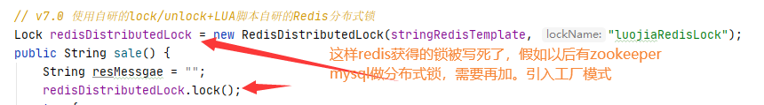

### 步骤一：<font color='gree'>复原程序为初识无锁版本</font>

```java
public String sale() {
    String resMessgae = "";

    try {
        // 1 抢锁成功，查询库存信息
        String result = stringRedisTemplate.opsForValue().get("inventory01");
        // 2 判断库存书否足够
        Integer inventoryNum = result == null ? 0 : Integer.parseInt(result);
        // 3 扣减库存，每次减少一个库存
        if (inventoryNum > 0) {
            stringRedisTemplate.opsForValue().set("inventory01", String.valueOf(--inventoryNum));
            resMessgae = "成功卖出一个商品，库存剩余：" + inventoryNum + "\t" + "，服务端口号：" + port;
            log.info(resMessgae);
        } else {
            resMessgae = "商品已售罄。" + "\t" + "，服务端口号：" + port;
            log.info(resMessgae);
        }
    } finally {

    }
    return resMessgae;
}
```

### 步骤二：新建RedisDistributedLock类实现JUC里面的Lock接口


### 步骤三：满足JUC里面AQS对Lock锁的接口规范定义来进行实现落地代码


### 步骤四：结合设计模式开发属于自己的Redis分布式锁工具类

lua脚本加锁

```lua
if redis.call('exists', KEYS[1]) == 0 or redis.call('hexists', KEYS[1], ARGV[1]) == 1 then
	redis.call('hincrby', KEYS[1], ARGV[1], 1)
	redis.call('expire', KEYS[1], ARGV[2])
	return 1
else
	return 0
end
```

lua脚本解锁

```lua
if redis.call('hexists', KEYS[1], ARGV[1]) == 0 then
	return nil
elseif redis.call('hincrby', KEYS[1], ARGV[1], -1) == 0 then
    return redis.call('del', KEYS[1])
else 
    return 0
end
```

工厂设计模式引入

- 通过实现JUC里面的Lock接口，实现Redis分布式锁RedisDistributedLock

  ```java
  package com.luojia.redislock.mylock;
  
  import cn.hutool.core.util.IdUtil;
  import org.springframework.data.redis.core.StringRedisTemplate;
  import org.springframework.data.redis.core.script.DefaultRedisScript;
  
  import java.util.Arrays;
  import java.util.concurrent.TimeUnit;
  import java.util.concurrent.locks.Condition;
  import java.util.concurrent.locks.Lock;
  
  /**
   * 自研的分布式锁，实现了Lock接口
   */
  public class RedisDistributedLock implements Lock {
  
      private StringRedisTemplate stringRedisTemplate;
  
      private String lockName; // KEYS[1]
      private String uuidValule; // ARGV[1]
      private long expireTime; // ARGV[2]
  
      public RedisDistributedLock(StringRedisTemplate stringRedisTemplate, String lockName) {
          this.stringRedisTemplate = stringRedisTemplate;
          this.lockName = lockName;
          this.uuidValule = IdUtil.simpleUUID() + ":" + Thread.currentThread().getId();
          this.expireTime = 50L;
      }
  
      @Override
      public void lock() {
          tryLock();
      }
  
      @Override
      public boolean tryLock() {
          try {
              tryLock(-1L, TimeUnit.SECONDS);
          } catch (InterruptedException e) {
              e.printStackTrace();
          }
          return false;
      }
  
      @Override
      public boolean tryLock(long time, TimeUnit unit) throws InterruptedException {
          if (-1 == time) {
              String script =
                      "if redis.call('exists', KEYS[1]) == 0 or redis.call('hexists', KEYS[1], ARGV[1]) == 1 then " +
                          "redis.call('hincrby', KEYS[1], ARGV[1], 1) " +
                          "redis.call('expire', KEYS[1], ARGV[2]) " +
                          "return 1 " +
                      "else " +
                           "return 0 " +
                      "end";
              System.out.println("lockName:" + lockName + "\t" + "uuidValue:" + uuidValule);
  
              // 加锁失败需要自旋一直获取锁
              while (!stringRedisTemplate.execute(
                      new DefaultRedisScript<>(script, Boolean.class),
                      Arrays.asList(lockName),
                      uuidValule,
                      String.valueOf(expireTime))) {
                  // 休眠60毫秒再来重试
                  try {TimeUnit.MILLISECONDS.sleep(60);} catch (InterruptedException e) {e.printStackTrace();}
              }
              return true;
          }
          return false;
      }
  
      @Override
      public void unlock() {
          String script = "" +
                  "if redis.call('hexists', KEYS[1], ARGV[1]) == 0 then " +
                  "return nil " +
                  "elseif redis.call('hincrby', KEYS[1], ARGV[1], -1) == 0 then " +
                  "return redis.call('del', KEYS[1]) " +
                  "else " +
                  "return 0 " +
                  "end";
          System.out.println("lockName:" + lockName + "\t" + "uuidValue:" + uuidValule);
          
          // LUA脚本由C语言编写，nil -> false; 0 -> false; 1 -> true;
          // 所以此处DefaultRedisScript构造函数返回值不能是Boolean，Boolean没有nil
          Long flag = stringRedisTemplate.execute(
                  new DefaultRedisScript<>(script, Long.class),
                  Arrays.asList(lockName),
                  uuidValule);
          if (null == flag) {
              throw new RuntimeException("this lock does not exists.");
          }
      }
  
      // 下面两个暂时用不到，不用重写
      @Override
      public void lockInterruptibly() throws InterruptedException {
  
      }
  
      @Override
      public Condition newCondition() {
          return null;
      }
  }
  ```
  
  ```java
  // v7.0 使用自研的lock/unlock+LUA脚本自研的Redis分布式锁
  Lock redisDistributedLock = new RedisDistributedLock(stringRedisTemplate, "luojiaRedisLock");
  public String sale() {
      String resMessgae = "";
      redisDistributedLock.lock();
      try {
          // 1 抢锁成功，查询库存信息
          String result = stringRedisTemplate.opsForValue().get("inventory01");
          // 2 判断库存书否足够
          Integer inventoryNum = result == null ? 0 : Integer.parseInt(result);
          // 3 扣减库存，每次减少一个库存
          if (inventoryNum > 0) {
              stringRedisTemplate.opsForValue().set("inventory01", String.valueOf(--inventoryNum));
              resMessgae = "成功卖出一个商品，库存剩余：" + inventoryNum + "\t" + "，服务端口号：" + port;
              log.info(resMessgae);
          } else {
              resMessgae = "商品已售罄。" + "\t" + "，服务端口号：" + port;
              log.info(resMessgae);
          }
      } finally {
          redisDistributedLock.unlock();
      }
      return resMessgae;
  }
  ```
  
- 如果直接使用上面的代码设计，会有什么问题
  

- 需要考虑扩展，本次是Redis实现分布式锁，以后zookeeper、MySQL实现呢？

- 引入工厂模式改造7.1版code

  DistributedLockFactory

  ```java
  package com.luojia.redislock.mylock;
  
  import org.springframework.beans.factory.annotation.Autowired;
  import org.springframework.data.redis.core.StringRedisTemplate;
  import org.springframework.stereotype.Component;
  
  import java.util.concurrent.locks.Lock;
  
  @Component
  public class DistributedLockFactory {
  
      @Autowired
      private StringRedisTemplate stringRedisTemplate;
  
      public Lock getDistributedLock(String lockType, String lockName) {
          if (lockType == null) {
              return null;
          }
  
          if ("REDIS".equalsIgnoreCase(lockType)) {
              return new RedisDistributedLock(stringRedisTemplate, lockName);
          } else if ("ZOOKEEPER".equalsIgnoreCase(lockType)) {
              // 后面存在就返回对应的分布式锁
          } else if ("MYSQL".equalsIgnoreCase(lockType)) {
              // 后面存在就返回对应的分布式锁
          }
  
          return null;
      }
  }
  ```
  
  InventoryService使用工厂模式版本
  
  ```java
  // v7.0 使用自研的lock/unlock+LUA脚本自研的Redis分布式锁
  @Autowired
  private DistributedLockFactory distributedLockFactory;
  public String sale() {
      String resMessgae = "";
      Lock redisLock = distributedLockFactory.getDistributedLock("REDIS", "luojiaRedisLock");
      redisLock.lock();
      try {
          // 1 抢锁成功，查询库存信息
          String result = stringRedisTemplate.opsForValue().get("inventory01");
          // 2 判断库存书否足够
          Integer inventoryNum = result == null ? 0 : Integer.parseInt(result);
          // 3 扣减库存，每次减少一个库存
          if (inventoryNum > 0) {
              stringRedisTemplate.opsForValue().set("inventory01", String.valueOf(--inventoryNum));
              resMessgae = "成功卖出一个商品，库存剩余：" + inventoryNum + "\t" + "，服务端口号：" + port;
              log.info(resMessgae);
          } else {
              resMessgae = "商品已售罄。" + "\t" + "，服务端口号：" + port;
              log.info(resMessgae);
          }
      } finally {
          redisLock.unlock();
      }
      return resMessgae;
  }
  ```
  
- 单机+并发通过测试


