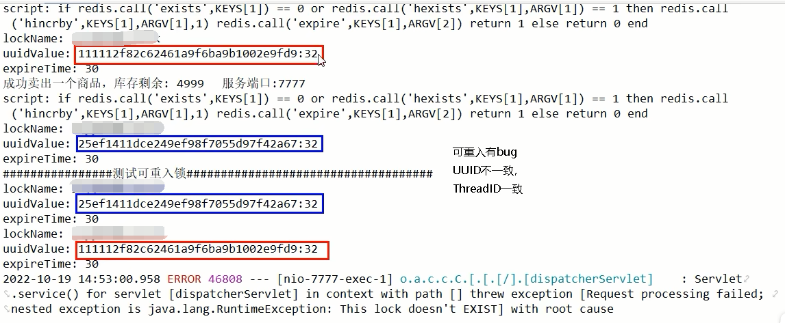

### 可重入测试

InventoryService类新增可重入测试方法

```java
// v7.1 使用工厂类创建锁
@Autowired
private DistributedLockFactory distributedLockFactory;
public String sale() {
    String resMessgae = "";
    Lock redisLock = distributedLockFactory.getDistributedLock("REDIS", "luojiaRedisLock");
    redisLock.lock();
    try {
        // 1 抢锁成功，查询库存信息
        String result = stringRedisTemplate.opsForValue().get("inventory01");
        // 2 判断库存书否足够
        Integer inventoryNum = result == null ? 0 : Integer.parseInt(result);
        // 3 扣减库存，每次减少一个库存
        if (inventoryNum > 0) {
            stringRedisTemplate.opsForValue().set("inventory01", String.valueOf(--inventoryNum));
            resMessgae = "成功卖出一个商品，库存剩余：" + inventoryNum + "\t" + "，服务端口号：" + port;
            log.info(resMessgae);
            testReEntry();
        } else {
            resMessgae = "商品已售罄。" + "\t" + "，服务端口号：" + port;
            log.info(resMessgae);
        }
    } finally {
        redisLock.unlock();
    }
    return resMessgae;
}

private void testReEntry() {

    Lock redisLock = distributedLockFactory.getDistributedLock("REDIS", "luojiaRedisLock");
    redisLock.lock();
    try {
        log.info("=================测试可重入锁=================");
    } finally {
        redisLock.unlock();
    }
}
```

结果：无法重入

testReEntry方法中，会创建一个新的锁Key，因为ThreadID一致了，但是UUID不OK



### 引入工厂模式改造7.2版本code

DistributedLockFactory -> 新增一个无参构造函数

```Java
package com.luojia.redislock.mylock;

import cn.hutool.core.util.IdUtil;
import org.springframework.beans.factory.annotation.Autowired;
import org.springframework.data.redis.core.StringRedisTemplate;
import org.springframework.stereotype.Component;

import java.util.concurrent.locks.Lock;

@Component
public class DistributedLockFactory {

    @Autowired
    private StringRedisTemplate stringRedisTemplate;

    private String uuid;

    public DistributedLockFactory() {
        this.uuid = IdUtil.simpleUUID();
    }

    public Lock getDistributedLock(String lockType, String lockName) {
        if (lockType == null) {
            return null;
        }

        if ("REDIS".equalsIgnoreCase(lockType)) {
            return new RedisDistributedLock(stringRedisTemplate, lockName, uuid);
        } else if ("ZOOKEEPER".equalsIgnoreCase(lockType)) {
            // 后面存在就返回对应的分布式锁
        } else if ("MYSQL".equalsIgnoreCase(lockType)) {
            // 后面存在就返回对应的分布式锁
        }
        return null;
    }
}
```

RedisDistributedLock -> 修改构造方法

```java
// V7.2 
public RedisDistributedLock(StringRedisTemplate stringRedisTemplate, String lockName, String uuid) {
    this.stringRedisTemplate = stringRedisTemplate;
    this.lockName = lockName;
    this.uuidValule = uuid + ":" + Thread.currentThread().getId();
    this.expireTime = 50L;
}
```

使用@Autowired创建的工厂类是一个单例的，在spring进行注入的时候已经初始化好了，所以所有线程产生的UUID都是一样的


