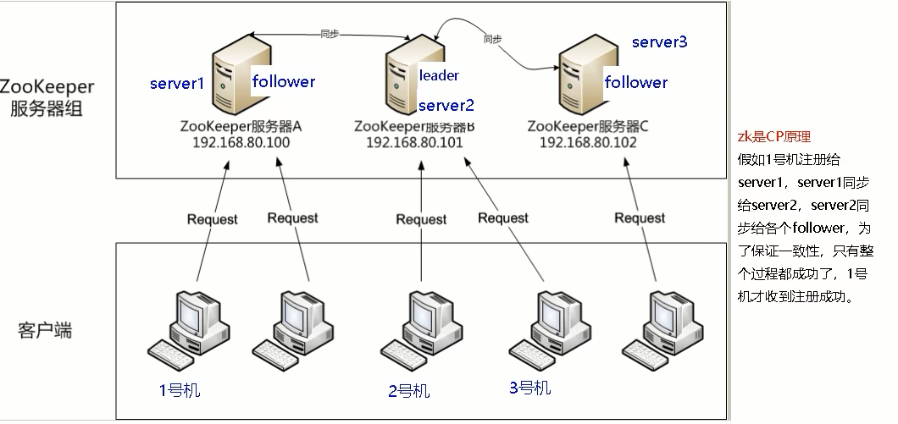
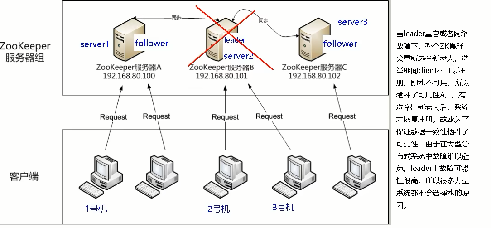
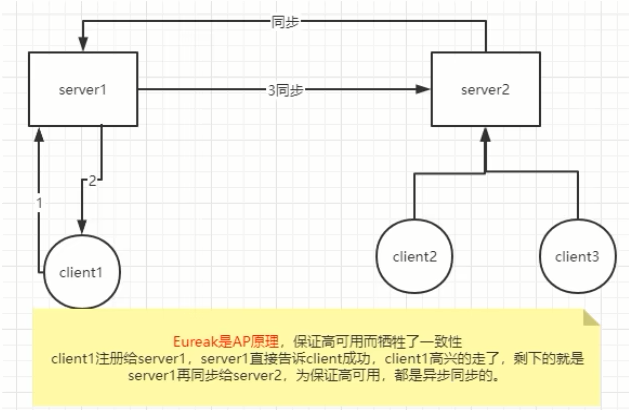
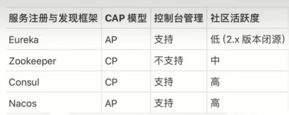

 ### 确保RedisLock过期时间大于业务执行时间的问题

时间到了，业务没有执行完需要自动续期

### CAP

- Redis集群是AP

  <font color='red'>redis异步复制造成的锁丢失</font>，比如：主节点没来的及把刚刚set进来的这条数据给从节点，master就挂了，从机上位但是从机上无数据

- Zookeeper集群是CP

  

  故障：

- Eureka集群是AP

  

- Nacos集群是AP

  

### 自动续期的LUA脚本

```lua
// 自动续期的LUA脚本
if redis.call('hexists', KEYS[1], ARGV[1]) == 1 then
    return redis.call('expire', KEYS[1], ARGV[2])
else
    return 0
end
```

测试验证

```lua

if redis.call('hexists', KEYS[1], ARGV[1]) == 1 then return redis.call('expire', KEYS[1], ARGV[2]) else return 0 end
---
hset luojiaRedisLock test 001
expire luojiaRedisLock 30
eval "if redis.call('hexists', KEYS[1], ARGV[1]) == 1 then return redis.call('expire', KEYS[1], ARGV[2]) else return 0 end" 1 luojiaRedisLock test 1
```

### <font color='gree'>8.0新增自动续期功能</font>

```java
@Override
public boolean tryLock(long time, TimeUnit unit) throws InterruptedException {
    if (-1 == time) {
        String script =
            "if redis.call('exists', KEYS[1]) == 0 or redis.call('hexists', KEYS[1], ARGV[1]) == 1 then " +
            "redis.call('hincrby', KEYS[1], ARGV[1], 1) " +
            "redis.call('expire', KEYS[1], ARGV[2]) " +
            "return 1 " +
            "else " +
            "return 0 " +
            "end";
        System.out.println("lock() lockName:" + lockName + "\t" + "uuidValue:" + uuidValule);

        // 加锁失败需要自旋一直获取锁
        while (!stringRedisTemplate.execute(
            new DefaultRedisScript<>(script, Boolean.class),
            Arrays.asList(lockName),
            uuidValule,
            String.valueOf(expireTime))) {
            // 休眠60毫秒再来重试
            try {TimeUnit.MILLISECONDS.sleep(60);} catch (InterruptedException e) {e.printStackTrace();}
        }
        // 新建一个后台扫描程序，来检查Key目前的ttl，是否到我们规定的剩余时间来实现锁续期
        resetExpire();
        return true;
    }
    return false;
}

// 自动续期
private void resetExpire() {
    String script =
        "if redis.call('hexists', KEYS[1], ARGV[1]) == 1 then " +
        "return redis.call('expire', KEYS[1], ARGV[2]) " +
        "else " +
        "return 0 " +
        "end";
    new Timer().schedule(new TimerTask() {
        @Override
        public void run() {
            if (stringRedisTemplate.execute(
                new DefaultRedisScript<>(script, Boolean.class),
                Arrays.asList(lockName),
                uuidValule,
                String.valueOf(expireTime))) {
                // 续期成功，继续监听
                System.out.println("resetExpire() lockName:" + lockName + "\t" + "uuidValue:" + uuidValule);
                resetExpire();
            }
        }
    }, (this.expireTime * 1000 / 3));
}
```


