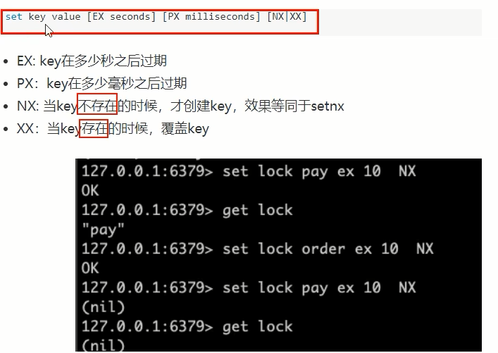
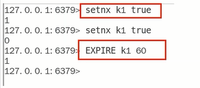

### 分布式锁



setnx key value



<font color ='red' >setnx+expire不安全，两条命令为非原子性命令</font>

set key value[EX seconds] \[PX milliseconds] \[NX|XX]

### 重点

JUC中AQS锁的规范落地参考+可重入锁+Lua脚本+Redis命令一步步实现分布式锁

### Base案例(boot+redis)

使用场景：多个服务间保证同一时间段内同一用户只能有一个请求（防止关键业务出现并发攻击）

建Module

​	redis_distributed_lock2

​    redis_distributed_lock3

写POM

```xml
<?xml version="1.0" encoding="UTF-8"?>
<project xmlns="http://maven.apache.org/POM/4.0.0" xmlns:xsi="http://www.w3.org/2001/XMLSchema-instance"
         xsi:schemaLocation="http://maven.apache.org/POM/4.0.0 https://maven.apache.org/xsd/maven-4.0.0.xsd">
    <modelVersion>4.0.0</modelVersion>
    <parent>
        <groupId>org.springframework.boot</groupId>
        <artifactId>spring-boot-starter-parent</artifactId>
        <version>2.7.11</version>
        <relativePath/> <!-- lookup parent from repository -->
    </parent>
    <groupId>com.luojia</groupId>
    <artifactId>redis_distributed_lock2</artifactId>
    <version>0.0.1-SNAPSHOT</version>
    <name>redis_distributed_lock2</name>
    <description>Demo project for Spring Boot</description>
    <properties>
        <project.build.sourceEncoding>UTF-8</project.build.sourceEncoding>
        <java.version>1.8</java.version>
        <maven.compiler.source>1.8</maven.compiler.source>
        <maven.compiler.target>1.8</maven.compiler.target>
        <lombok.version>1.16.18</lombok.version>
    </properties>

    <dependencies>
        <!--SpringBoot 通用依赖模块-->
        <dependency>
            <groupId>org.springframework.boot</groupId>
            <artifactId>spring-boot-starter-web</artifactId>
        </dependency>
        <!-- SpringBoot 与Redis整合依赖 -->
        <dependency>
            <groupId>org.springframework.boot</groupId>
            <artifactId>spring-boot-starter-data-redis</artifactId>
        </dependency>
        <dependency>
            <groupId>org.apache.commons</groupId>
            <artifactId>commons-pool2</artifactId>
        </dependency>
        <!-- swagger2 -->
        <dependency>
            <groupId>io.springfox</groupId>
            <artifactId>springfox-swagger2</artifactId>
            <version>2.9.2</version>
        </dependency>
        <dependency>
            <groupId>io.springfox</groupId>
            <artifactId>springfox-swagger-ui</artifactId>
            <version>2.9.2</version>
        </dependency>

        <dependency>
            <groupId>cn.hutool</groupId>
            <artifactId>hutool-all</artifactId>
            <version>5.2.3</version>
        </dependency>

        <!-- 通用基础配置 -->
        <dependency>
            <groupId>org.projectlombok</groupId>
            <artifactId>lombok</artifactId>
            <version>${lombok.version}</version>
            <optional>true</optional>
        </dependency>

        <dependency>
            <groupId>org.springframework.boot</groupId>
            <artifactId>spring-boot-starter-test</artifactId>
            <scope>test</scope>
        </dependency>
    </dependencies>

    <build>
        <plugins>
            <plugin>
                <groupId>org.springframework.boot</groupId>
                <artifactId>spring-boot-maven-plugin</artifactId>
            </plugin>
        </plugins>
    </build>
</project>
```

改YML

```yaml
server.port=7777
spring.application.name=redis_distributed_lock2
# =====================swaqqer2=====================
# http://localhost:7777/swagger-ui.html
swagger2.enabled=true
spring.mvc.pathmatch.matching-strategy=ant_path_matcher
# =====================redis单机=====================
spring.redis.database=0
#修改为自己真实IP
spring.redis.host=127.0.0.1
spring.redis.port=6379
spring.redis.password=123456
spring.redis.lettuce.pool.max-active=8
spring.redis.1ettuce.pool.max-wait=-1ms
spring.redis.1ettuce.pool.max-idle=8
spring.redis.lettuce.pool.min-idle=0
```

主启动

业务类

InventoryService

```java
package com.luojia.redislock.service;

import lombok.extern.slf4j.Slf4j;
import org.springframework.beans.factory.annotation.Autowired;
import org.springframework.beans.factory.annotation.Value;
import org.springframework.data.redis.core.StringRedisTemplate;
import org.springframework.stereotype.Service;

import java.util.concurrent.locks.Lock;
import java.util.concurrent.locks.ReentrantLock;

@Service
@Slf4j
public class InventoryService {
    
    @Autowired
    private StringRedisTemplate stringRedisTemplate;
    @Value("${server.port}")
    private String port;

    private Lock lock = new ReentrantLock();

    public String sale() {
        String resMessgae = "";
        lock.lock();
        try {
            // 1 查询库存信息
            String result = stringRedisTemplate.opsForValue().get("inventory01");
            // 2 判断库存书否足够
            Integer inventoryNum = result == null ? 0 : Integer.parseInt(result);
            // 3 扣减库存，每次减少一个库存
            if (inventoryNum > 0) {
                stringRedisTemplate.opsForValue().set("inventory01", String.valueOf(--inventoryNum));
                resMessgae = "成功卖出一个商品，库存剩余：" + inventoryNum;
                log.info(resMessgae + "\t" + "，服务端口号：" + port);
            } else {
                resMessgae = "商品已售罄。";
                log.info(resMessgae + "\t" + "，服务端口号：" + port);
            }
        } finally {
            lock.unlock();
        }
        return resMessgae;
    }
}
```

InventoryController

```java
package com.luojia.redislock.controller;

import com.luojia.redislock.service.InventoryService;
import io.swagger.annotations.Api;
import io.swagger.annotations.ApiOperation;
import org.springframework.beans.factory.annotation.Autowired;
import org.springframework.web.bind.annotation.GetMapping;
import org.springframework.web.bind.annotation.RestController;

@RestController
@Api(tags = "redis分布式锁测试")
public class InventoryController {
    @Autowired
    private InventoryService inventoryService;

    @GetMapping("/inventory/sale")
    @ApiOperation("扣减库存，一次卖一个")
    public void sale() {
        inventoryService.sale();
    }
}
```


