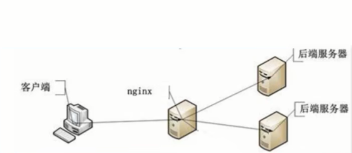
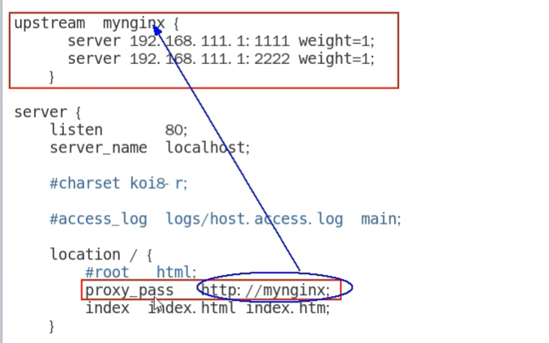
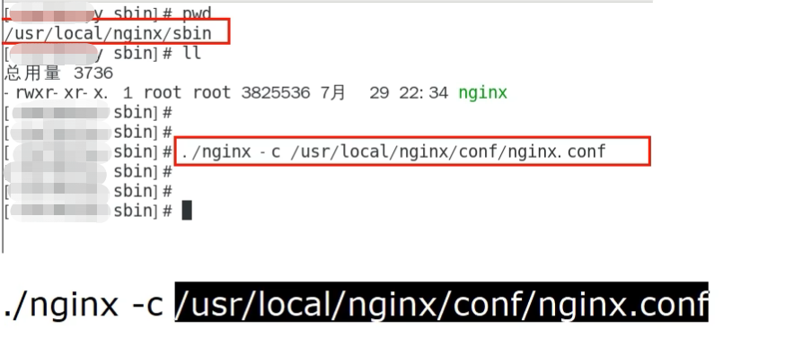
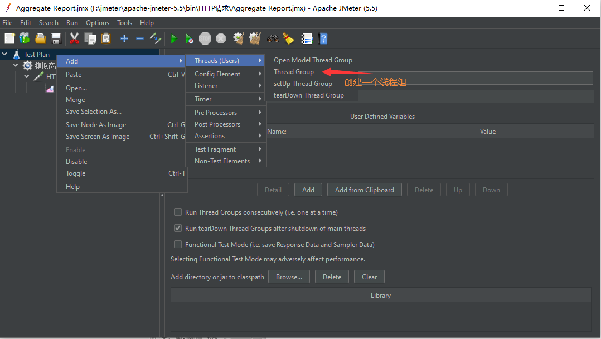
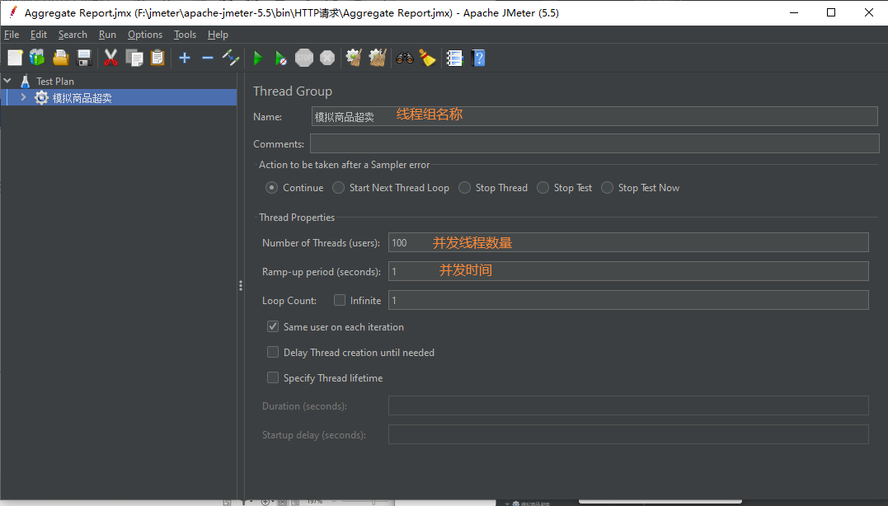
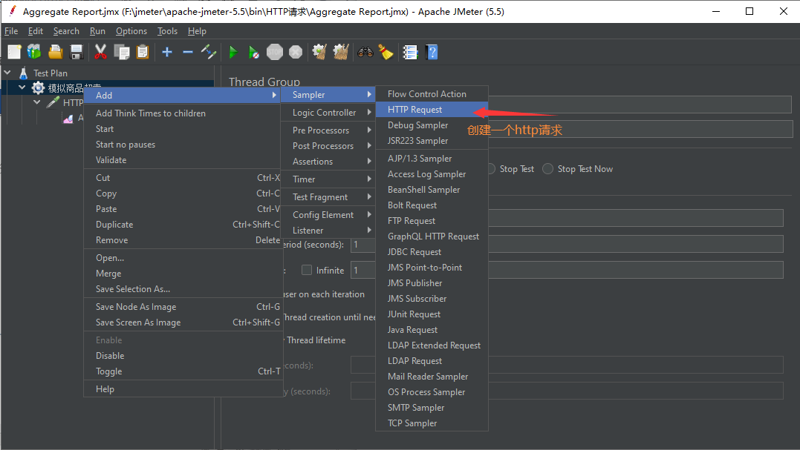
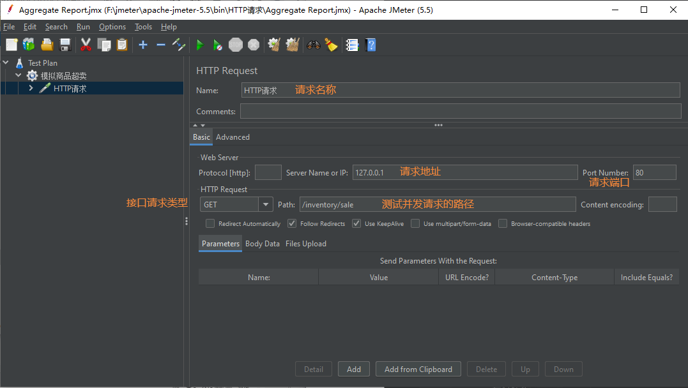
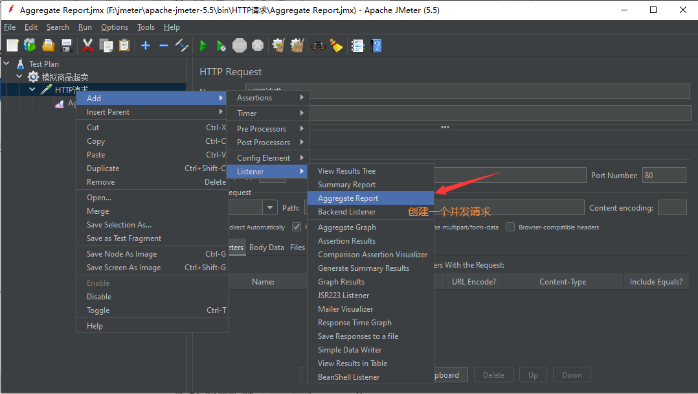
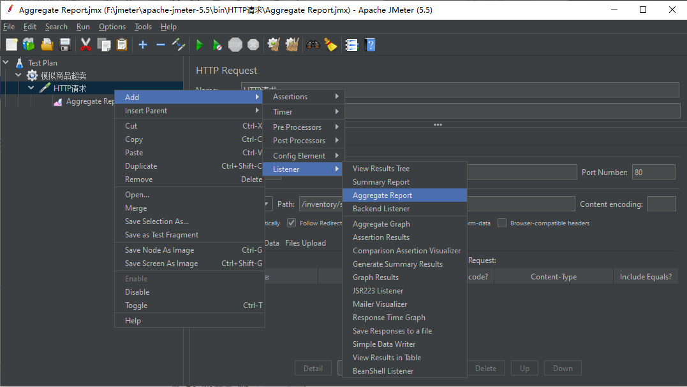
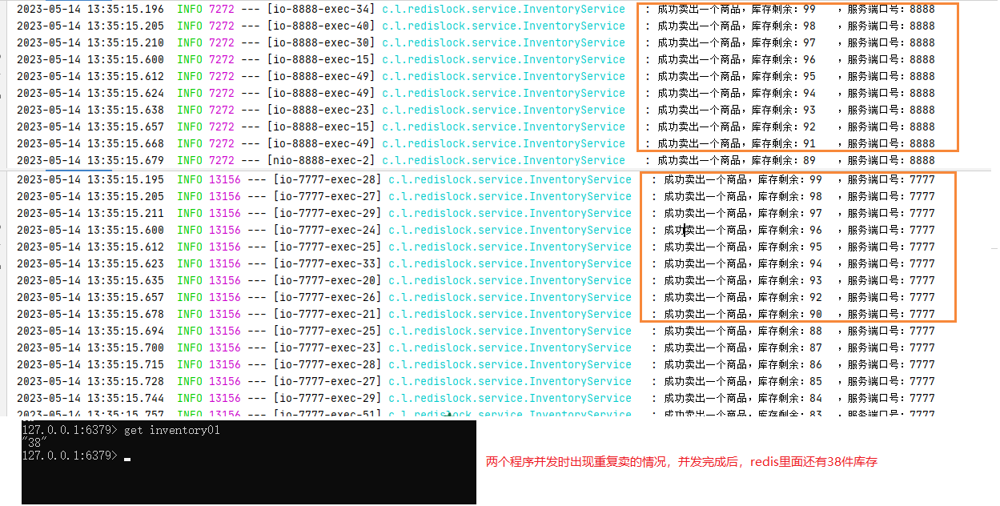

# 手写分布式锁思路分析2023

上述笔记代码的不足

1. 初始化版本简单添加

   业务类，将上面7777的业务逻辑代码原样拷贝到8888，加上synchronized或者Lock

2. nginx分布式微服务架构

   - v2.0版本代码分布式部署后，单机锁还是出现超卖现象，需要分布式锁

     

   - Nginx配置负载均衡

     - 命令地址+配置地址

       命令地址：/usr/local/nginx/sbin

       配置地址：/usr/local/nginx/conf

     - 启动

       /usr/local/nginx/sbin	执行./nginx

       启动Nginx并测试通过，浏览器看到Nginx欢迎welcome页面

     - /usr/local/nginx/conf目录下修改配置文件nginx.conf新增反向代理和负载均衡配置

       

     - 关闭

       /usr/local/nginx/sbin  执行./nginx -s stop

     - 指定配置启动

       在/usr/local/nginx/sbin 路径下执行命令 ./nginx -c nginx.conf全路径

       

     - 重启

       在/usr/local/nginx/sbin  执行./nginx -s reload

   - v2.0版本代码修改+启动两个微服务

     ​	通过Nginx访问，自己Linux服务器IP地址，反向代理+负载均衡
     
     ​	可以点击查看效果，可以看到一边一个，通过配置的权重来轮询
     
     ​    http://1270.0.1/inventory/sale
     
   - 上面纯手工点击验证OK，下面高并发模拟

     - 使用jmeter进行压测
     
     - 创建线程组Redis
     
       
     
       
     
     - 创建一个http请求
     
       
     
       
     
       
     
     - jmeter压测
     
       
     
       查看报告
     
       
     
       执行绿色执行按钮，开始并发请求程序
     
     - 发现商品出现超卖
     
       
     
   - Bug？why？

     synchronized和ReentrantLock是单机锁，只能管住当前自己的jvm。
     
     在单机环境下，可以使用synchronized或Lock来实现
     
     但是在分布式系统中，因为竞争的线程可能不在同一个节点上(同一个jvm中)，所以需要一个让所有进程都能访问到的锁来实现(比如redis或者zookeeper来构建)
     
     不同进程ivm层面的锁就不管用了，那么可以利用第三方的一个组件，来获取锁，未获取到锁，则阻塞当前想要运行的线程
     
   - 分布式锁出现

     跨进程+跨服务
     
     解决超卖
     
     防止缓存击穿

3. 解决

   上Redis分布式锁setnx；Redis具有极高的性能,且其命令对分布式锁支持友好,借助SET 命令即可实现加锁处理。

   

