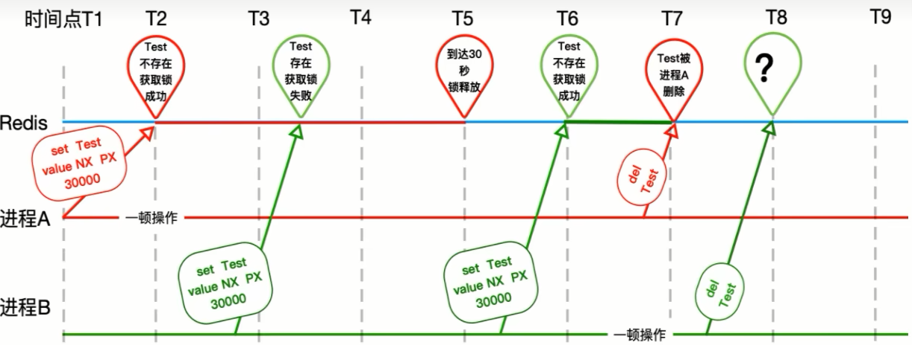

### v4.2版本代码问题

实际业务中，如果处理时间超过了设置的key的过期时间，那删除key的时候岂不是<font color='blue'>张冠李戴，删除了别人的锁</font>




### 解决

只能自己删除自己的，不允许删除别人的说，修改代码为5.0版本

```java
// v5.0 版本
public String sale() {
    String resMessgae = "";
    String key = "luojiaRedisLocak";
    String uuidValue = IdUtil.simpleUUID() + ":" + Thread.currentThread().getId();

    // 不用递归了，高并发容易出错，我们用自旋代替递归方法重试调用；也不用if，用while代替
    while (!stringRedisTemplate.opsForValue().setIfAbsent(key, uuidValue, 30L, TimeUnit.SECONDS)) {
        // 线程休眠20毫秒，进行递归重试
        try {TimeUnit.MILLISECONDS.sleep(20);} catch (InterruptedException e) {e.printStackTrace();}
    }

    try {
        // 1 抢锁成功，查询库存信息
        String result = stringRedisTemplate.opsForValue().get("inventory01");
        // 2 判断库存书否足够
        Integer inventoryNum = result == null ? 0 : Integer.parseInt(result);
        // 3 扣减库存，每次减少一个库存
        if (inventoryNum > 0) {
            stringRedisTemplate.opsForValue().set("inventory01", String.valueOf(--inventoryNum));
            resMessgae = "成功卖出一个商品，库存剩余：" + inventoryNum + "\t" + "，服务端口号：" + port;
            log.info(resMessgae);
        } else {
            resMessgae = "商品已售罄。" + "\t" + "，服务端口号：" + port;
            log.info(resMessgae);
        }
    } finally {
        // v5.0 改进点，判断加锁与解锁是不同客户端，自己只能删除自己的锁，不误删别人的锁
        if (stringRedisTemplate.opsForValue().get(key).equalsIgnoreCase(uuidValue)) {
            stringRedisTemplate.delete(key);
        }
    }
    return resMessgae;
}
```


