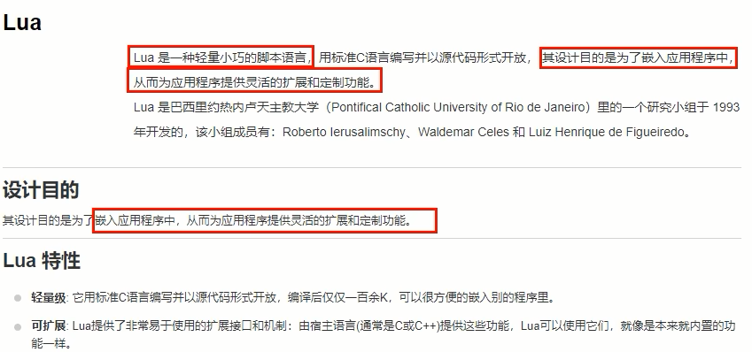
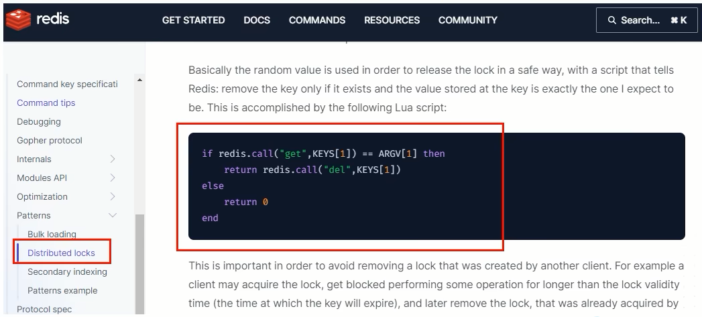
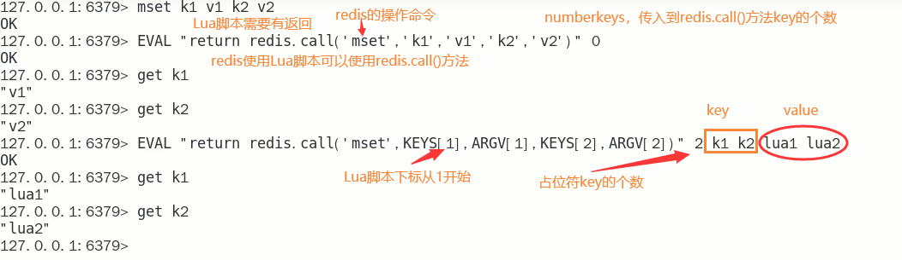
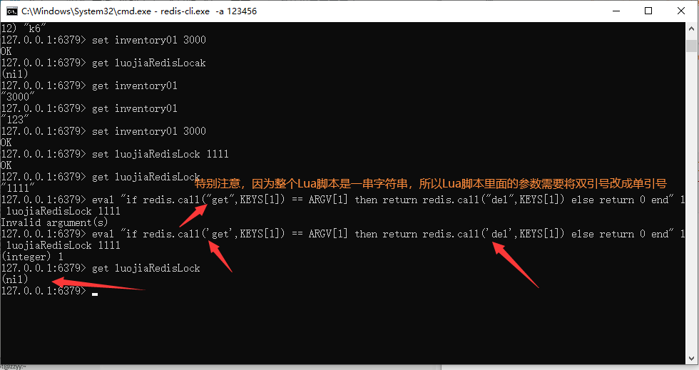
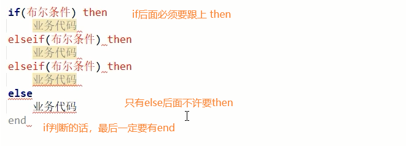
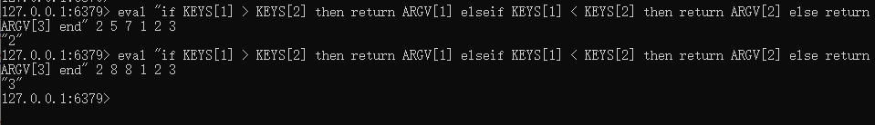
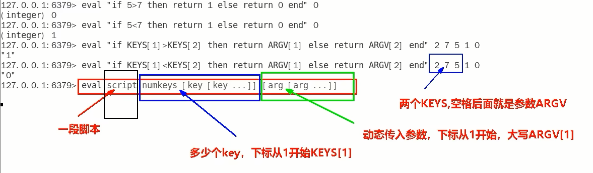

### v5.0依旧存在问题

finally代码块的判断+del删除不是原子性的

### <font color='red'>启用Lua脚本编写redis分布式锁判断+删除判断代码</font>

lua脚本



官网解释：https://redis.io/docs/manual/patterns/distributed-locks/



### Lua脚本浅谈

- Lua脚本初识

  Redis调用Lua脚本通过eval命令保证代码执行的原子性，直接用return返回脚本执行后的结果值

  eval luascript numkeys [key [key ...]] [arg [arg ...]]

  

- Lua脚本进一步

  Redis分布式锁Lua脚本官网练习

  ```lua
  eval "if redis.call('get',KEYS[1]) == ARGV[1] then return redis.call('del',KEYS[1]) else return 0 end" 1 luojiaRedisLock 1111
  ```

  

  条件语法判断

  

  条件判断案例

  ```lua
  if KEYS[1] > KEYS[2] then return ARGV[1] elseif KEYS[1] < KEYS[2] then return ARGV[2] else return ARGV[3] end
  ```

  

  

### 通过Lua脚本解决v5.0版本Bug

```java
public String sale() {
    String resMessgae = "";
    String key = "luojiaRedisLocak";
    String uuidValue = IdUtil.simpleUUID() + ":" + Thread.currentThread().getId();

    // 不用递归了，高并发容易出错，我们用自旋代替递归方法重试调用；也不用if，用while代替
    while (!stringRedisTemplate.opsForValue().setIfAbsent(key, uuidValue, 30L, TimeUnit.SECONDS)) {
        // 线程休眠20毫秒，进行递归重试
        try {TimeUnit.MILLISECONDS.sleep(20);} catch (InterruptedException e) {e.printStackTrace();}
    }

    try {
        // 1 抢锁成功，查询库存信息
        String result = stringRedisTemplate.opsForValue().get("inventory01");
        // 2 判断库存书否足够
        Integer inventoryNum = result == null ? 0 : Integer.parseInt(result);
        // 3 扣减库存，每次减少一个库存
        if (inventoryNum > 0) {
            stringRedisTemplate.opsForValue().set("inventory01", String.valueOf(--inventoryNum));
            resMessgae = "成功卖出一个商品，库存剩余：" + inventoryNum + "\t" + "，服务端口号：" + port;
            log.info(resMessgae);
        } else {
            resMessgae = "商品已售罄。" + "\t" + "，服务端口号：" + port;
            log.info(resMessgae);
        }
    } finally {
        // 改进点，修改为Lua脚本的Redis分布式锁调用，必须保证原子性，参考官网脚本案例
        String luaScript =
            "if redis.call('get',KEYS[1]) == ARGV[1] then " +
            "return redis.call('del',KEYS[1]) " +
            "else " +
            "return 0 " +
            "end";
        stringRedisTemplate.execute(new DefaultRedisScript(luaScript, Boolean.class), Arrays.asList(key), uuidValue);

    }
    return resMessgae;
}
```


