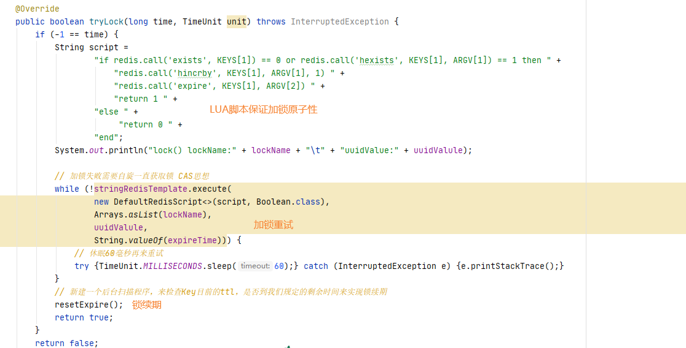
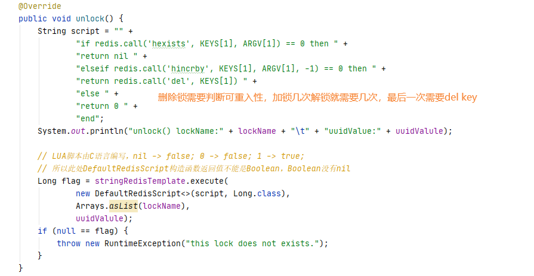

### 自研一把分布式锁，面试回答的主要考点

1. 按照JUC里面java.util.concurrent.locks.Lock接口规范编写

2. lock()加锁关键逻辑

   - 加锁：加锁实际上就是在redis中，给key设置一个值，为了避免死锁，并给定一个过期时间

   - 可重入：加锁的LUA脚本，通过redis里面的hash数据模型，加锁和可重入性都要保证

   - 自旋：加锁不成，需要while进行重试并自旋，AQS

   - 续期：在过期时间内，一定时间内业务还未完成，自动给锁续期

     

3. unlock()解锁关键逻辑

   - 将redis的key删除，但是也不能乱删，不能说客户端1的请求将客户端2的锁给删除掉了，只能自己删自己的锁

   - 考虑可重入性的递减，加锁几次就需要删除几次

   - 最后到零了，直接del删除

     

上面自研的redis锁对于一般中小公司，不是特别高并发场景足够用了，单机redis小业务也撑得住

