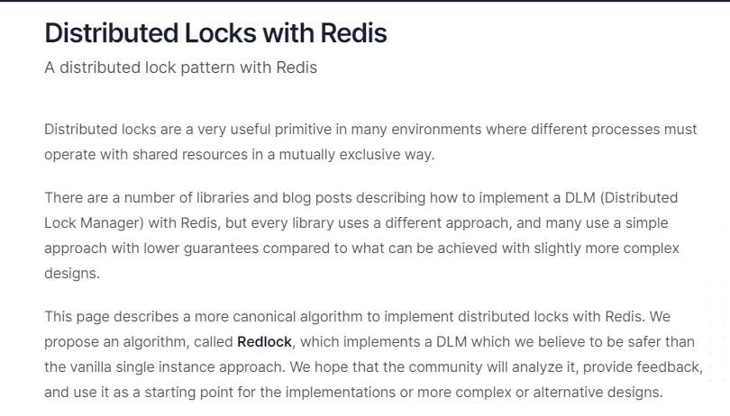
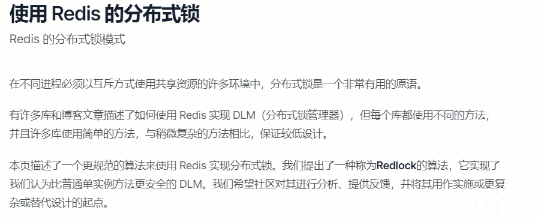
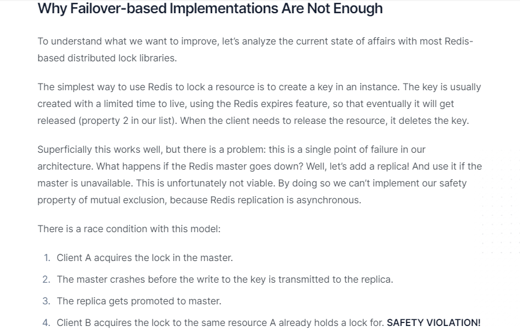
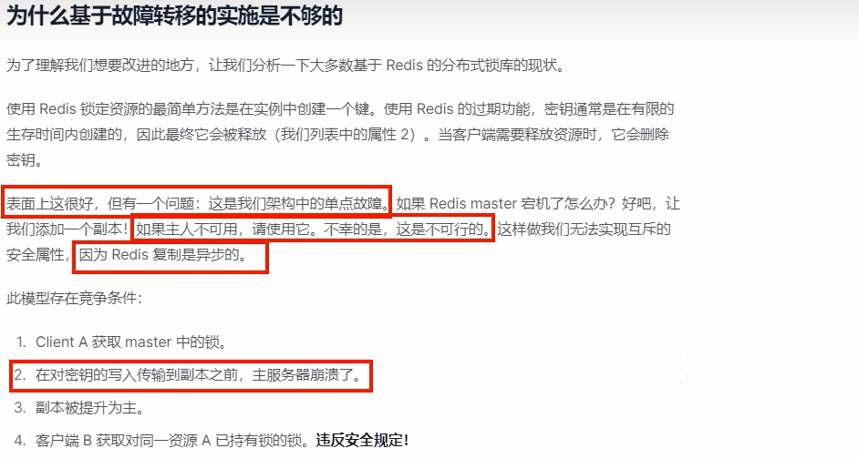
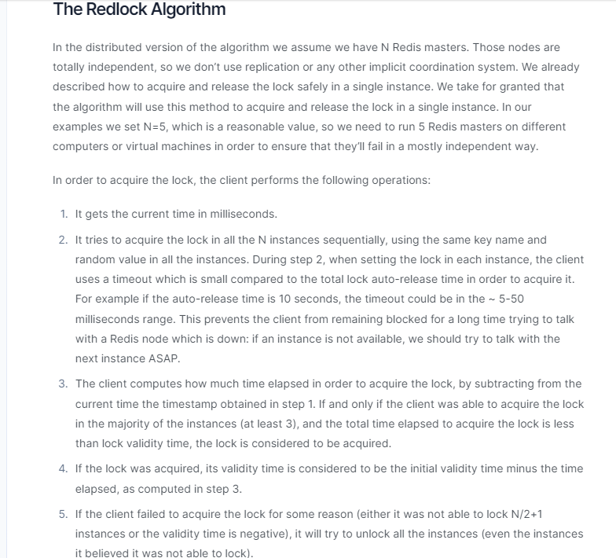
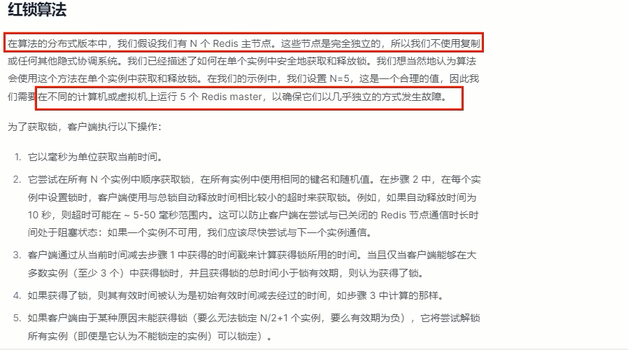
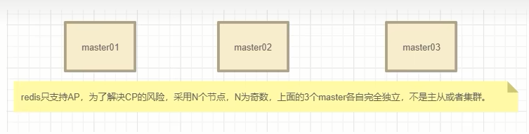

# Redis分布式锁-Redlock红锁算法 Distributed locks with Redis

### 官网说明

https://redis.io/docs/manual/patterns/distributed-locks/

主页说明

### 为什么学习这个？怎么产生的？

之前手写的分布式锁有什么缺点：

官网说明：

翻译：

有时在特殊情况下，例如在故障期间，多个客户端可以同时持有锁是完全没问题的。如果是这种情况，您可以使用基于复制的解决方案。否则，我们建议实施本文档中描述的解决方案。

线程1首先获取锁成功，将键值对写入redis 的 master节点，在 redis将该键值对同步到slave 节点之前，master发生了故障；

redis触发故障转移，其中一个slave升级为新的 master，此时新上位的master并不包含线程1写入的键值对，因此线程⒉尝试获取锁也可以成功拿到锁，此时相当于有两个线程获取到了锁，可能会导致各种预期之外的情况发生，例如最常见的脏数据。

我们加的是排它独占锁，同一时间只能有一个建redis锁成功并持有锁，严禁出现2个以上的请求线程拿到锁。

### RedLock算法设计理念

- Redis之父提出了RedLock算法解决上面这个一锁被多建的问题

  **Redis**也提供了**Redlock**算法，用来实现基于多个实例的分布式锁。
  锁变量由多个实例维护，即使有实例发生了故障，锁变量仍然是存在的，客户端还是可以完成锁操作。Redlock算法是实现高可靠分布式锁的一种有效解决方案，可以在实际开发中使用。

  Redlock算法官网：

  翻译：

- 设计理念

  该方案也是基于(set加锁、Lua脚本解锁）进行改良的，所以redis之父antirez只描述了差异的地方，大致方案如下：假设我们有N个Redis主节点，例如N= 5这些节点是完全独立的，我们不使用复制或任何其他隐式协调系统，为了取到锁客户端执行以下操作：

  1. 获取当前时间，以毫秒为单位;

  2. 依次尝试从5个实例，使用相同的 key和随机值（例如 UUID）获取锁。当向Redis 请求获取锁时，客户端应该设置一个超时时间，这个超时时间应该小于锁的失效时间。例如你的锁自动失效时间为10秒，则超时时间应该在5-50毫秒之间。这样可以防止客户端在试图与一个宕机的 Redis 节点对话时长时间处于阻塞状态。如果一个实例不可用，客户端应该尽快尝试去另外一个Redis实例请求获取锁;

  3. 客户端通过当前时间减去步骤1记录的时间来计算获取锁使用的时间。当且仅当从大多数(N/2+1，这里是3个节点)的Redis节点都取到锁，并且获取锁使用的时间小于锁失效时间时，锁才算获取成功;

  4. 如果取到了锁，其真正有效时间等于初始有效时间减去获取锁所使用的时间（步骤3计算的结果）。

  5. 如果由于某些原因未能获得锁（无法在至少N/2＋1个Redis实例获取锁、或获取锁的时间超过了有效时间)，客户端应该在所有的Redis 实例上进行解锁（即便某些Redis实例根本就没有加锁成功，防止某些节点获取到锁但是客户端没有得到响应而导致接下来的一段时间不能被重新获取锁）。

     该方案为了解决数据不一致的问题，直接舍弃了异步复制只使用master节点，同时由于舍弃了slave，为了保证可用性，引入了N个节点

     客户端只有在满足下面的这两个条件时，才能认为是加锁成功。

     条件1:客户端从超过半数（大于等于N/2+1）的Redis实例上成功获取到了锁;

     条件2:客户端获取锁的总耗时没有超过锁的有效时间。

- 解决方案

  

  为什么是奇数：N = 2X + 1 （N是最终部署机器数，X是容错机器数）

### Redisson实现

Redisson是Java的Redis客户端之一，提供了一些API方便操作Redis

Redisson之官网：https://redisson.org

Redisson之github：https://github.com/redisson/redisson/wiki

Redisson之解决分布式锁：https://github.com/redisson/redisson/wiki/8.-distributed-locks-and-synchronizers

