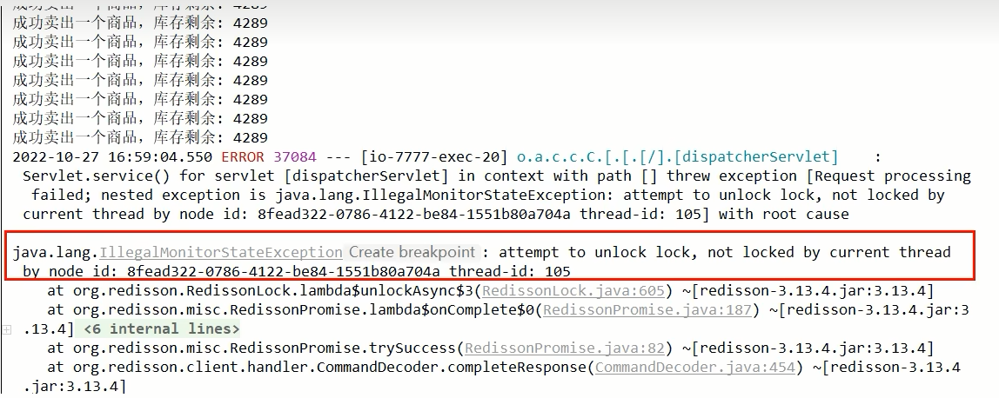

### V9.0版本修改

改pom：加上Redisson相关代码

```xml
<!-- redisson -->
<dependency>
    <groupId>org.redisson</groupId>
    <artifactId>redisson</artifactId>
    <version>3.13.4</version>
</dependency>
```

配置类：RedisConfig

```java
@Bean
public Redisson redisson() {
    Config config = new Config();
    config.useSingleServer()
        .setAddress("redis://127.0.0.1:6379")
        .setDatabase(0)
        .setPassword("123456");
    return (Redisson) Redisson.create(config);
}
```

修改服务方法：InventoryService

```java
// V9.0, 引入Redisson对应的官网推荐RedLock算法实现类
@Autowired
private Redisson redisson;
public String saleByRedisson() {
    String resMessgae = "";
    RLock redissonLock = redisson.getLock("luojiaRedisLock");
    redissonLock.lock();
    try {
        // 1 抢锁成功，查询库存信息
        String result = stringRedisTemplate.opsForValue().get("inventory01");
        // 2 判断库存书否足够
        Integer inventoryNum = result == null ? 0 : Integer.parseInt(result);
        // 3 扣减库存，每次减少一个库存
        if (inventoryNum > 0) {
            stringRedisTemplate.opsForValue().set("inventory01", String.valueOf(--inventoryNum));
            resMessgae = "成功卖出一个商品，库存剩余：" + inventoryNum + "\t" + "，服务端口号：" + port;
            log.info(resMessgae);
        } else {
            resMessgae = "商品已售罄。" + "\t" + "，服务端口号：" + port;
            log.info(resMessgae);
        }
    } finally {
        redissonLock.unlock();
    }
    return resMessgae;
}
```

### 测试

jmeter压测

- 发现Bug

  

- 解决

  业务代码修改为V9.1版本，保证删除时候，删除的是自己，修改删除代码的finally部分即可

  ```java
  finally {
      // 改进点，只能删除属于自己的key，不能删除别人的
      if(redissonLock.isLocked() && redissonLock.isHeldByCurrentThread()) {
          redissonLock.unlock();
      }
  }
  ```


