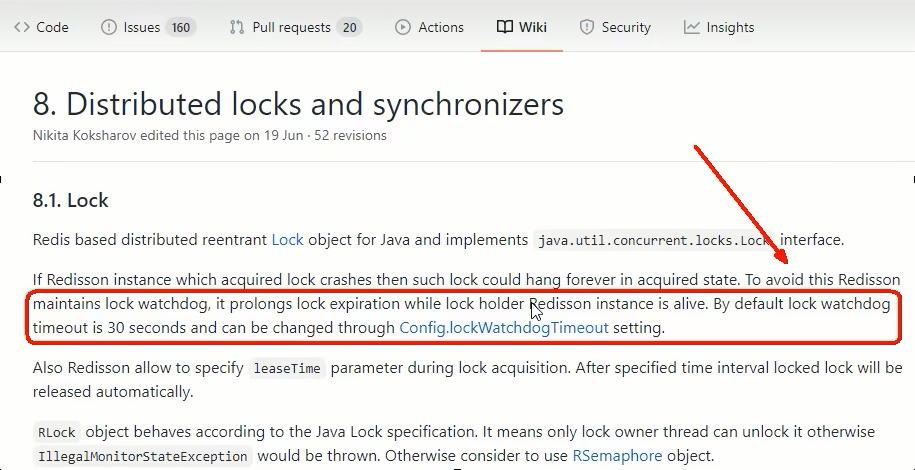
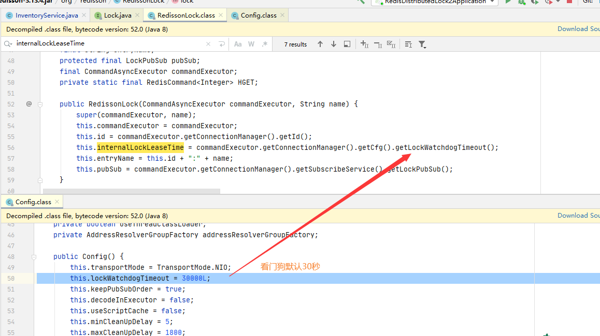
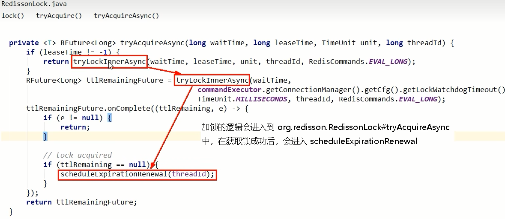
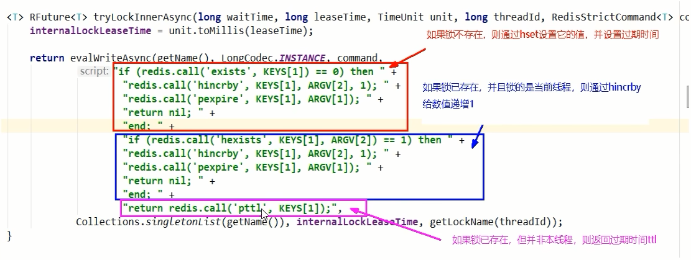
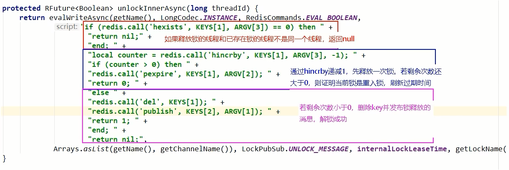

#### 加锁、可重入、续命、解锁

### 分析步骤

- Redis分布式锁过期了，但是业务逻辑还没有处理完怎么办

  需要给对应的key续期

- 守护线程“续命”

  <font color = 'red'>额外起一个线程，定期检查线程是否还持有锁，如果有则延长过期时间</font>；

  Redisson里面就实现了这个方案，使用“看门狗”定期检查（每1/3的锁时间检查1次），如果线程还持有锁，则刷新过期时间。

- 在获取锁成功后，给锁加一个watchdog，watchdog会起一个定时任务，在锁没有被释放且快要过期的时候会续期

  

- 上述源码分析1

  通过Redisson新建出来的锁key，默认是30秒

  

- 上述源码分析2：lock -> tryAcquire -> tryAcquireAsync -> scheduleExpirationRenewal 缓存续期

  

- 上述源码分析3：lock -> tryAcquire -> tryAcquireAsync，锁的可重入性

  通过exists判断，如果锁不存在，则设置值和过期时间，加锁成功

  通过hexists判断，如果锁已存在，并且锁的是当前线程，则证明是重入锁，加锁成功

  如果锁已存在，但锁的不是当前线程，则证明有其他线程持有锁。返回当前锁的过期时间(代表了锁key的剩余生存时间)，加锁失败

  

- 上述源码分析4

  **watch dog自动延期机制：**

  源码中初始化了一个定时器，dely的时间是 internalLockLeaseTime / 3。

  在Redisson中，internalLockLeaseTime 是获取配置的看门狗的时间，默认是30s，也就是每隔10s续期一次，每次重新设置过期时间为30s。

  Redisson看门狗续期源码：

  ```java
  private void renewExpiration() {
      ExpirationEntry ee = EXPIRATION_RENEWAL_MAP.get(getEntryName());
      if (ee == null) {
          return;
      }
  
      Timeout task = commandExecutor.getConnectionManager().newTimeout(new TimerTask() {
          @Override
          public void run(Timeout timeout) throws Exception {
              ExpirationEntry ent = EXPIRATION_RENEWAL_MAP.get(getEntryName());
              if (ent == null) {
                  return;
              }
              Long threadId = ent.getFirstThreadId();
              if (threadId == null) {
                  return;
              }
  
              RFuture<Boolean> future = renewExpirationAsync(threadId);
              future.onComplete((res, e) -> {
                  if (e != null) {
                      log.error("Can't update lock " + getName() + " expiration", e);
                      return;
                  }
  
                  if (res) {
                      // reschedule itself
                      renewExpiration();
                  }
              });
          }
      }, internalLockLeaseTime / 3, TimeUnit.MILLISECONDS);
  
      ee.setTimeout(task);
  }
  ```

  如果直接调用lock方法，客户端A加锁成功，就会启动一个watch dog看门狗，他是一个后台线程，默认是每隔10s检查一下，如果客户端A还持有锁，就会不断的延长锁的时间。当然，如果不想使用看门狗，可以使用其他的lock带参数方法，有锁过期时间，不会有看门狗续期

  **自动续期Lua脚本源码：**

  ```java
  protected RFuture<Boolean> renewExpirationAsync(long threadId) {
      return evalWriteAsync(getName(), LongCodec.INSTANCE, RedisCommands.EVAL_BOOLEAN,
                            "if (redis.call('hexists', KEYS[1], ARGV[2]) == 1) then " +
                            "redis.call('pexpire', KEYS[1], ARGV[1]); " +
                            "return 1; " +
                            "end; " +
                            "return 0;",
                            Collections.singletonList(getName()),
                            internalLockLeaseTime, getLockName(threadId));
  }
  ```

  

- 解锁

  


