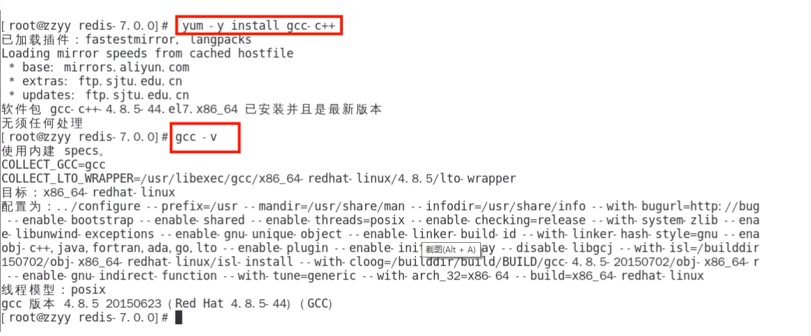

#Redis安装配置

### 1.自行购买云服务器

自己购买阿里云、青牛云、腾讯云或华为云服务器，自带centoOS或者Ubuntu环境，直接开干

### 2.VMware本地虚拟机

通过命令 getconf LONG_BIT查看，它返回结果是多少就是多少位

### 3.redis的安装

window版安装：

下载地址：https://github.com/zkteco-home/redis-windows

####linux版安装：

#####Linux环境安装Redis必须先具备gcc编译环境

​	1.1什么是gcc?

gcc是linux下的一个编译程序，是C程序的编译工具。
GCC(GNU Compiler Collection)是 GNU(GNU's Not Unix) 计划提供的编译器家族，它能够支持 C,C++, Objective-C, Fortran, Java 和Ada 等等程序设计语言前端，同时能路运在 X86，X86-64，IA-64，PowerPC，SPARC和Alpha 等等几乎目前所有的硬件平台上。鉴于这些特征，以及 GCC 编译代码的高效性，使得 GCC 成为绝大多数自由软件开发编译的首选工具。虽然对于程序员们来说，编译器只是一个工具，除了开发和维护人员，很少有人关注编译器的发展，但是 GCC 的影响力是如此之大，它的性能提升甚至有望改善所有的自由软件的运行效率，同时它的内部结构的变化也体现出现代编译器发展的新特征。

​	1.2查看gcc版本

gcc -v

​	1.3安装

·安装redis之前需要具备c++库环境

·yum -y install gcc-c++

·命令案例

##### 版本选择

1.1查看自己redis版本的命令：redis -server -v

1.2安全Bug按照官网提示，升级成为6.0.8及以上

1.3目前建议都需要升级到6.0.8版本以上

1.4本次使用redis7.0

