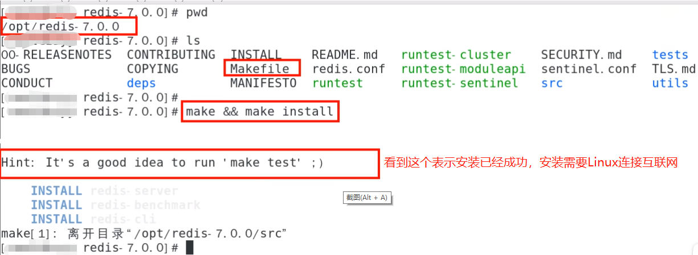
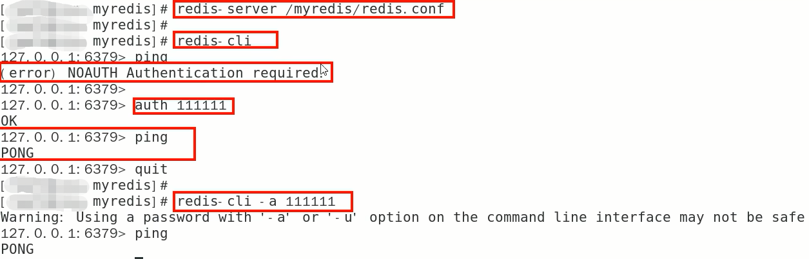
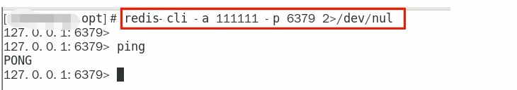

# Redis7安装步骤

1.下载获取redis-7.0.0.tar.gz后将它放入我们的Linux目录/opt

2./opt目录下解压redis，tar -zxvf redis-7.0.0.tar.gz，解压后会多一个redis-7.0.0的文件夹

3进入目录，cd redis-7.0.0

4.在redis-7.0.0目录下执行make命令

5.查看默认安装目录：/usr/local/bin，Linux下的/usr/local类似我们Windows系统的C:\Program Files，安装完成后，去/usr/local/bin下查看

redis-benchmark:性能测试工具，服务启动后运行该命令，看看自己电脑性能如何

redis-check-aof:修复有问题的AOF文件，RDB和AOF后续学习

redis-check-dump:修复有问题的dump.rdb文件

redis-cli:客户端操作入口

redis-sentinel:redis集群使用

reids-server:redis服务器启动命令

6.将默认的redis.conf拷贝到自己定义好的一个路径下，比如/myredis  ，cp redis.conf  /myredis/redis7.conf

$\textcolor{red}{7.修改/myredis目录下redis.conf配置文件做初始化设置}$

redis.conf配置文件，改完后确保生效，$\textcolor{red}{记得重启}$

1默认daemonize no		改为 daemonize yes

2默认protected-mode yes	改为 protected-mode no

3默认bind 127.0.0.1		改为 直接注释掉(默认bind 127.0.0.1只能本机访问)或改成本机IP，否则影响远程IP连接

4默认redis密码 			改为 requirepass 自己设定的密码

8.启动服务

/usr/local/bin目录下运行redis-server命令，启用/myredis目录下的redis.conf配置文件

执行命令：redis-server /myredis/redis7.conf

9.连接服务

redis-cli -a 123456 -p 6379(-a 后面是redis设置的密码)

######备注说明：

Warning: Using a password with '-a' or '-u' option on the command line interface may not be safe.这段警告看着不舒服怎么办?

warning 这串输出并不是普通输出，shell的标准输出包含两种：

1（标准输出）

2（标准错误）我们的命令，即包含1也包含2，2即是我们想要除去的提示

解决办法将标准错误去除即可，追加2>/dev/null，将标准错误丢弃即可，就没有烦人的警告了。

10.Redis端口为什么是6379？

Redis的默认端口是6379，是由手机键盘字母MERZ的位置决定的。MERZ在Antirez的朋友圈语言中是"愚蠢和傻B"的代名词，源于意大利广告女郎Alessia Merz在电视节目上说了一堆愚蠢的话，redis之父对她有"特殊"印象，就给她弄成端口号了

11.关闭Redis服务器

单实例关闭：在Redis服务器外面关闭命令：redis-cli -a 123456 shutdown，如果在Redis服务器里面可以直接使用shutdown命令

多实例关闭，指定端口关闭：redis-cli -p 6379 shutdown