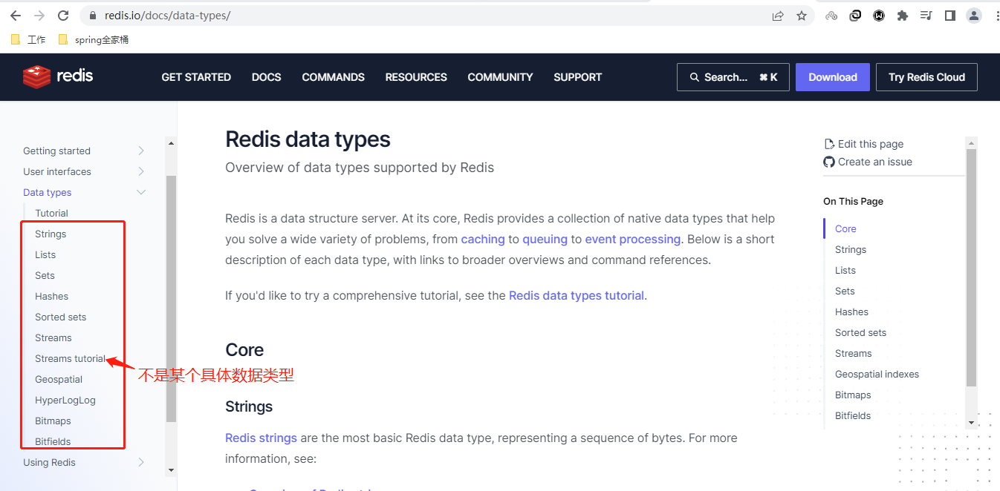
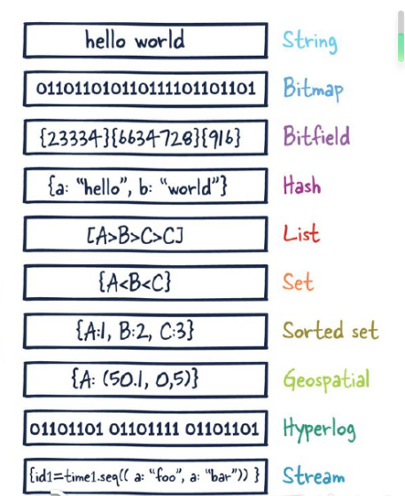
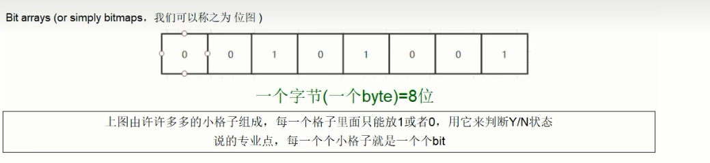

# 10大数据类型

which 10

官网:https://redis.io/docs/data-types/

**提前声明**

这里说的数据类型是value的数据类型，key的类型都是字符串

## 1.redis字符串（String）

String是redis最基本的数据类型，一个key对应一个value。

string类型是二进制安全的，意思是redis的string可以包含任何数据，比如jpg图片或者序列化的对象。

string类型是Redis最基本的数据类型，一个redis中字符串value**最多可以是512M**

## 2.redis列表（List）

Redis列表是最简单的字符串列表，按照插入顺序排序。你可以添加一个元素到列表的$\textcolor{blue}{头部（左边）或者尾部（右边）}$，它的底层实际是个$\textcolor{red}{双端链表}$，最多可以包含2^32-1个元素（4294967295，每个列表超过40亿个元素）

## 3.redis哈希表（Hash）

Redis Hash是一个string类型的field（字段）和value（值）的映射表，Hash特别适合用户存储对象。

Redis中每个Hash可以存储2^32-1个键值对（40多亿）

## 4.redis集合（Set）

Redis的Set是string类型的$\textcolor{red}{无序集合}$。集合成员是唯一的，这就意味着集合中不能出现重复的数据，集合对象的编码可以是intset或者Hashtable。

Redis中Set集合是通过哈希表实现的，所以添加，删除，查找的复杂度都是O(1)。

集合中最大的成员数为2^32-1（4294967295，每个集合可存储40多亿个成员）

## 5.redis有序集合（ZSet）

zset(sorted set：有序集合)

Redis zset和Set一样也是string类型元素的集合，且不允许重复的成员。

$\textcolor{red}{不同的是每个元素都会关联一个double类型的分数}$，redis正是通过分数来为集合中的成员进行从小到大的排序。

$\textcolor{red}{zset的成员是唯一的，但是分数（score）却可以重复。}$

$\textcolor{red}{zset集合是通过哈希表实现的，所以添加，删除，查找的复杂度都是O(1)。集合中最大的成员数是2^.32-1}$

## 6.redis地理空间（GEO）

Redis GEO主要用于存储地理位置信息，并对存储的信息进行操作，包括：

添加地理位置的坐标。

获取地理位置的坐标。

计算两个位置之间的距离。

根据用户给定的经纬度坐标来获取指定范围内的地址位置集合。

## 7.redis基数统计（HyperLogLog）

HyperLogLog是用来做$\textcolor{red}{基数统计}$的算法，HyperLogLog的优点是，在输入元素的数量或者体积非常非常大时，计算基数所需要的空间总是固定且是很小的。

在Redis里面，每个HyperLogLog键只需要花费12KB内存，就可以计算接近2^64个不同元素的基数。这和计算基数时，元素越多耗费内存就越多的集合形成鲜明对比。

但是，因为HyperLogLog只会根据输入元素来计算基数，而不会存储输入元素本身，所以HyperLogLog不能像集合那样，返回输入的各个元素。

## 8.redis位图（bitmap）

由0和1状态表现的二进制位的bit数组

## 9.redis位域（bitfield）

通过bitfield命令可以一次性操作多个$\textcolor{red}{比特位域(指的是连续的多个比特位)}$，它会执行一系列操作并返回一个响应数组，这个数组中的元素对应参数列表中的相应的执行结果。

说白了就是通过bitfield命令我们可以一次性对多个比特位域进行操作。

## 10.redis流（Stream）

Redis Stream是Redis5.0版本新增加的数据结构。

Redis Stream主要用于消息队列（MQ，Message Queue），Redis本身就是一个Redis发布订阅（pub/sub）来实现消息队列的功能，但它有个缺点就是消息无法持久化，如果出现网络断开、Redis宕机等，消息就会被丢弃。

简单来说发布订阅（pub/sub）可以分发消息，但无法记录历史消息。

而Redis Stream提供了消息的持久化和主备复制功能，可以让任何客户端访问任何时刻的数据，并且能记住每一个客户端的访问位置，还能保证消息不丢失。

$\textcolor{red}{redis常见数据类型操作命令}$

官网英文： https://redis.io/commands/

中文：http://www.redis.cn/commands.html

