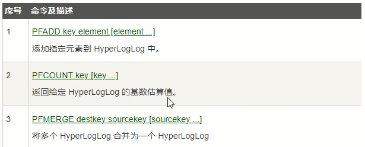
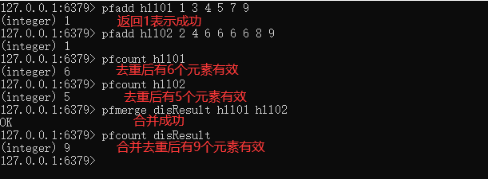

# Redis基数统计(HyperLogLog)

### 看需求：

用户搜索网站关键词的数量

统计用户每天搜索不同词条个数

统计某个网站的UV、统计某个文章的UV

什么是UV？

Unique Visitor，独立访客，一般理解为客户端IP，**需要去重考虑**

### 是什么

去重复统计功能的基数估计算法-就是HyperLogLog

```tex
Redis在2.8.9版本添加了HyperLogLog 结构。
Redis HyperLogLog是用来做基数统计的算法，HyperLogLog 的优点是，在输入元素的数量或者体积非常非常大时，计算基数所需的空间总是固定的、并且是很小的。
在Redis里面，每个 HyperLogLog键只需要花费12KB内存，就可以计算接近2^64个不同元素的基数。这和计算基数时，元素越多耗费
内存就越多的集合形成鲜明对比。
但是，因为HyperLogLog只会根据输入元素来计算基数，而不会储存输入元素本身，所以HyperLogLog不能像集合那样，返回输入的各个元素。
```

**基数**：是一种数据集，去重复后的真实个数

```tex
(全集)={2,4,6,8,77,39,4,8,10}
去掉重复的内容
基数={2,4,6,8,77,39,10} = 7
```

基数统计：用于统计一个集合中不重复的元素个数，就是对集合去重复后剩余元素的计算。

一句话：去重脱水后的真实数据

基本命令：







