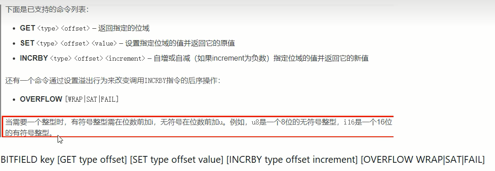
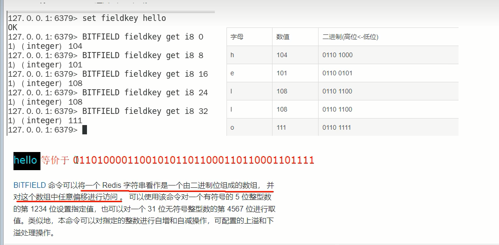
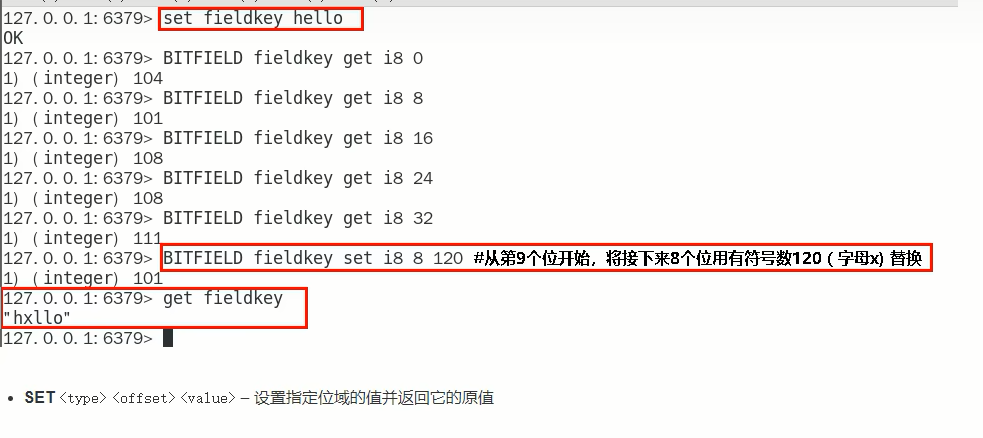
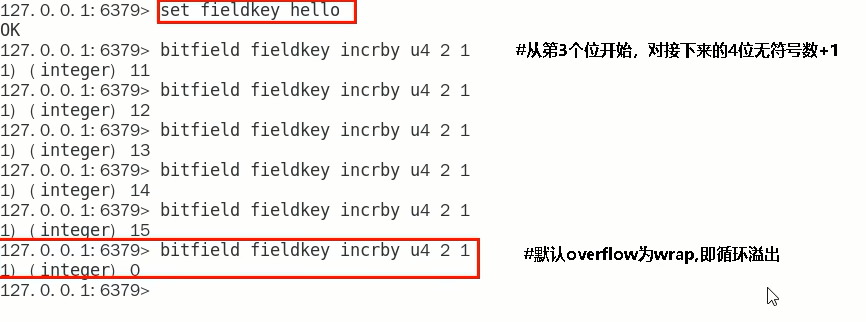
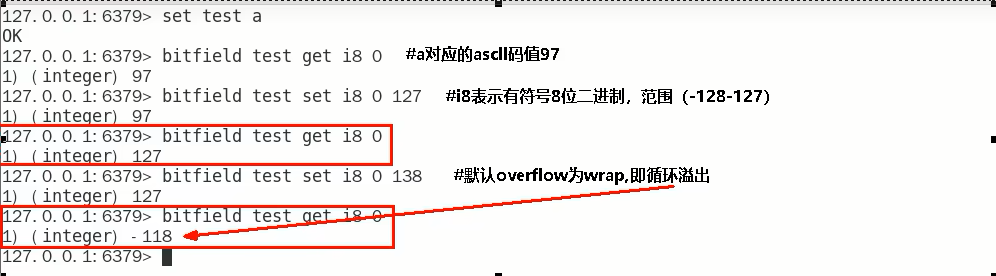
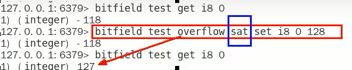
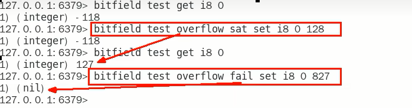

# Redis位域(bitfield)

## 能干嘛

位域修改、溢出控制

## 一句话

将一个redis字符串看作是**一个由二进制位组成的数组**并能对变长位宽和任意没有字节对齐的指定整型位域进行寻址和修改

# 命令代码实操

Ascii码表：https://ascii.org.cn

### 1.BITFIELD key [GET type offset]

### 2.BITFIELD key set type offstet value

### 3.BITFIELD key [INCRBY type offset increment]

如果偏移量后面的值发生溢出（大于127），redis对此也有对应的溢出控制，默认情况下，INCRBY使用WRAP参数

### 4.溢出控制 OVERFLOW [WRAP|SAT|FAIL]

WRAP:使用回绕(wrap around)方法处理有符号整数和无符号整数溢出情况

SAT:使用饱和计算(saturation arithmetic)方法处理溢出，下溢计算的结果为最小的整数值，而上溢计算的结果为最大的整数值

fail:命令将拒绝执行那些会导致上溢或者下溢情况出现的计算，并向用户返回空值表示计算未被执行

