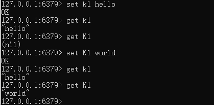
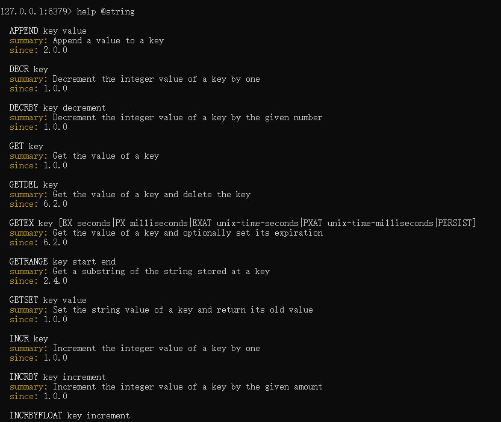

# 数据类型命令及落地运用

英文：https://redis.io/commands/

中文：http://www.redis.cn/commands.html

**备注：**

1.$\textcolor{blue}{命令不区分大小写，而key是区分大小写的}$

2.永远的帮助命令，help @类型

help @string

help @list

help @hash

help @hyperloglog

