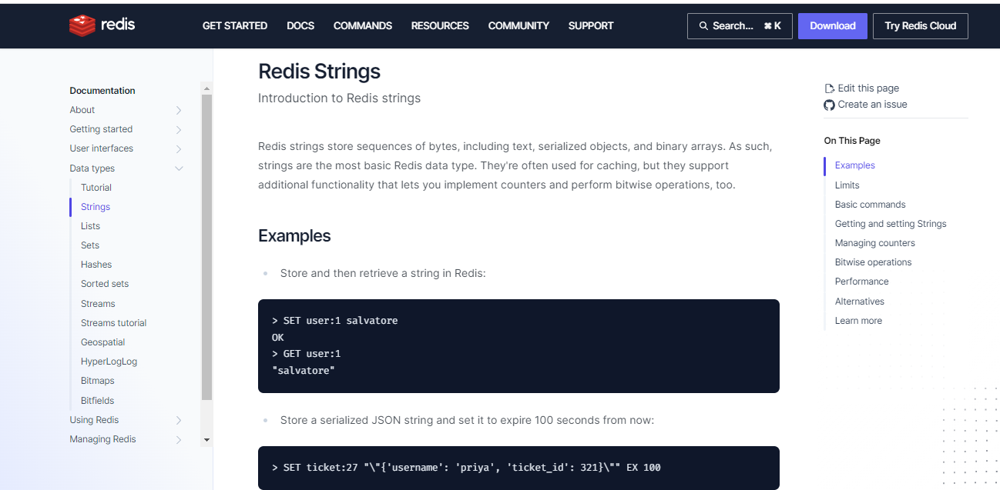
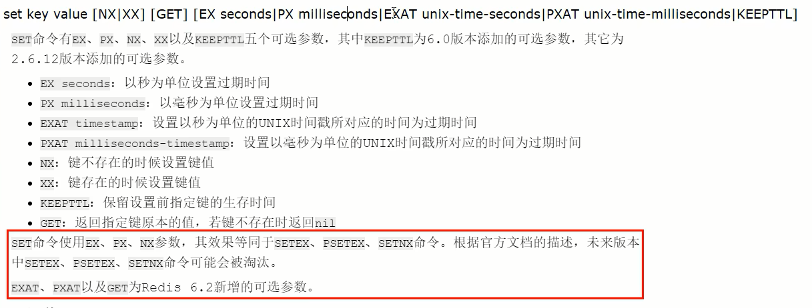
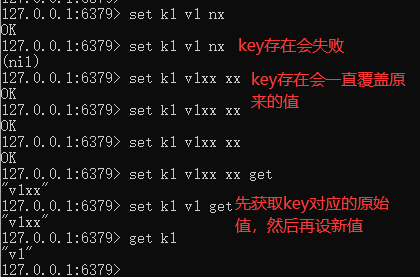
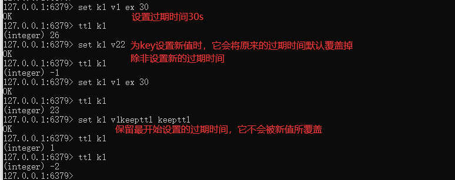
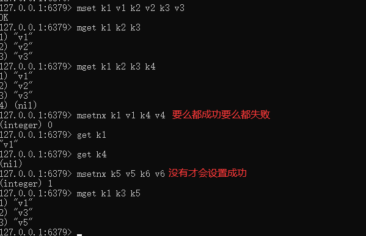
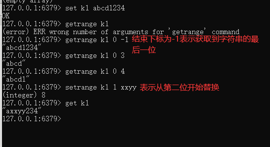
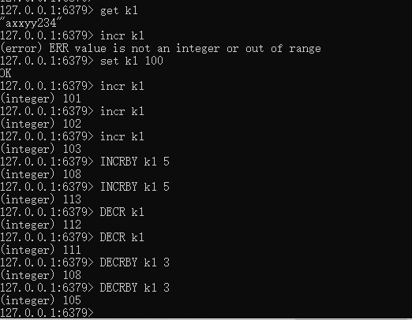
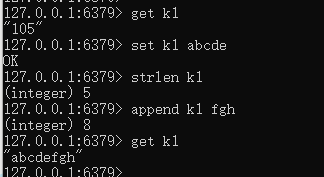
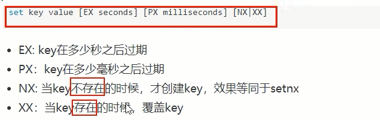
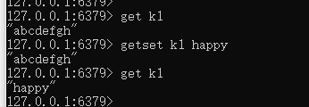

# Redis字符串(String)

官网：https://redis.io/docs/data-types/strings/



单值单value

案例：

### 1.$\textcolor{red}{最 常 用：set \quad key \quad value  }$ |  get key



**返回值：**

设置成功则返回OK，返回nil为未执行Set命令，如不满足NX，XX条件等。

若使用GET参数，则返回该键原来的值，或在键不存在时nil。



如何获得设置指定的key过期的Unix时间，单位为秒

```java
System.out.println(Long.toString(System.currentTimeMillis()/1000L));
```



### 2.同时设置/获取多个键值

MSET key value [key value...]

MGET key [key ...]

mset/mget/msetnx



### 3.获取指定区间范围内的值

getrange/setrange



### 4.数值增减

$\textcolor{red}{一定要是数据才能进行加减}$

递增数字：INCR key

增加指定的整数：INCRBY key increment

递减数值：DECR key

减少指定的整数：DECRBY key decrement



### 5.获取字符串长度和内容追加

获取字符串长度：strlen key

字符串内容追加：append key value



### 6.分布式锁

setnx key value

setex(set with expire)键秒值/setnx(set if not exist)



### 7.getset(先get再set)

getset：将给定key的值设为value，并返回key的旧值(old value)。

简单一句话：先get然后立即set




