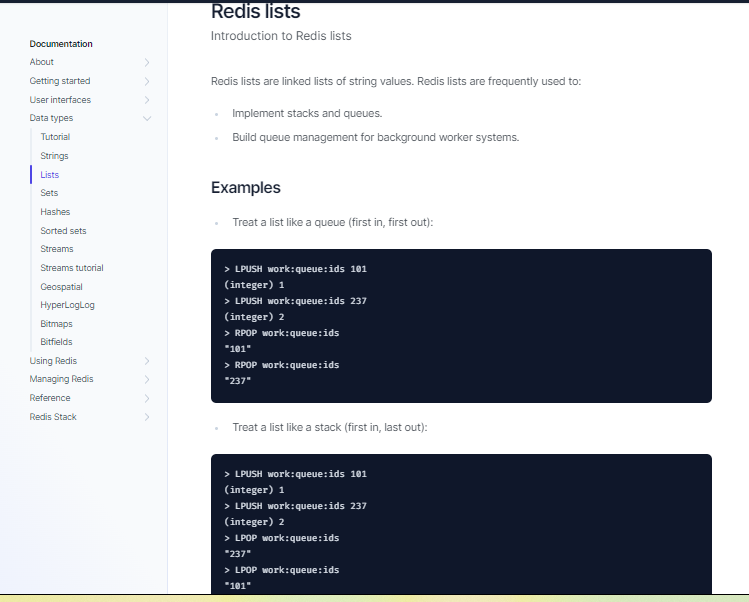
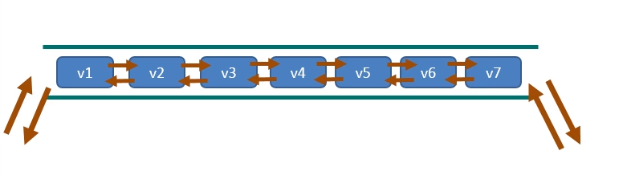
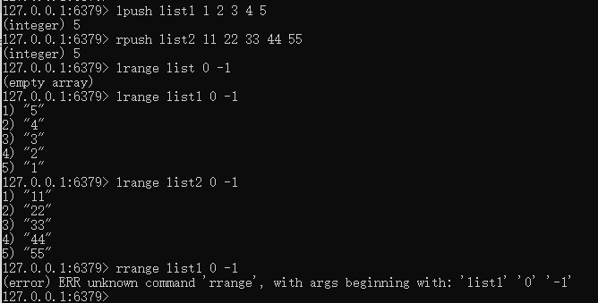
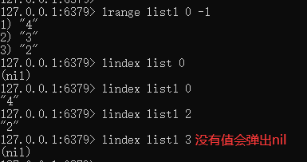
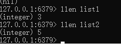
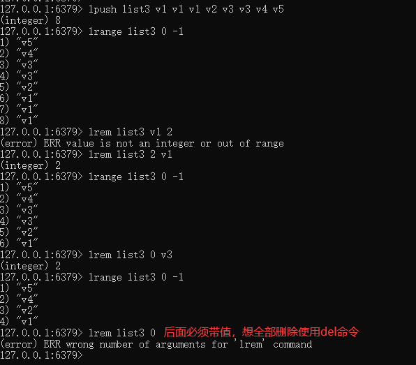
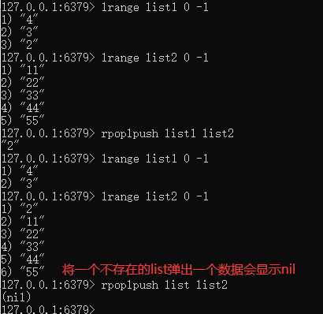
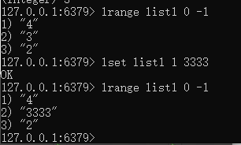
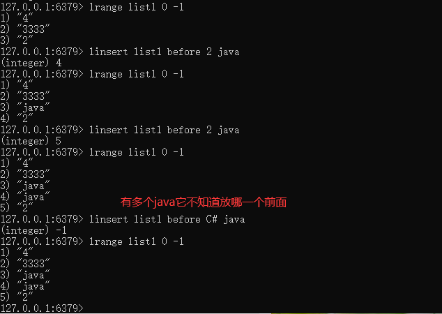

# Redis列表(List)

**单key多value**

简单说明：$\textcolor{red}{一个双端链表的结构}$，容量是2的32次方减1个元素大概40多亿，主要功能有push/pop等，一般用在栈、队列、消息队列等场景。left、right都可以插入添加；

如果键不存在，创建新的链表；

如果键已存在，新增内容；

如果值全移除，对应的键也就消失了

$\textcolor{green}{它的底层实际上就是个双向链表，对两端的作性能很高，通过索引下标的操作中间的节点性能会较差}$

案例：

### 1.lpush/rpush/lrange      注：**没有rrange**

### 2.lpop/rpop

### 3.lindex，按照索引下标获得元素（从上到下）

### 4.llen,获取List列表中元素的个数

### 5.lrem key 数字N 给定值v1

解释：删除N个值等于v1的元素

从left往right删除2个值等于v1的元素，返回的值为实际删除的数量

LREM list3 0 值，表示删除全部给定的值，$\textcolor{red}{零个就是全部值}$

### 6.ltrim key 开始index 结束index

截取指定范围的值后在赋值给key

### 7.rpoplpush 源列表  目的列表

移除列表的最后一个元素，并将该元素添加到另一个列表并返回

### 8.lset key index value

让指定数组集合的小标位置值替换成新值

### 9.linsert key before/after 已有值 插入的新值

