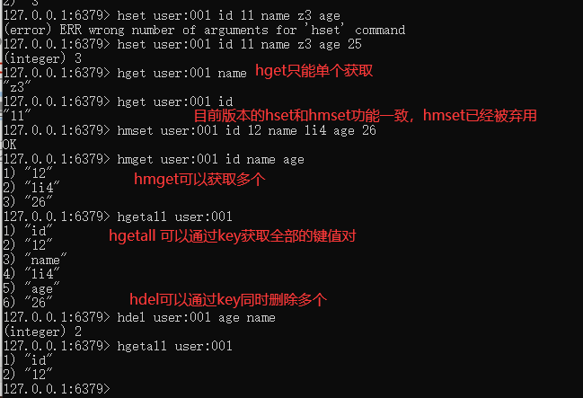
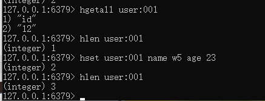
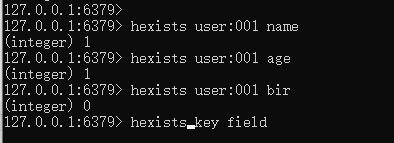
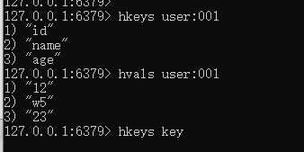
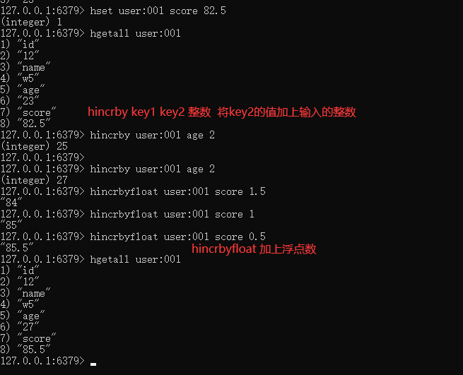
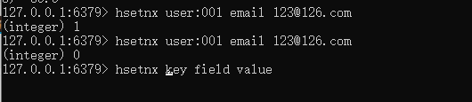

# Redis哈希(Hash)

KV模式不变，但V是一个键值对  Map<String, Map<Object, Object>>

案例：

###$\textcolor{red}{1.hset/hget/hmset/hmget/hgetall/hdel}$

### 2.hlen

获取某个key内的全部数量

###3.hexists key 在key里面的某个值的key

### $\textcolor{red}{4.hkeys/hvals}$

hkeys key 查询出所有key对应的子key值

hvals key 查询出所有key对应的子key的value值

### 5.hincrby/hincrbyfloat

### 6.hsetnx

不存在赋值，存在了无效

