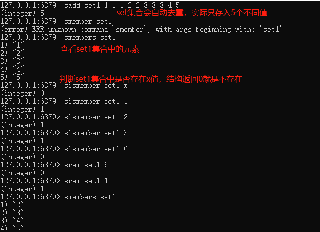
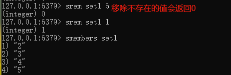
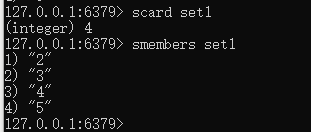
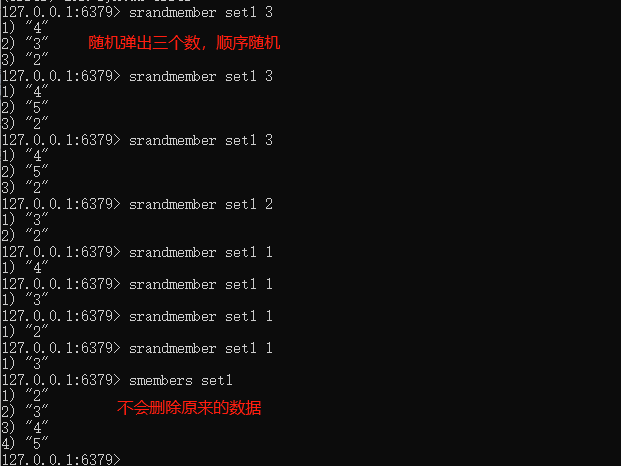
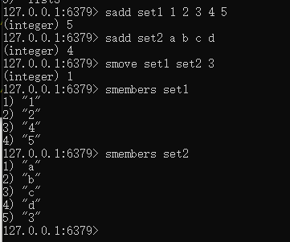
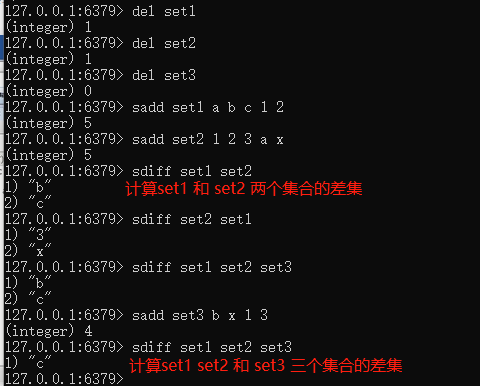
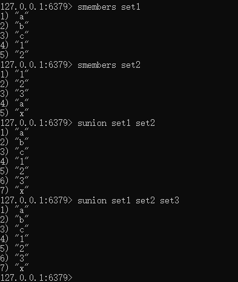
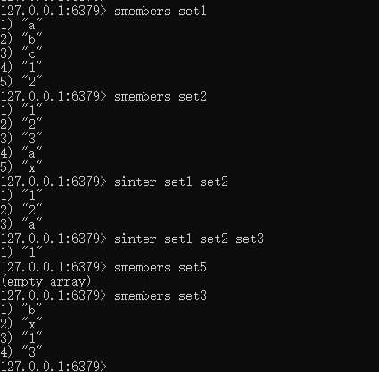
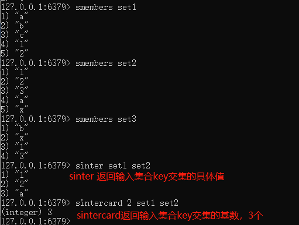
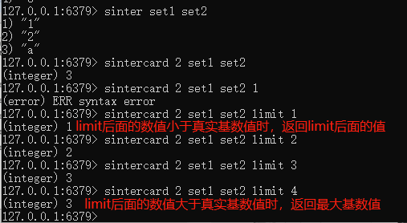

# Redis集合(Set)

单值多value，且无重复

案例：

### 1.SADD key member [member ...] 

添加元素，可以多次向同一个key中设置不同值，不会覆盖之前的值

### 2.SMEMBERS key 

遍历集合中的所有元素

### 3.SISMEMBER key member

判断元素是否在集合中

### 4.SREM key member [member ...]

删除元素

### 5.scard

获取集合里面的元素个数

### 6.SRANDMEMBER key [数字]

从集合中随机$\textcolor{red}{展现设置的数字个数}$元素，元素不删除

### 7.SPOP key [数字] 

从集合中随机$\textcolor{red}{弹出}$一个元素，出一个删除一个

### 8. smove key1 key2

将key1里已存在的某个值赋给key2

### 9.集合运算-集合的差集运算A-B

属于A但是不属于B的元素构成的集合

SDIFF key [key ...]，可以计算多个元素的差集

### 10.集合运算-集合的并集运算A∪B

属于A或者属于B的元素构成的集合

SUNION key [key ...]

### 11.集合运算-集合的交集运算A∩B

属于A同时也属于B的共同拥有的元素构成的集合

SINTER key [key ...]

**SINTERCARD numkeys key 【key ...】【LIMIT limit】**

numkeys 的具体值由输入的key个数决定

SINTERCARD 为redis7新命令，它不返回结果集，而是返回结果的基数。返回由所有给定集合的交集产生的集合的基数

基数的词语解释: 用于表示事物个数的数

