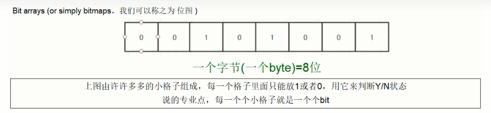
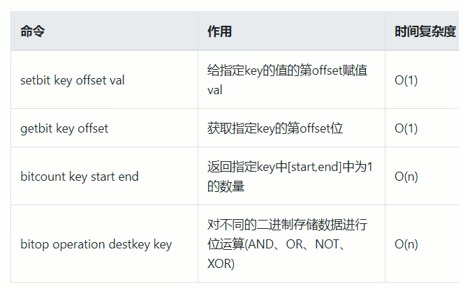
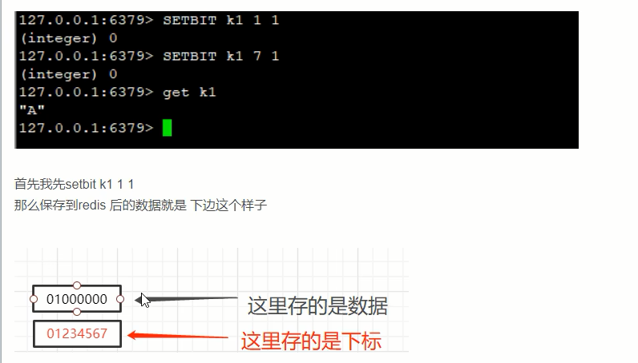
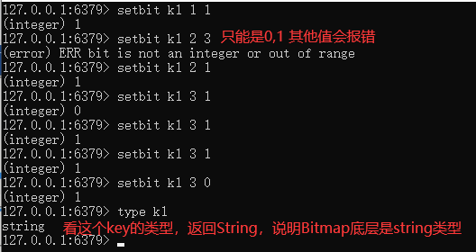
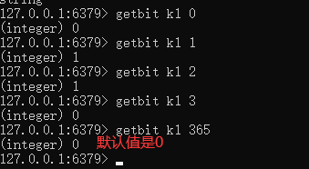
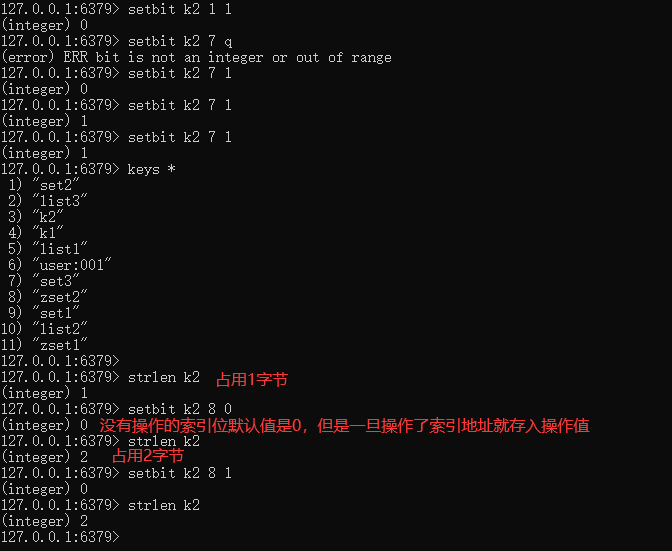
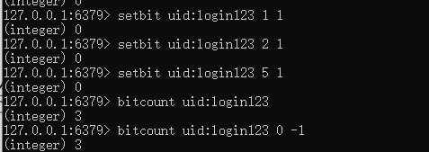
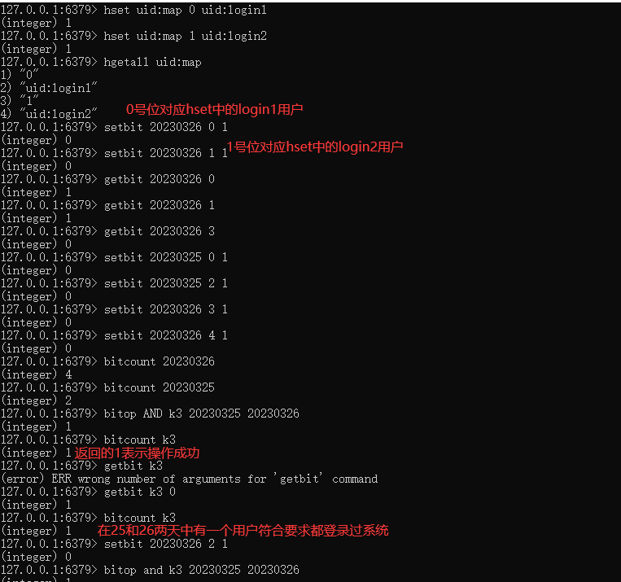

# Redis位图(bitmap)

一句话：由0和1状态表现的二进制位的bit数组

### 看需求：

1. 用户是否登陆过Y、N，比如软件的每日签到功能
2. 电影、广告是否被点击播放过
3. 钉钉打卡上下班，签到统计

### 是什么?

说明：$\textcolor{red}{用String类型作为底层数据结构实现的一种统计二值状态的数据类型}$

$\textcolor{red}{位图本质是数组}$，它是基于String数据类型的按位的操作。该数组由多个二进制位组成，每个二进制位都对应一个偏移量（我们称之为一个索引）。

Bitmap支持的最大位数是2^32位，它可以极大的节约存储空间，使用512M内存就可以存储多达42.9亿的字节信息(2^32=4294967296)

### 能干嘛？

用于状态统计，Y、N类似AtomicBoolean

### 基本命令

### 1.setbit key offset value

setbit 键偏移位 只能零或者1

**Bitmap的偏移量从零开始计算的**

### 2.getbit key offset

获取键偏移位的值

### 3.strlen key

统计字节数占用多少

不是字符串长度而是占据几个字节，超过8位后自己按照8位一组**一byte**再扩容

### 4.bitcount key [start end [byte|bit]] 

全部键里面包含有1的有多少个

### 5.bitop operation(AND|OR|XOR|NOT) destkey key [key ...]

案例：连续2天都签到的用户数量

假如某个网站或者系统，它的用户有1000W，我们可以使用redis的HASH结构和bitmap结构做个用户id和位置的映射

