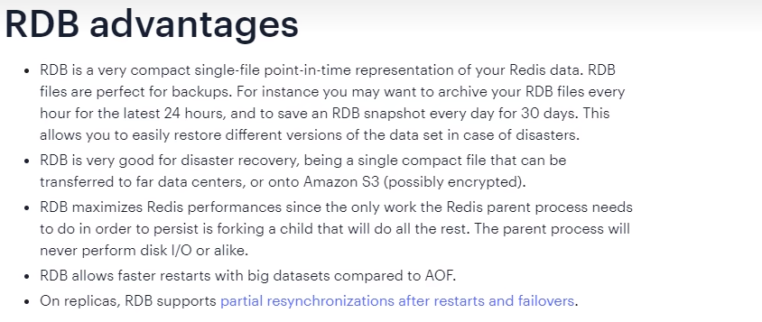
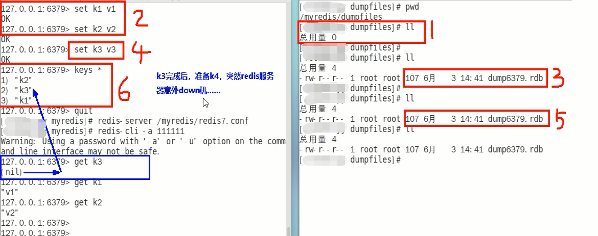

# RDB优劣

### 优势

官网说明：

- RDB是Redis 数据的一个非常紧凑的单文件时间点表示。RDB文件非常适合备份。例如，您可能希望在最近的24小时内每小时归档一次RDB文件，并在30天内每天保存一个RDB快照。这使您可以在发生灾难时轻松恢复不同版本的数据集。
- RDB非常适合灾难恢复，它是一个可以传输到远程数据中心或Amazon S3(可能已加密）的压缩文件。
- RDB最大限度地提高了Redis 的性能，因为Redis 父进程为了持久化而需要做的唯一工作就是派生一个将完成所有其余工作的子进程。父进程永远不会执行磁盘I/О或类似操作。
- 与AOF 相比，RDB允许使用大数据集更快地重启。
- 在副本上，RDB支持重启和故障转移后的部分重新同步。

小总结：

- 适合大规模的数据恢复
- 按照业务定时备份
- 对数据完整性和一致性要求不高
- RDB文件在内存中的加载速度要比AOF快很多

### 劣势

官网说明：

- 如果您需要在Redis停止工作时（例如断电后）将数据丢失的可能性降到最低，那么RDB并不好。您可以配置生成RDB的不同保存点（例如，在对数据集至少5分钟和100次写入之后，您可以有多个保存点)。但是，您通常会每五分钟或更长时间创建一次RDB快照，因此，如果Redis由于任何原因在没有正确关闭的情况下停止工作，您应该准备好丢失最新分钟的数据。
- RDB需要经常fork()以便使用子进程在磁盘上持久化。如果数据集很大，fork()可能会很耗时，并且如果数据集很大并且CPU性能不是很好，可能会导致Redis停止为客户端服务几毫秒甚至一秒钟。AOF也需要fork()但频率较低，您可以调整要重写日志的频率，而不需要对持久性进行任何权衡。

小总结：

- 在一定间隔时间做一次备份，所以如果redis意外down掉的话，就会丢失从当前至最近一次快照期间的数据，**快照之间的数据会丢失**
- 内存数据的全量同步，如果数据量太大会导致IO严重影响服务器性能
- RDB依赖于主进程的fork，在更大的数据集中，这可能会导致服务请求的瞬间延迟。fork的时候内存中的数据被克隆了一份，大致2倍的膨胀性，需要考虑

模拟数据丢失：

