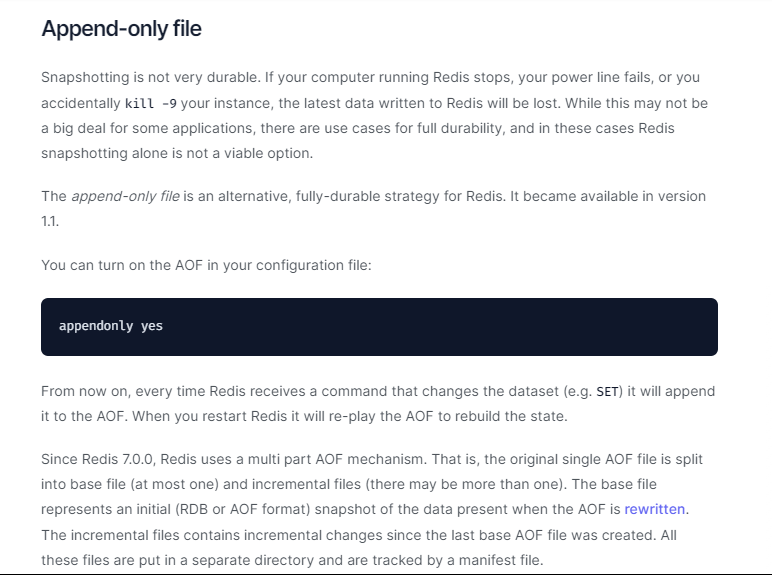
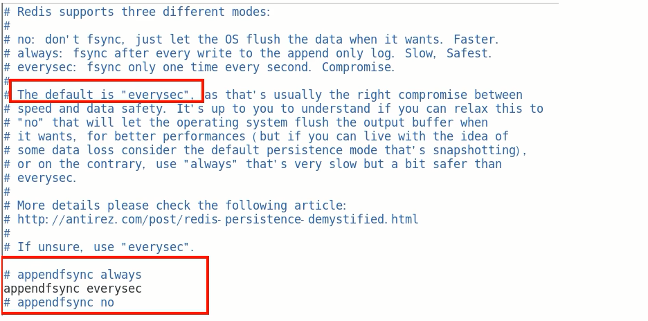
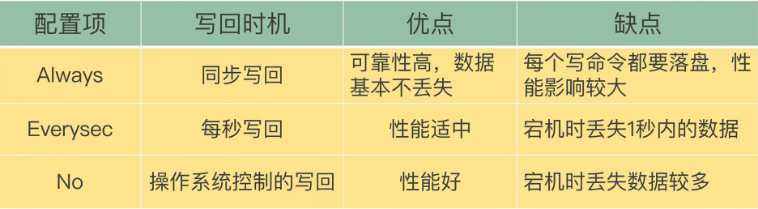

# AOF(Append Only File)

### 官网介绍

### 是什么

$\textcolor{red}{以日志的形式来记录每个写操作}$，将Redis执行过的所有写指令记录下来(读操作不记录)，只许追加文件但是不可以改写文件，redis启动之初会读取该文件重新构建数据，换言之，redis重启的话就根据日志文件的内容将写指令从前到后执行一次以完成数据的恢复工作

默认情况下，redis是没有开启AOF的。开启AOF功能需要设置配置：appendonly yes

### 能干嘛

AOF保存的是appendonly.aof文件

### AOF持久化工作流程

1.Client作为命令的来源，会有多个源头以及源源不断的请求命令。

2.在这些命令到达Redis Server 以后并不是直接写入AOF文件，会将其这些命令先放入AOF缓存中进行保存。这里的AOF缓冲区实际上是内存中的一片区域，存在的目的是当这些命令达到一定量以后再写入磁盘，避免频繁的磁盘IO操作。

3.AOF缓冲会根据AOF缓冲区**同步文件的三种写回策略**将命令写入磁盘上的AOF文件。

4.随着写入AOF内容的增加为避免文件膨胀，会根据规则进行命令的合并(**又称AOF重写**)，从而起到AOF文件压缩的目的。

5.当Redis Server服务器重启的时候会队AOF文件载入数据。

### AOF缓冲区三种写回策略

**ALways**：同步写回，每个写命令执行完立刻同步地将日志写会磁盘

**everysec**：每秒写回，每个写命令执行完，只是先把日志写到AOF文件的内存缓冲区，每隔1秒把缓冲区中的内容写入到磁盘

**no**：操作系统控制的写回，每个写命令执行完，只是先把日志写到AOF文件的内存缓冲区，由操作系统决定何时将缓冲区内容写回磁盘

小总结：

