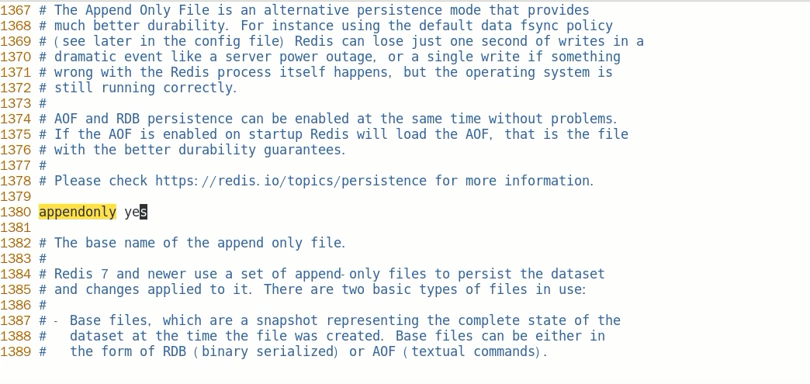
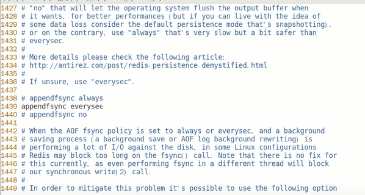
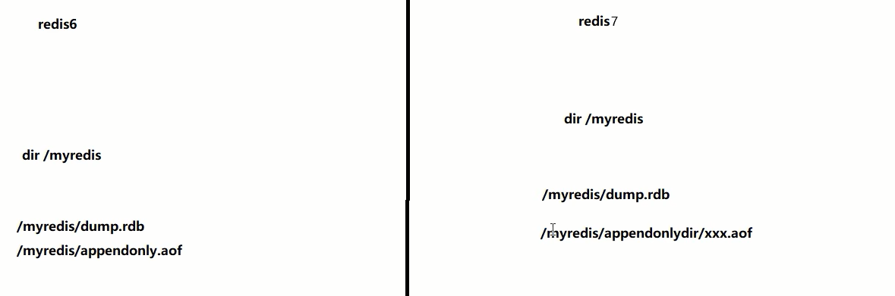
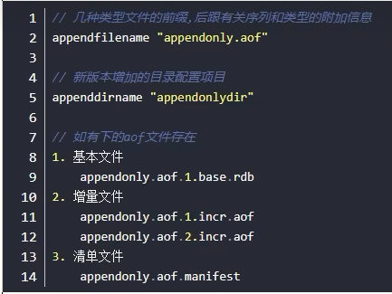
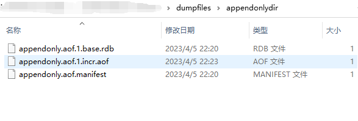
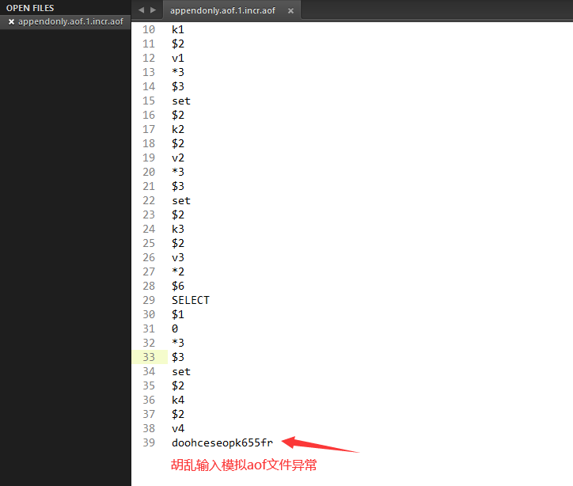
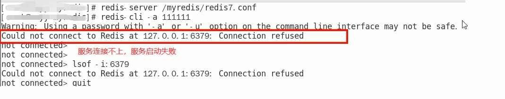
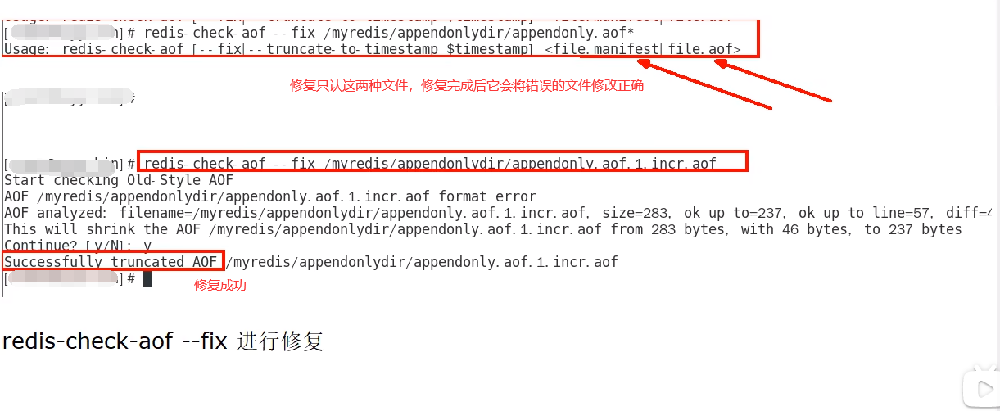
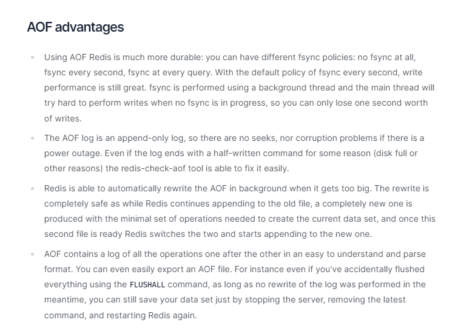
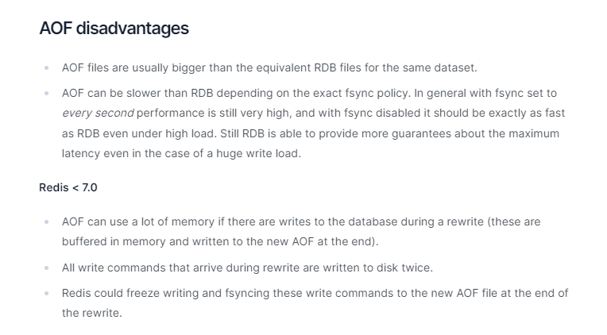

# AOF案例演示和优劣对比

### 配置文件说明 (6 VS 7)

#### 如何开启aof

#### 使用默认写回策略

#### aof文件-保存路径

- redis6及以前

  AOF保存文件的位置和RDB保存文件的位置一样，都是通过redis.conf配置文件的dir配置

.jpg)

- redis7最新

.jpg)

**一句话：**

#### aof文件-保存名称

- redis6及以前 ，有且仅有一个

.jpg)

- Redis7 Multi Part AOF的设计

从1个文件到3个文件

.jpg)

**MP-AOF实现**
**方案概述**
顾名思义，MP-AOF就是将原来的单个AOF文件拆分成多个AOF文件。在MP-AOF中，我们将AOF分为三种类型,
分别为:

- **BASE: 表示基础AOF**，它一般由子进程通过重写产生，该文件最多只有一个。

- **INCR:表示增量AOF**，它一般会在AOFRW开始执行时被创建，该文件可能存在多个。

- **HISTORY**:表示历史AOF，它由BASE和INCR AOF变化而来，每次AOFRW成功完成时，本次AOFRW之前对应的BASE和INCR AOF都将变为HISTORY，HISTORY类型的AOF会被Redis自动删除。

为了管理这些AOF文件，我们引入了一个manifest (清单)文件来跟踪、管理这些AOF。同时，为了便于AOF备份和拷贝，我们将所有的AOF文件和manifest文件放入一个单独的文件目录中，目录名由appenddirname配置(Redis 7.0新增配置项)决定。

Redis7.0config 中对应的配置项

### 正常恢复

1. 修改默认的appendonly no，改为yes
2. 写操作继续，生成aof文件到指定目录（然后将appendonly文件备份，使用flushdb+shutdown服务器来模拟redis宕机数据丢失，删除生成的新aof文件，将备份文件恢复）
   
3. 恢复：重启redis然后重新加载，结果OK，将数据重新写入到了redis

### 异常恢复

1. 故意胡乱改动正常的AOF文件，模拟网络闪断文件写入不完整等其他异常情况
   
2. 重启Redis之后就会进行AOF文件的载入
   
3. 异常修复命令：redis-check-aof --fix进行修复
   
4. 启动后OK

### 优势

更好的保护数据不丢失、性能高、可做紧急恢复

- 使用AOF Redis 更加持久: 您可以有不同的fsync 策略: 根本不fsync、每秒 fsync、每次查询时fsync。使用每秒fsync的默认策略，写入性能仍然很棒。fsync 是使用后台线程执行的，当没有fsync正在进行时，主线程将努力执行写入，因此您只能丢失一秒钟的写入。
- AOF 日志是一个仅附加日志，因此不会出现寻道问题，也不会在断电时出现损坏问题。即使由于某种原因(磁盘已满或其他原因) 日志以写一半的命令结尾，redis-check-aof 工具也能够轻松修复它。
- 当AOF 变得太大时，Redis 能够在后台自动重写AOF。重写是完全安全的，因为当 Redis继续附加到旧文件时，会使用创建当前数据集所需的最少操作集生成一个全新的文件，一旦第二个文件准备就绪，Redis 就会切换两者并开始附加到新的那一个。
- AOF以易于理解和解析的格式依次包含所有操作的日志。您甚至可以轻松导出AOF文件。例如，即使您不小心使用孩FLUSHALL命令刷新了所有内容，只要在此期间没有执行日志重写，您仍然可以通过停止服务器、删除最新命令并重新启动 Redis 来保存您的数据集。

### 劣势

相同数据集的数据而言AOF文件要远大于RDB文件，恢复速度慢于RDB

AOF运行效率要慢于RDB，每秒同步策略效率较好，不同步效率和RDB相同

- AOF文件通常比相同数据集的等效 RDB 文件大。
- 根据确切的 fsync策略，AOF可能比 RDB 慢。一般来说，将fsync 设置为每秒性能仍然非常高，并且在禁用 fsync的情况下，即使在高负载下它也应该与 RDB 一样快。即使在巨大的写入负载的情况下，RDB仍然能够提供关于最大延迟的更多保证。

