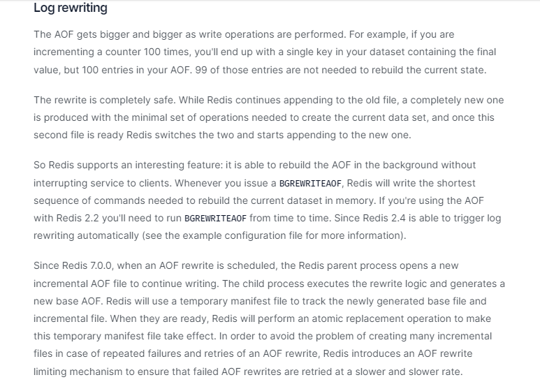
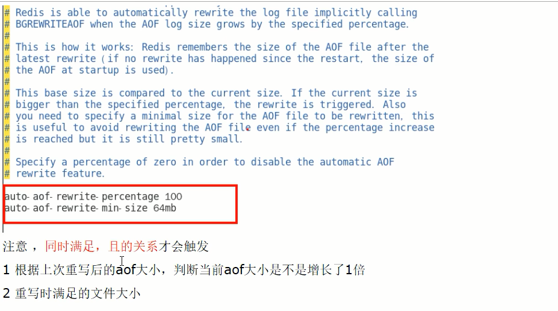

# AOF重写机制

### 是什么？

由于AOF持久化是Redis不断将写命令记录到 AOF 文件中，随着Redis不断的进行，AOF 的文件会越来越大,文件越大，占用服务器内存越大以及 AOF 恢复要求时间越长。
为了解决这个问题，**Redis新增了重写机制**，当AOF文件的大小超过所设定的峰值时，Redis就会**自动**启动AOF文件的内容压缩.只保留可以恢复数据的最小指令集或者可以**手动使用命令 bgrewriteaof 来重新**。

一句话：启动AOF文件的内容压缩，只保留可以恢复数据的最小指令集。

### 触发机制

- **官网默认配置**

- **自动触发**

满足配置文件中的选项后，Redis会记录上次重写时的AOF大小默认配置是当AOF文件大小是上次rewrite后大小的一倍且文件大于64M时

- **手动触发**

客户端向服务器发送bgrewriteaof命令

案例说明

