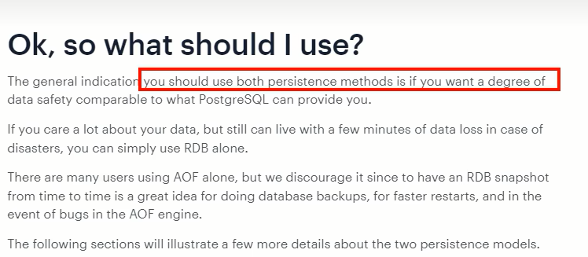
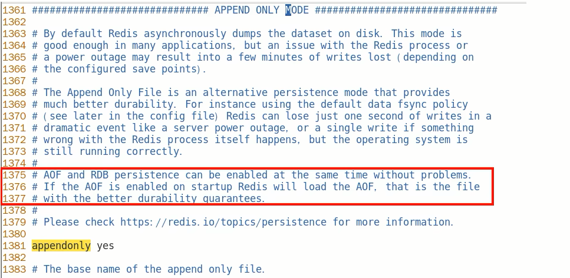
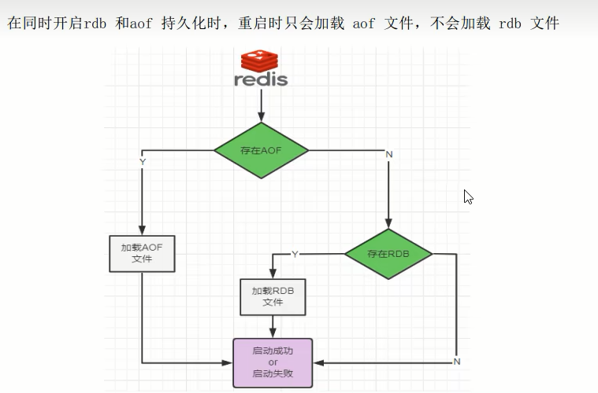
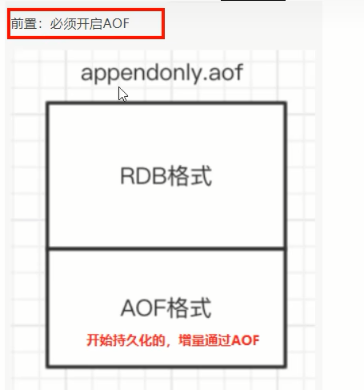

# RDB-AOF混合持久化

### 官网建议

### RDB VS AOF

**问题：**

可否共存？

如果共存听谁的？

**Redis配置文档解答：RDB和AOF共存时会优先加载AOF文件**

**$\textcolor{red}{数据恢复顺序和加载流程}$**

### 你怎么选？用哪个？

- RDB持久化方式能够在指定的时间间隔对你的数据进行快照存储。
- AOF持久化方式记录每次对服务器写的操作，当服务器重启的时候会重新执行这些命令来恢复原始的数据，AOF命令以redis协议追加保存每次写的操作到文件末尾。

### 同时开启两种持久化方式

- 在这种情况下，$\textcolor{red}{当redis重启的时候会优先载入AOF文件来恢复原始的数据}$，因为在通常情况下AOF文件保存的数据集要比RDB文件保存的数据集要完整。
- RDB的数据不实时，同时使用两者时服务器重启也只会找AOF文件。但是作者也不建议只使用AOF方式备份，因为RDB更适合用于备份数据库（AOF在不断的变化不好备份），留着RDB作为一个万一的手段。

### 推荐方式

RDB+AOF混合方式

1开启混合方式设置
$\textcolor{red}{设置aof-use-rdb-preamble的值为yes， yes表示开启，设置为no表示禁用}​$
2 RDB+AOF的混合方式--------->结论:RDB镜像做全量持久化，AOF做增量持久化
先使用RDB进行快照存储，然后使用AOF持久化记录所有的写操作，当重写策略满足或手动触发重写的时候，将最新的数据存储为新的RDB记录。这样的话，重启服务的时候会从RDB和AOF两部分恢复数据，既保证了数据完整性，又提高了恢复数据的性能。简单来说:混合持久化方式产生的文件一部分是RDB格式，一部分是AOF格式。----》AOF包括了RDB头部+AOF混写

