# 怎么玩

官网 ：https://redis.io/docs/manual/transactions/

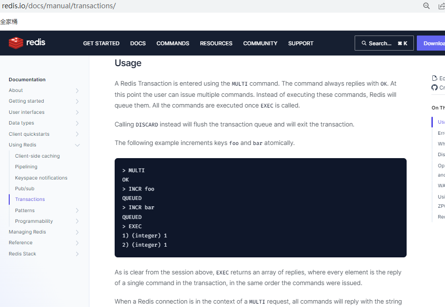

### 常用命令

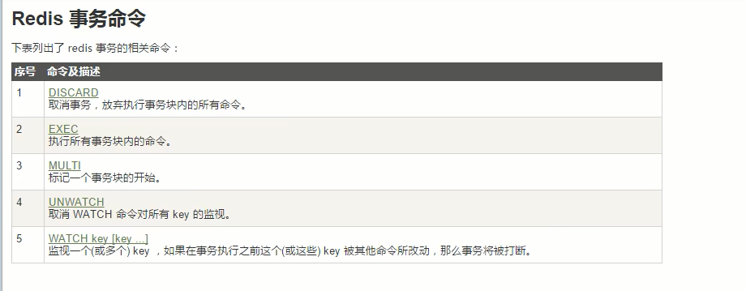

### case1：正常执行 MULTI EXEC

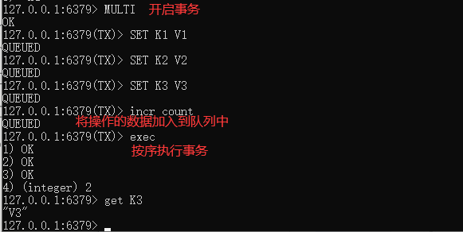

### case2：放弃事务 MULTI DISCARD

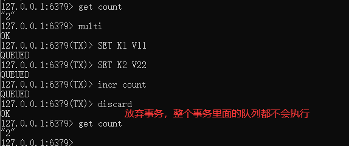

### case3：全体连坐

官网说明：

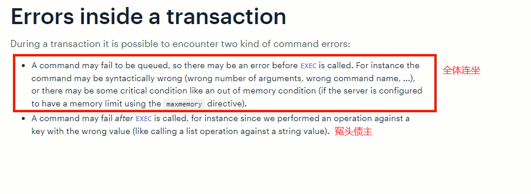

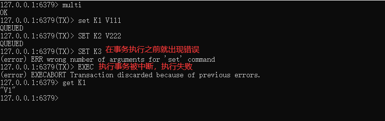

一个语法出错，全体连坐。如果任何一个命令语法有错，Redis会直接返回错误，所有的命令都不会执行

### case4：冤头债主

**官网说明：**

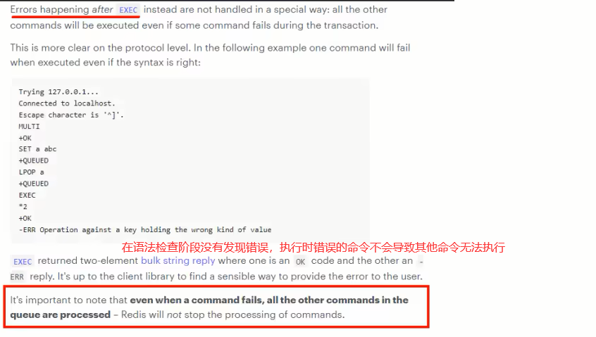

**补充：**

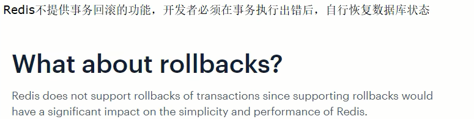

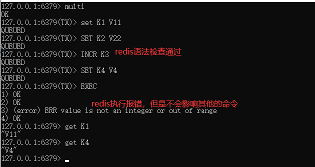

$\textcolor{red}{注意和传统数据库事务的区别，不一定要么全部成功要么全部失败}$

### case5：watch监控

- **Redis使用Watch来提供乐观锁定，类似于CAS(Check-and-Set)**

  1. 悲观锁：悲观锁(Pessimistic Lock)，顾名思义，就是很悲观，每次去拿数据的时候都认为别人会修改，所以每次在拿数据的时候都会上锁，这样别人想拿这个数据就会block直到它拿到锁

  2. 乐观锁：乐观锁(Optimistic Lock)，顾名思义，就是很乐观，每次去拿数据的时候都认为别人不会修改，$\textcolor{red}{所以不会上锁}$，但是在更新的时候会判断一下在此期间别人有没有去更新这个数据。

     $\textcolor{red}{乐观锁策略：提交版本必须大于记录当前版本才能执行更新}$

  3. CAS

     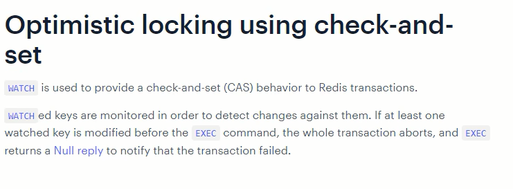

- **watch key [key ...]**

  1. 初始化k1和balance两个key，先监控在开启multi，保证两个key变动在同一个事务内

     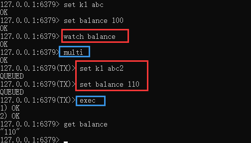

  2. 有加塞篡改：watch命令是一种乐观锁的实现，Redis在修改的时候会检测数据是否被更改，如果被更改了，则执行失败

     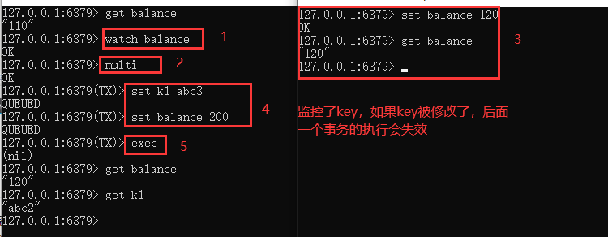

     图中3和4不管哪个先执行，最终的结果都是整个事务执行失败

     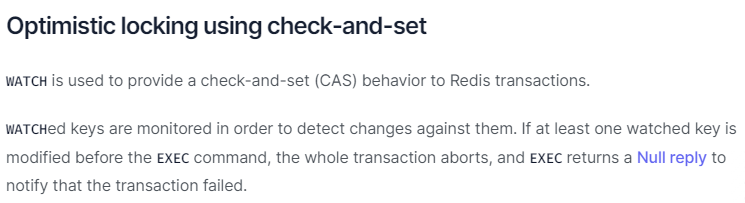

- **unwatch**

  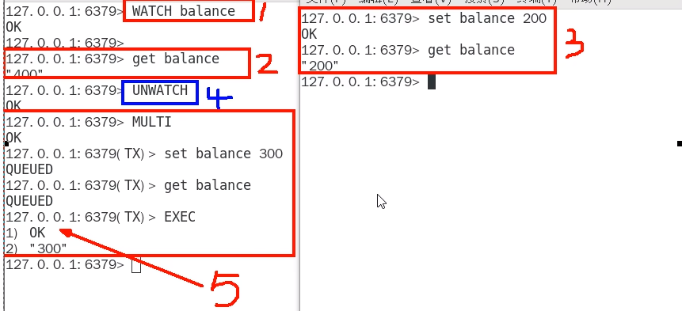

- **小结**

  一旦执行了exec之前加的监控锁都会被取消掉

  当客户端连接丢失的时候(比如退出链接)，所有东西都会被取消监视

### 小总结

$\textcolor{red}{开启}$：以multi开始一个事务

$\textcolor{red}{入队}$：将多个命令入队到事务中，接到这些命令并不会立即执行，而是放到等待执行的事务队列里面

$\textcolor{red}{执行}$：有exec命令触发事务

