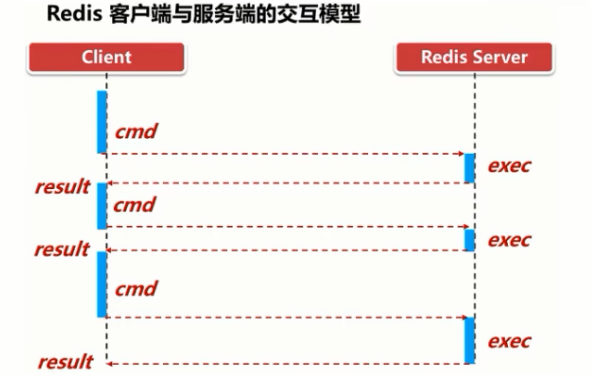

# Redis管道介绍

### 面试题：如何优化频繁命令往返造成的性能瓶颈？

Redis是一种基于**客户端-服务端模型**以及请求/响应协议的TCP服务。一个请求会遵循以下步骤:
1客户端向服务端发送命令分四步(发送命令→命令排队→命令执行-返回结果)，并监听Socket返回，通常以阻塞模式等待服务端响应。
2服务端处理命令，并将结果返回给客户端。
上述两步称为: Round Trip Time(简称RTT,数据包往返于两端的时间)。

如果同时需要执行大量的命令，那么就要等待上一条命令应答后再执行，这中间不仅仅多了RTT (Round Time Trip) ，而且还频繁调用系统IO， 发送网络请求，同时需要redis调用多次read()和write()系统方法， 系统方法会将数据从用户态转移到内核态，这样就会对进程上下文有比较大的影响了，性能不太好，0(π_ π)0。这时候Redis管道就出现了。

