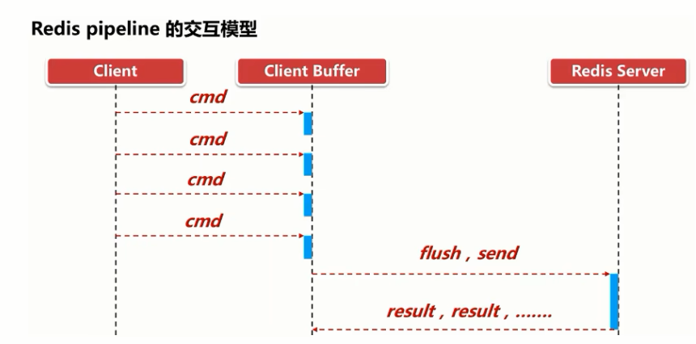
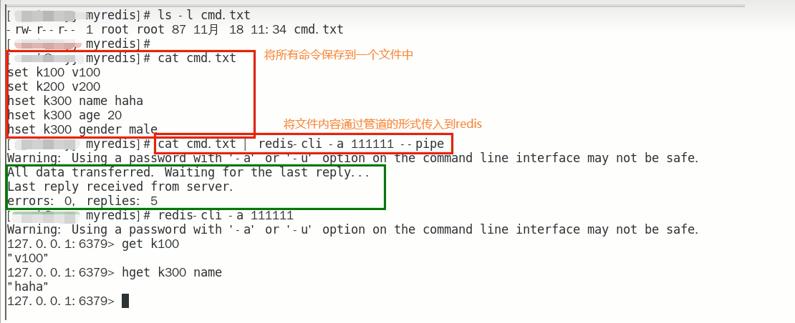

# 是什么

### 上述问题的解决思路

管道(pipeline)可以一 次性发送多条命令给服务端，**服务端依次处理完毕后，通过一 条响应一次性将结果返回，通过减少客户端与redis的通信次数来实现降低往返延时时间**。pipeline实现的原理是队列，先进先出特性就保证数据的顺序性。

### 官网：

https://redis.io/docs/manual/pipelining/

### 定义：

pipeline是为了解决RTT往返时，仅仅是将命令打包一次性发送，对整个Redis的执行不造成其他任何影响

### 一句话：

**批处理命令变种优化措施**，类似Redis的原生批命令(mget和mset)

### 案例演示

