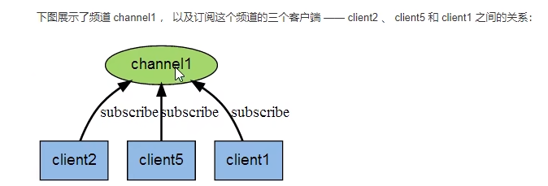
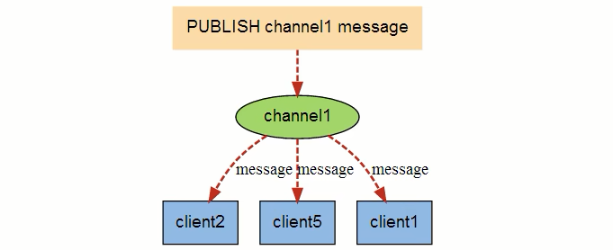
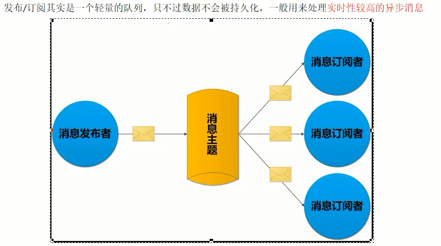

# Redis发布订阅介绍

#### $\textcolor{green}{学习定位：了解即可}$

### 是什么

**定义：**是一种消息通信模式：发送者(PUBLISH)发送消息，订阅者(SUBSCRIBE)接收消息，可以实现进程间的消息传递

**官网：**https://redis.io/docs/manual/pubsub/

**一句话：**Redis可以实现消息中间件MQ的功能，通过发布订阅实现消息的引导和分流。但是目前不推荐使用该功能，专业的事情交给专业的中间件处理，redis就做好分布式缓存功能

### 能干嘛

Redis客户端可以订阅任意数量的频道，类似我们微信关注多个公众号

当有新消息通过publish命令发送给频道channel1时，订阅客户端都会收到消息

### 小总结

