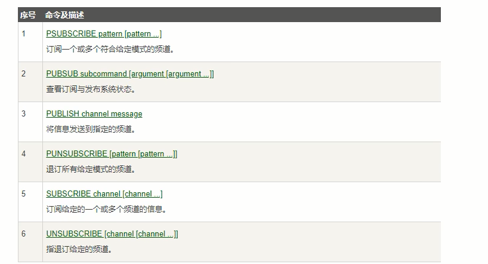
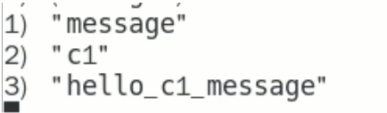
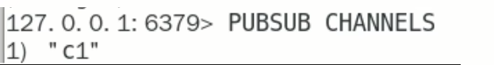
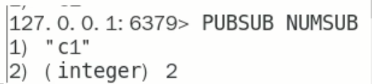
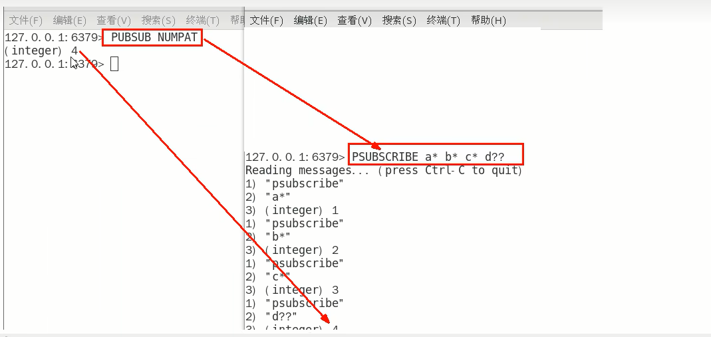

# Redis发布订阅常用命令

### 常用命令：

- SUBSCRIBE channel [channel ...]

  订阅给定的一个或多个频道的信息

  $\textcolor{red}{推荐先执行订阅然后在发布，订阅成功之前发布的消息是收不到的}$

  订阅的客户端每次可以收到一个3个参数的消息

  1. 消息种类
  2. 始发频道的名称
  3. 实际的消息内容

- PUBLISH channel message

  发布消息到指定的频道

- PSUBSCRIBE pattern [pattern ...]

  按照模式批量订阅，订阅一个或多个符合给定模式(支持*号？号之类的)的频道

- PUBSUB subcommand [argument [argument ...]]

  查看订阅与发布系统

  PUBSUB CHANNELS

  ​	由活跃频道组成的列表

  

  PUBSUB NUMSUB [channel [channel ...]]

  ​	某个频道有几个订阅者

  

  PUBSUB NUMPAT

  ​	只统计使用PSUBSCRIBE命令执行的返回客户端订阅的唯一$\textcolor{red}{模式的数量}$

  

- UNSUBSCRIBE [channel [channel ...]]

  退订给定的频道

- PUNSUBSCRIBE [pattern [pattern ...]]

  退订所有给定模式的频道

