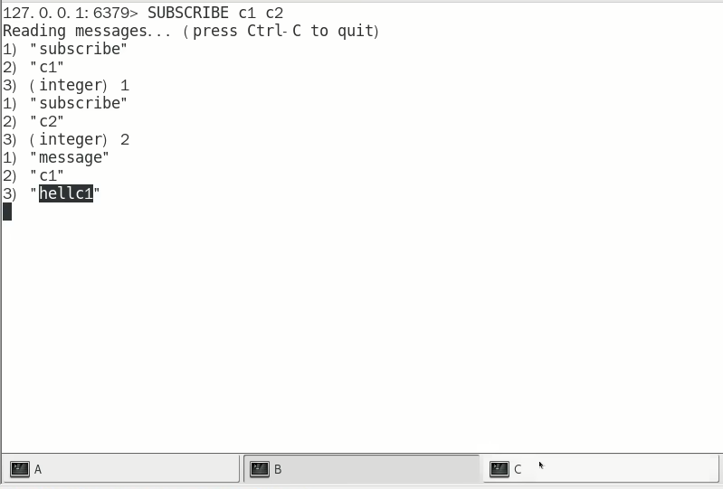
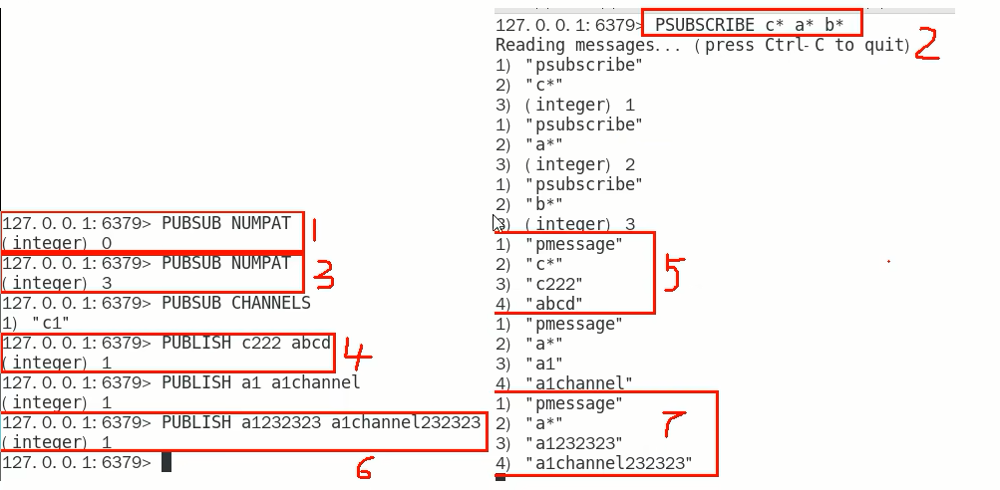
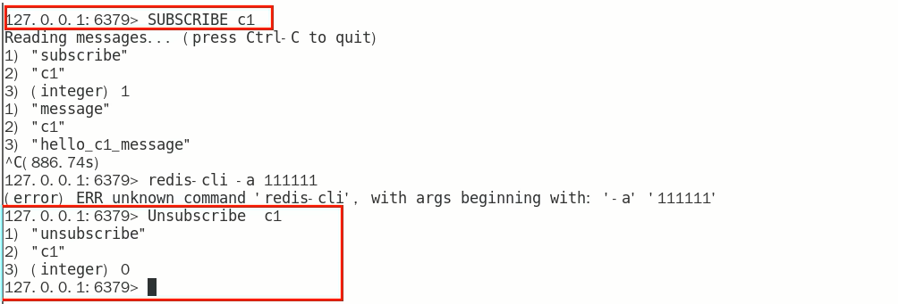

# 案例演示

1. 开启3个客户端，演示客户端A、B订阅消息，客户端C发布消息

   

2. 演示批量订阅和发布

   

3. 取消订阅

### 小总结

 **可以实现消息中间件MQ的功能，通过发布订阅实现消息的引导和分流。但是不推荐使用该功能，专业的事情交给专业的中间件处理，redis就做好分布式缓存功能**

PUB/SUB缺点

1. 发布的消息在Redis系统中不能持久化，因此，必须先执行订阅，在等待消息发布。如果先发布了消息，那么该消息由于没有订阅者，消息将被直接丢弃
2. 消息只管发送，对于发布者而言消息是即发即失，不管接受，也没有ACK机制，无法保证消息的消费成功
3. 以上的缺点导致Redis的Pub/Sub模式就像个小玩具，在生产环境中几乎无用武之地，为此Redis5.0版本新增了Stream数据结构，不但支持多播，还支持数据持久化，相比Pub/Sub更加的强大

