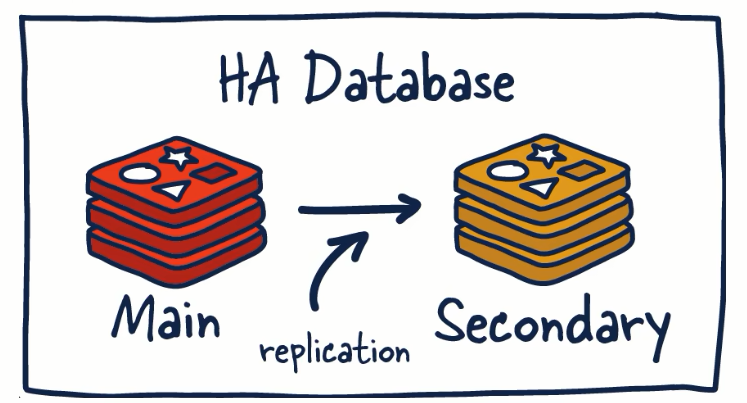
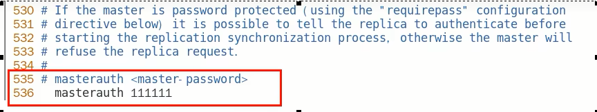

# Redis复制介绍

### 是什么

官网地址：https://redis.io/docs/management/replication/

一句话：就是主从复制，master以写为主，slave以读为主，当master数据变化的时候，自动将新的数据异步同步到其他的slave数据库

### 能干嘛

- 读写分离
- 容灾恢复
- 数据备份
- 水平扩容支撑高并发

### 怎么玩

- $\textcolor{red}{配从(库)不配主(库)}$

- 权限细节，重要

  master如果配置了requirepass参数，需要密码登录 ，那么slave就要配置masterauth来设置校验密码，否则的话master会拒绝slave的访问请求

  

- 基本操作命令

  **info replication** ：可以查看复制结点的主从关系和配置信息

  **replicaof 主库IP 主库端口** ：一般写入进Redis.conf配置文件内，重启后依然生效

  **slaveof 主库IP 主库端口** ：

  ​	每次与master断开之后，都需要重新连接，除非你配置进了redis.conf文件；在运行期间修改slave节点的信息，如果该数据库已经是某个主数据库的从数据库，那么会停止和原主数据库的同步关系 $\textcolor{red}{转而和新的主数据库同步，重新拜码头}$

  **slaveof no one** ：使当前数据库停止与其他数据库的同步，$\textcolor{red}{转成主数据库，自立为王}$

