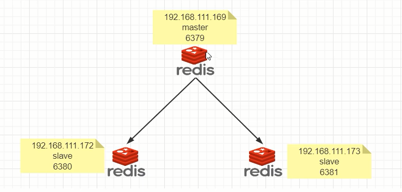
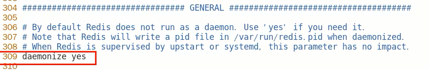
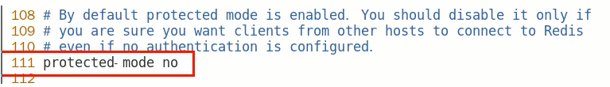
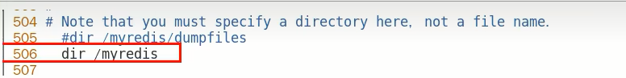
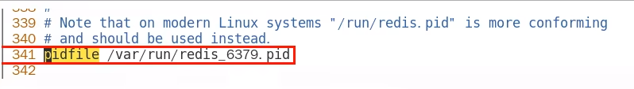
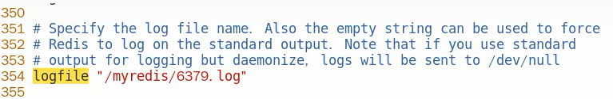
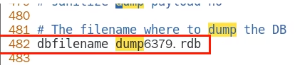
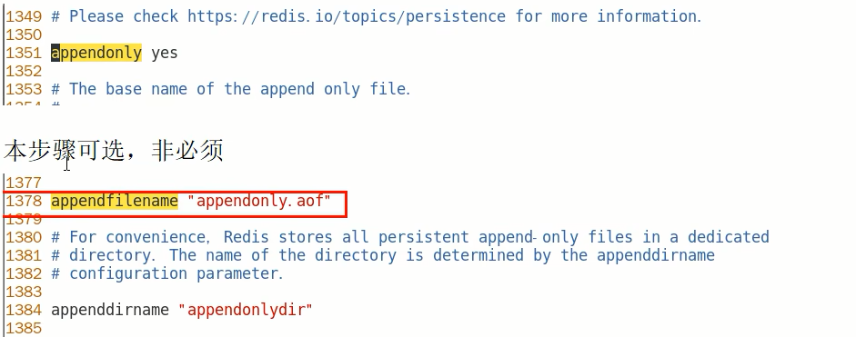
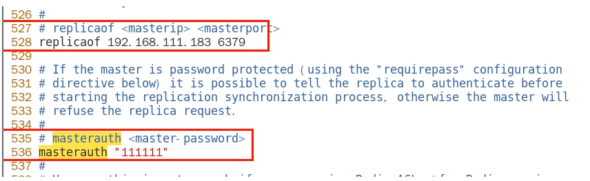

# 案例演示-配置文件

### 架构说明

一个Master两个Slave，三台虚拟机，每台都安装redis

拷贝多个redis.conf文件

redis6379.conf、redis6380.conf、redis6381.conf

### 小口诀

三台虚拟机需要能相互ping通且需要注意防火墙配置

三大命令：

1. 主从复制

   replicaof 主库IP 主库端口，配从(库)不配主(库)

2. 改换门庭

   slaveof 新主库IP 新主库端口

3. 自立为王

   slaveof no one

### 修改配置文件细节操作

redis6379.conf为例，步骤如下：

1. 开启daemonize yes

   

2. 注释掉bind 127.0.0.1

3. protected-mode no

   

4. 指定端口

5. 指定当前工作目录，dir

   

6. pid文件名字，pidfile

   

7. log文件名字，logfile

   **如果日志文件和启动文件同级，这里可以配置为./6379.log，否则这里一定要写绝对路径，是个巨坑！！！**

   

8. requiredpass 

   

9. dump.rdb名字

   

10. aof文件，appendfilename

    

11. $\textcolor{red}{从机访问主机的通行密码masterauth，必须配置}$

    

    **从机需要配置，主机不用**

