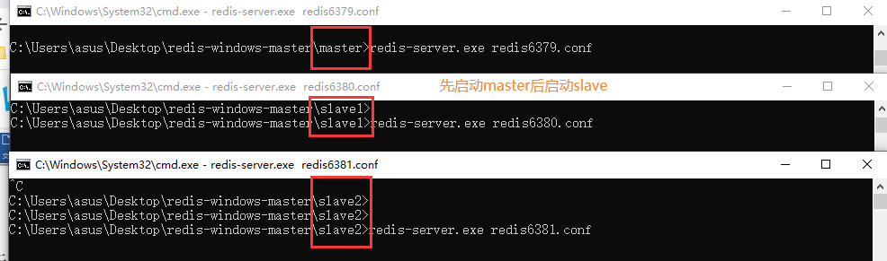
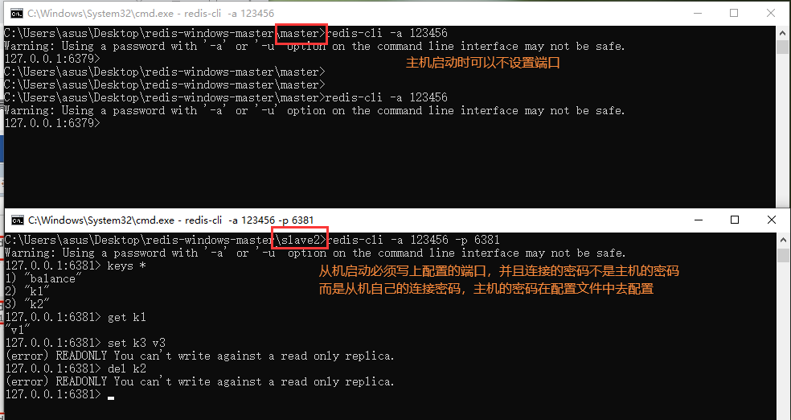
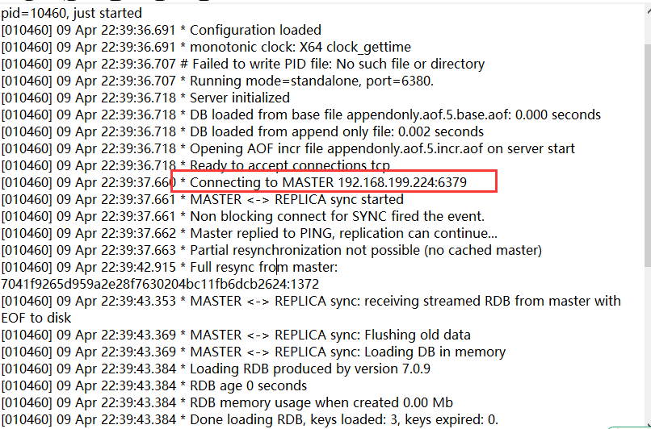
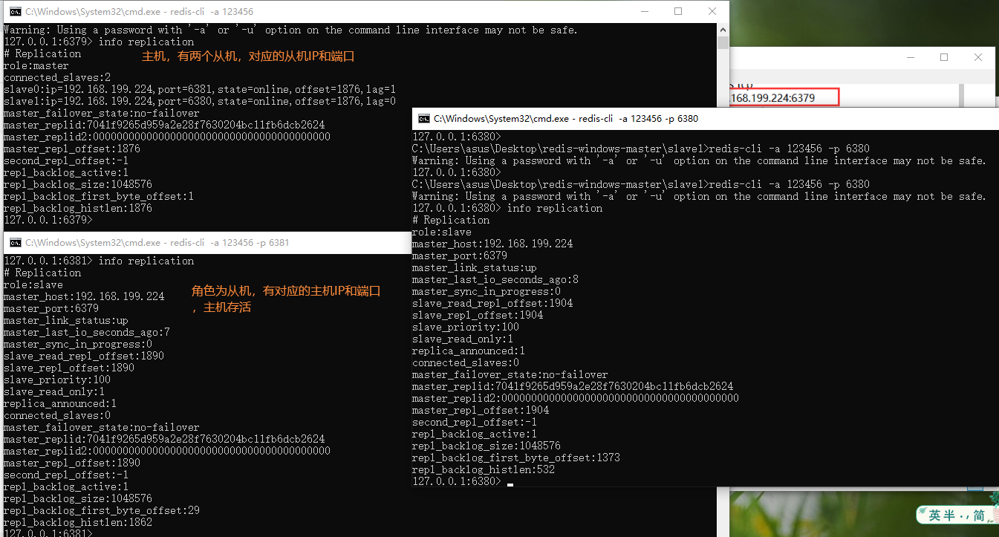
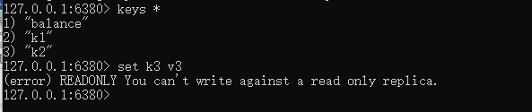
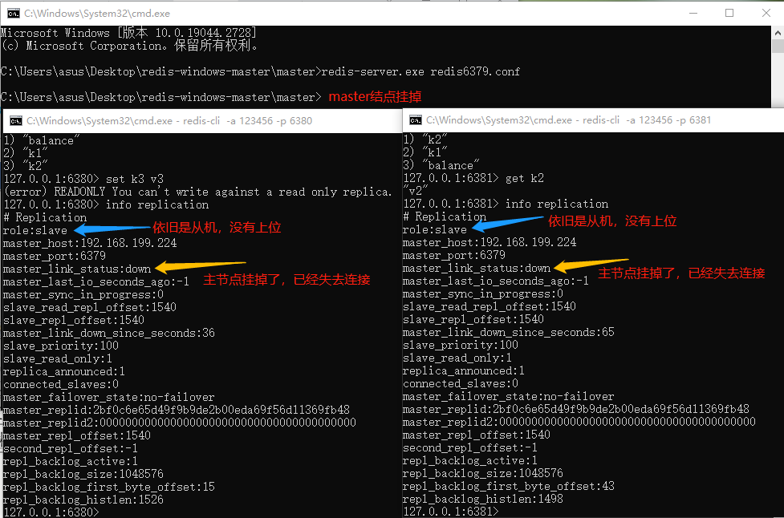
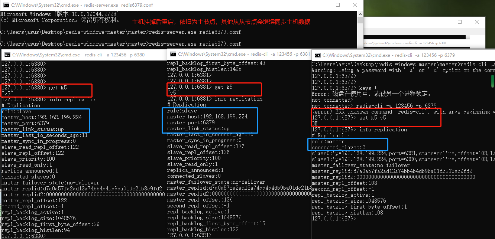
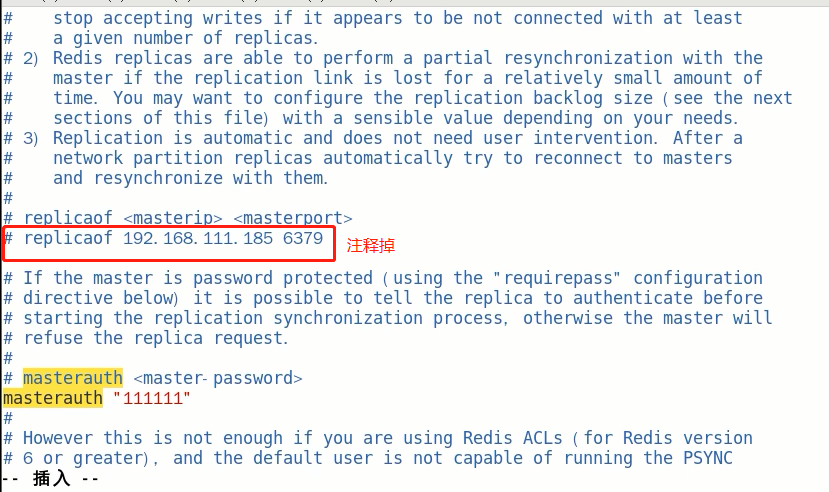
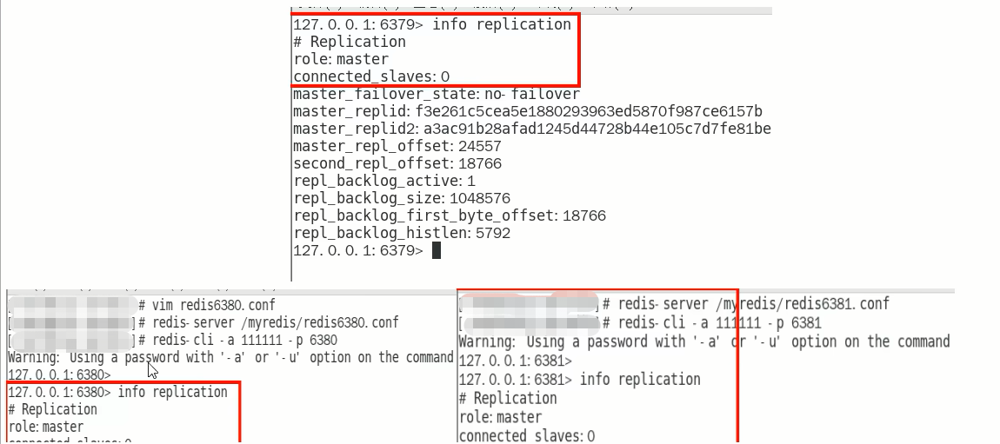
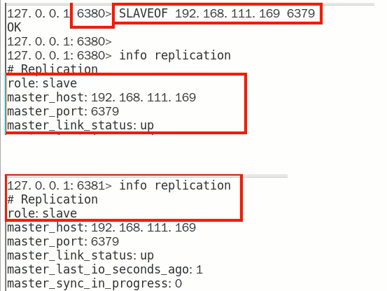

### 案例演示-配置文件

### 一主二仆

#### 方案1：配置文件固定写死主从关系

- 配置文件执行：replicaof 主库IP 主库端口

- 配从(库)不配(主)库：配置从机

  

- 先master后两台slave依次启动

  

  

- 主从关系查看

  主机日志

​	从机日志

​	命令：info replication命令查看

#### $\textcolor{red}{主从问题演示}$

1. Q：从机可以执行写命令吗？ 

   A：**不可以，从机只能读**

   

2. Q：从机切入点问题？

   Q：$\textcolor{blue}{slave是从头开始复制还是从切入点开始复制?}$
   A：master启动，写到k3
   slave1跟着master同时启动，跟着写到k3
   slave2写到k3后才启动，那之前的是否也可以复制?
   $\textcolor{blue}{Y，首次一锅端，后续跟随，master写，slave跟}$

3. Q：主机shutdown后，从机会上位吗？

    A：**从机不动，原地待命，从机数据可以正常使用，等待主机重启归来**

   

4. Q：主机shutdown后，重启后主从关系还在吗？从机还能否顺利复制？

   A：主从关系依然存在，从机依旧是从机，可以顺利复制

   

5. Q：某台从机down后，master继续，从机重启后它能跟上大部队吗？

   A：可以，类似于从机切入点问题

#### 方案2：命令操作手动主从关系指令

1. 从机停机去掉配置文件中的配置项，3台目前都是主机状态，各不从属

   

2. 3台master

   

3. 预设的从机上执行命令

   salveof 主库IP 主库端口

   

4. Q：用命令使用的话，2台从机重启后，关系还在吗？

   A：不会存在了

#### 配置 VS 命令的区别，配置，持久稳定永久生效；命令，当成生效

### 薪火相传

- 上一个slave可以是下一个slave的master，slave同样可以接收其他slaves的连接和同步请求，那么该slave作为了链条中下一个的master,可以有效减轻主master的写压力
- 中途变更转向:会清除之前的数据，重新建立主从关系并拷贝最新的
- slaveof 新主库IP 新主库端口

### 反客为主

slaveof no one  使当前数据库停止与其他数据库的同步关系

