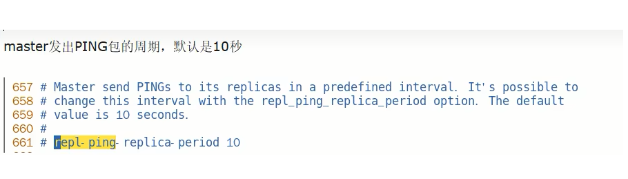
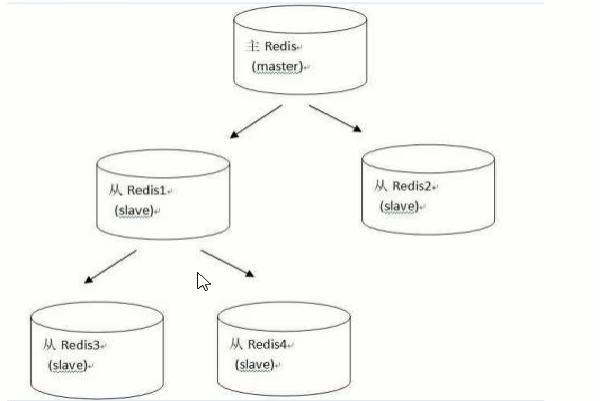

# 复制原理和工作流程

### slave启动，同步初请

- slave启动成功链接到master后会发送一个sync命令
- slave首次全新连接master，一次完全同步(全量复制)将被自动执行，slave自身原有数据会被master数据覆盖清除

### 首次连接，全量复制

- master节点收到sync命令后会开始在后台保存快照(即RDB持久化，主从复制时会触发RDB)，同时收集所有接收到的用于修改数据集的命令并缓存起来，master节点执行RDB持久化完后，master将RDB快照文件和所有缓存的命令发送到所有slave，以完成一次完全同步
- 而slave服务在接收到数据库文件数据后，将其存盘并加载到内存中，从而完成复制初始化

### 心跳持续，保持通信

- repl-ping-replica-period 10

  

### 进入平稳，增量复制

- master继续将新的所有收集到的修改命令自动依次传送给slave，完成同步

### 从机下线，重连续传

- master会检查backlog里面的offset，master和slave都会保存一个复制的offset还有一个masterId，offset是保存在backlog中的。$\textcolor{red}{master只会把已经缓存的offset后面的数据复制给slave，类似断点续传}$

### 复制的缺点

- 复制延时，信号衰减

  由于所有的写操作都是先在Master上操作，然后同步更新到Slave上，所以从Master同步到Slave机器有一定的延迟，当系统很繁忙的时候，延迟问题会更加严重，Slave机器数量的增加也会使这个问题更加严重。

  

- master挂了怎么办？

  默认情况下，不会在slave节点中自动选一个master

  那每次都要人工干预？ -> $\textcolor{red}{无人值守变成刚需}$

