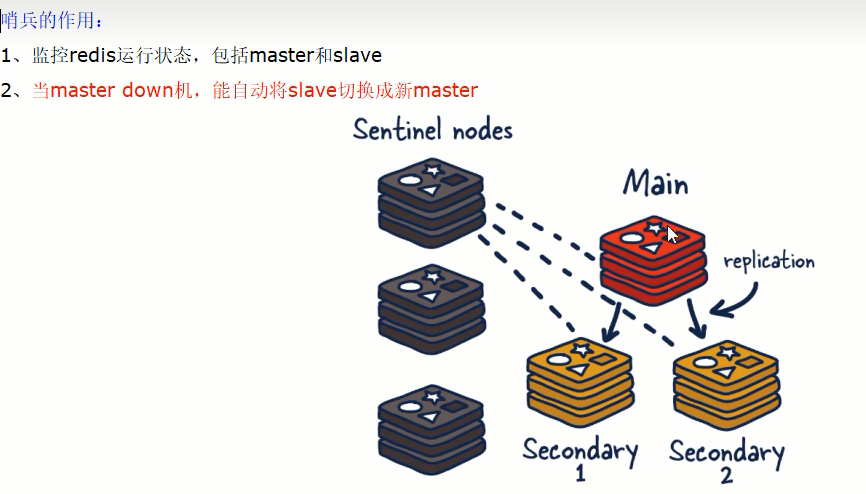
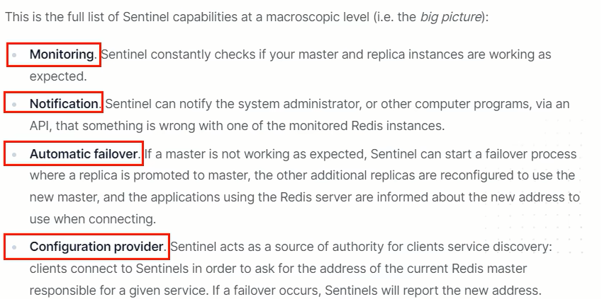

# Redis哨兵基本介绍

### 是什么

吹哨人巡查监控后台master主机是否故障，如果故障了根据$\textcolor{red}{投票数}$自动将某一个从库转换为新主库，继续对外服务

作用：俗称无人值守运维

官网理论：https://redis.io/docs/management/sentinel/

### 能干嘛

**主从监控**：监控主从redis库运行是否正常

**消息通知**：哨兵可以将故障转移的结果发送给客户端

**故障转移**：如果master异常，则会进行主从切换，将其中一个slave作为新master

**配置中心**：客户端通过连接哨兵来获得当前Redis服务的主节点地址

