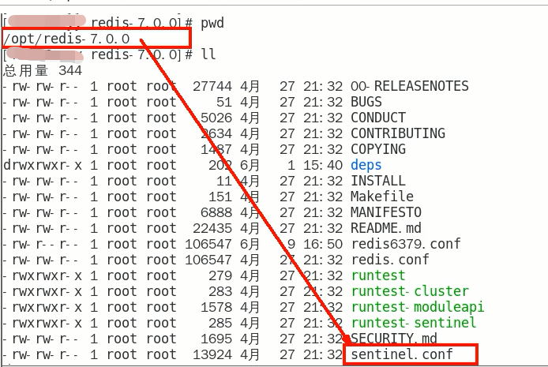
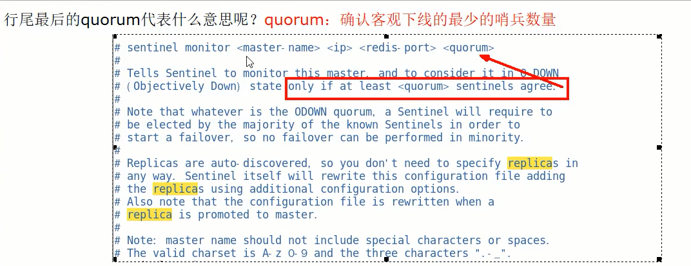

# 案例演示

### Redis Sentinel架构，前提说明

- 3个哨兵：自动监控和维护集群，不存放数据，只是吹哨人
- 1主2从：用于数据读取和存放

### 操作步骤

1. $\textcolor{red}{/myredis目录下新建或者拷贝sentinel.conf文件按，名字绝对不能错}$

2. 先看看/opt目录下默认的sentinel.conf文件的内容

   

3. 重要参数项说明

   - bind：服务监听地址，用于客户端连接，默认本机地址

   - daemonize：是否以后台daemon方式运行

   - protected-model：安全保护模式

   - port：端口

   - logfile：日志文件路径

   - pidfile：pid文件路径

   - dir：工作目录

   - $\textcolor{red}{sentinel monitor <master-name> <ip> <redis-port> <quorum>}$

     设置要监控的master服务器

     quorum表示最少有几个哨兵认可客观下线，同意故障迁移的法定票数

     

     网络是不可靠的有时候一个sentinel会因为网络堵塞而误以为master redis已经死掉，在sentinel集群环境下需要多个sentinel互相沟通来确认某个master是否真的死掉了，quorum这个参数是进行客观下线的一个依据，意思是至少有quorum个sentinel认为这个master有故障，才会对这个master进行下线以及故障转移。因为有的时候，某个sentinel节点可能因为自身网络原因，导致无法连接master，而此时master并没有出现故障，所以，这就需要多个sentinel都一致认为改master有问题，才可以进行下一步操作，这就保证了公平性和高可用。

   - $\textcolor{red}{sentinel auth-pass <master-name> <password>}$
   - 其他

4. ​

