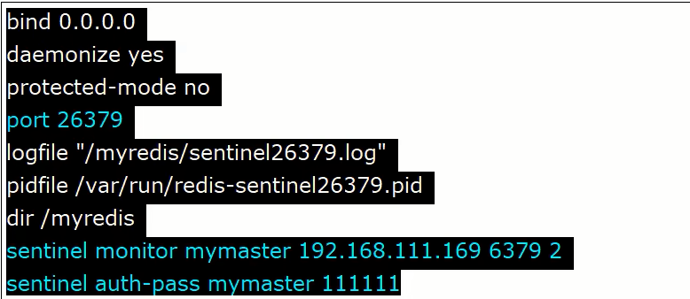
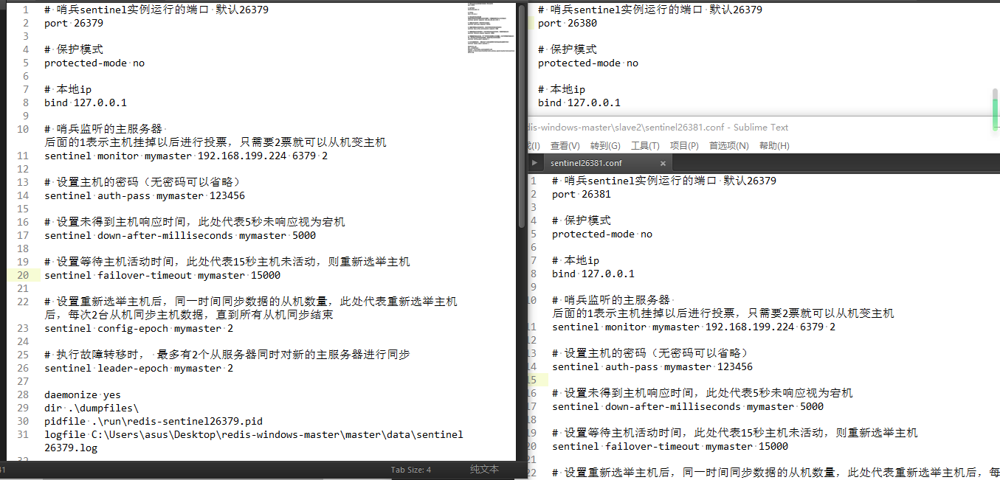
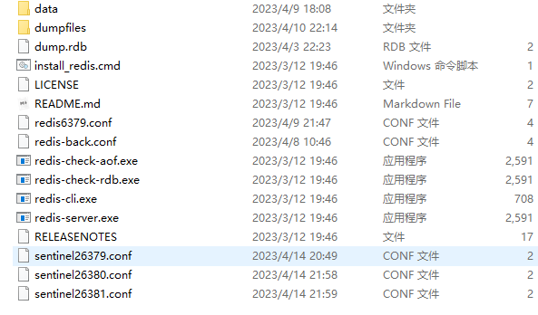
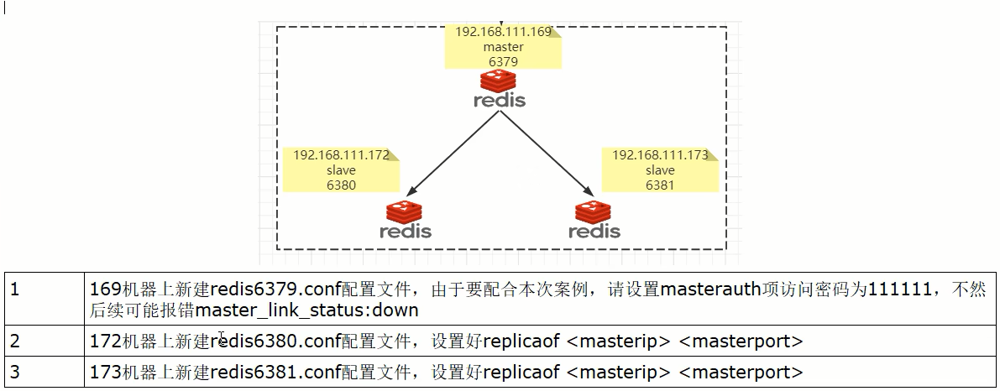
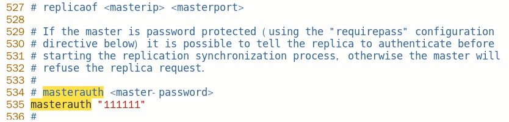

# sentinel通用配置及主从配置

### sentinel26379.conf、sentinel26380.conf、sentinel26381.conf

最终配置

理论上sentinel配置文件应该部署在不同的服务器上，做成集群，但是本次演示将其放到一台机器上

### 先启动一主二从3个redis实例，测试正常的主从复制

- 架构说明

  

- 主机6379配置修改

  

  6379后续可能会变成从机，需要设置访问新主机的密码，所以此处会设置masterauth，**不然后续可能会报错 master_link_status:down**

- ​

