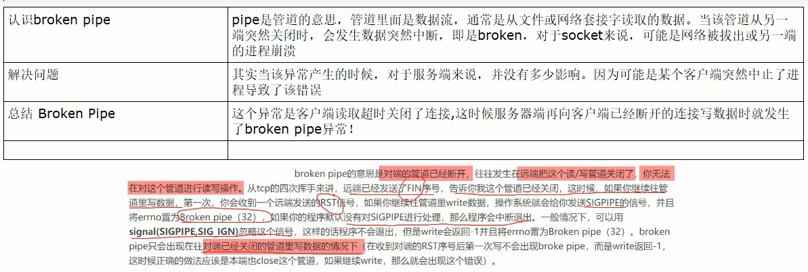
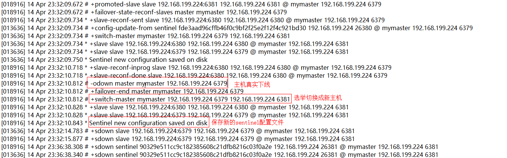
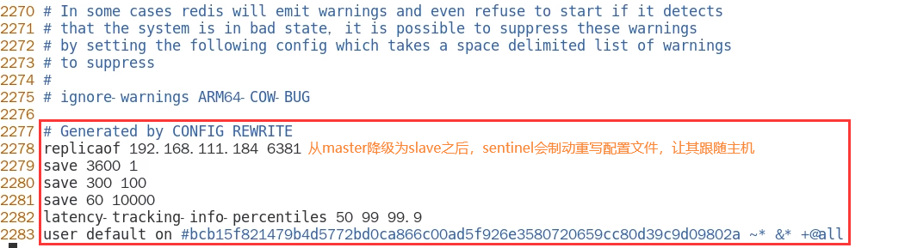
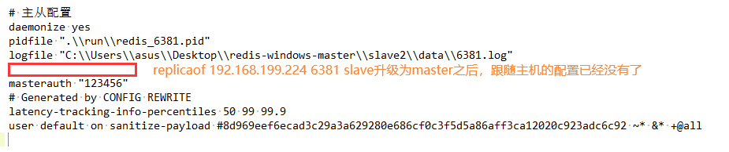
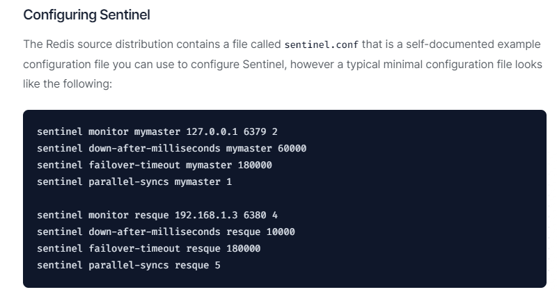

# 主节点异常情况

### 原有的master挂了

- 我们自己手动关闭6379服务器，模拟master挂了

- 问题思考

  1. 两台从机数据是否OK
  2. 是否会从剩下的2台机器上选出新的master
  3. 之前down机的master机器重启回来，谁将会是新老大？会不会双master冲突

- 揭晓答案

  1. 两台从机数据OK

     

  2. 会投票选出新的master主机

     

  3. 谁是master，限本次案例

     本案例中6381被选举为新的master，上位成功

     重启6379之后，它会从原来的master降级为slave

     6380还是slave，只不过是换了一个新老大6381(从跟随6379变成跟随6381)

### 对比配置文件

老master的redis6379.conf文件

新master的redis6381.conf文件

### 结论

$\textcolor{red}{文件的内容，在运行期间会被sentinel动态进行更改}$

$\textcolor{red}{Master-Slave切换后，master_redis.conf、slave_redis.conf、sentinel.conf的内容都会发生改\\变，即master_redis.conf中会多一行slaveof的配置，而升级为master的主机会去掉原来的slaveof配置，\\sentinel.conf的监控目标会随之调换}$

### 其他备注

生产上都是不同机房不同服务器，很少出现3个哨兵全部挂掉的情况

可以同时金童多个master，一行一个

