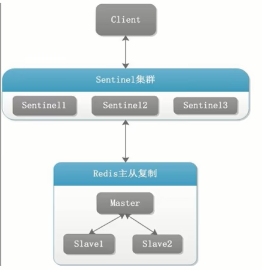
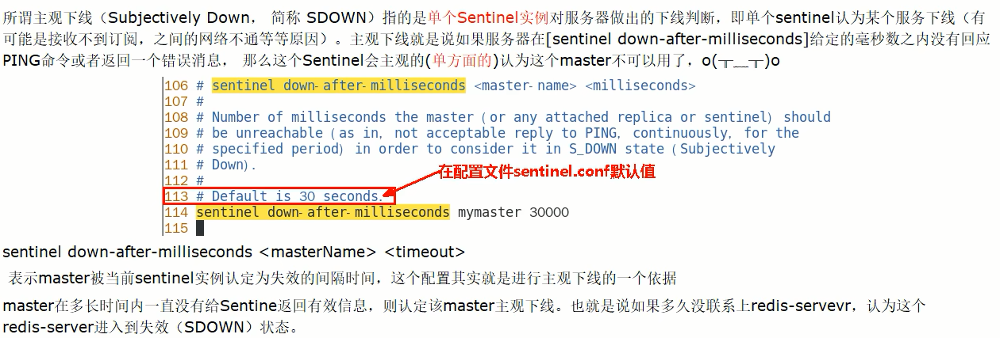
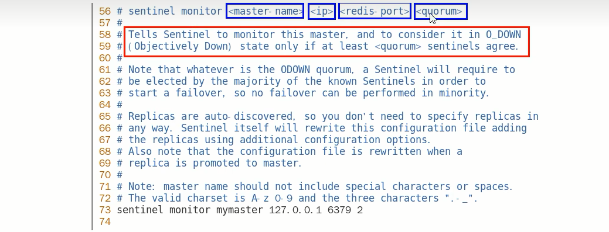
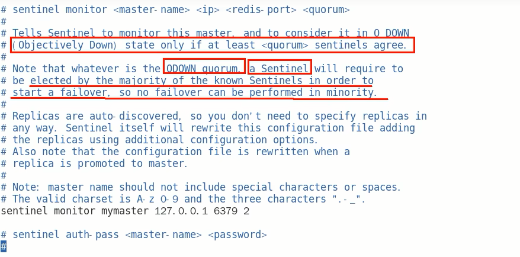
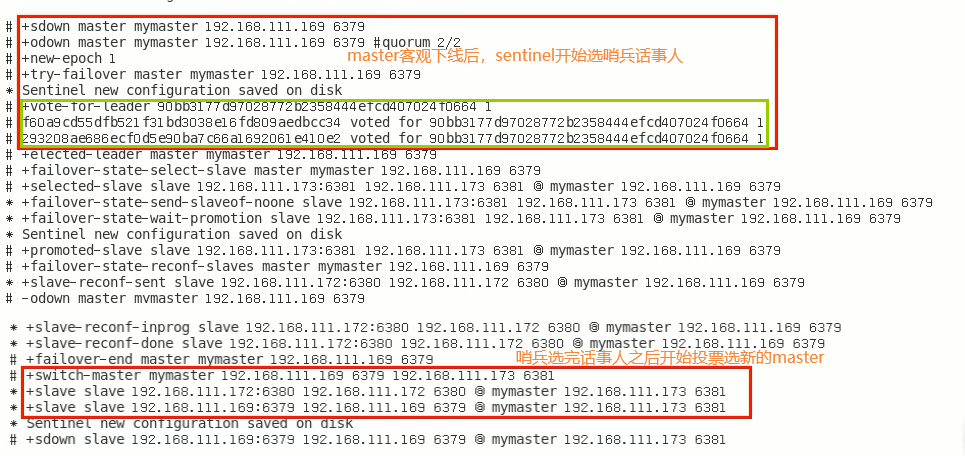
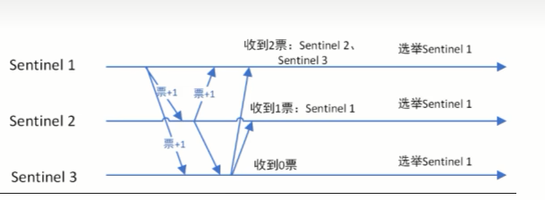
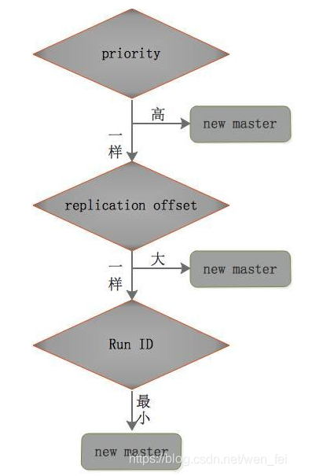
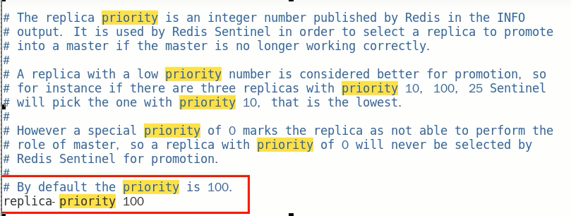
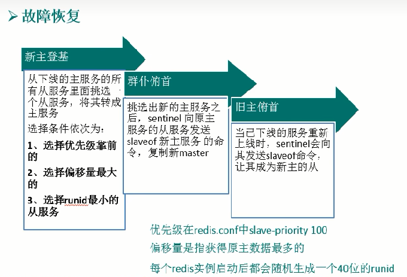

# 哨兵运行流程和选举原理

当一个主从配置中master失效后，sentinel可以选举出一个新的master用于自动接替原master的工作，主从配置中的其他redis服务器自动指向新的master同步数据，一般建议sentinel采取奇数台，防止某一台sentinel无法连接到master导致误切换

### 运行流程，故障切换

- 三个哨兵监控一主二从，正常运行中

  

- SDown主观下线(Subjectively Down)

  1. SDOWN（主观不可用）是**单个sentinel自己主观上**检测到的关于master的状态，从sentinel的角度来看，如果发送了PING心跳后，在一定时间内没有收到合法的回复，就达到了SDOWN的条件。

  2. sentinel配置文件中的down-after-milliseconds设置了判断主观下线的时间长度

  3. 说明

     

- ODown客观下线(Objectively Down)

  1. ODOWN需要一定数量的sentinel，$\textcolor{red}{多个哨兵达成一致意见}$才能认为一个master客观上已经宕机

  2. 说明

     

     $\textcolor{red}{\large quorum这个参数是进行客观下线的一个依据，法定人数/法定票数}$
     意思是至少有quorum个sentinel认为这个master有故障才会对这个master进行下线以及故障转移。因为有的时候，某个sentinel节点可能因为自身网络原因导致无法连接master，而此时master并没有出现故障，所以这就需要多个sentinel都一致认为该master有问题，才可以进行下一步操作，这就保证了公平性和高可用。

- 选举出领导者哨兵(哨兵中选出兵王)

  

  1. 当主节点被判断客观下线后，各个哨兵节点会进行协商，先选举出一个$\textcolor{red}{\large 领导者哨兵节点（兵王）}$并由该领导者也即被选举出的兵王进行failover（故障转移）。

     哨兵日志文件解读分析

     

  2. 哨兵领导者，兵王如何选出来的？-> Raft算法

     

     监视该主节点的所有哨兵都有可能被选为领导者，选举使用的算法是Raft算法;Raft算法的基本思路是先到先得:即在一轮选举中，哨兵A向B发送成为领导者的申请、如果B没有同意过其他哨兵，则会同意A成为领导者。

- 由兵王开始推动故障切换流程并选出新的master

  1. 新主登基

     - $\textcolor{red}{\large 某个Slave被选中成为新Master}$

     - 选出新master的规则，剩余Slave节点健康前提下，会按下图规则进行选举

       

       1. redis.conf文件中，优先级slave-priority或者replica-priority最高的从节点(数字越小优先级越高)

       

       2. 复制偏移位置offset最大的从节点(也就是在master还没有宕机时，复制到数据比其他Slave要多)

       3. 最小Run ID的从节点，字典顺序，ASCII码

  2. 群臣俯首

     - $\textcolor{red}{\large 一朝天子一朝臣，换个码头重新拜}$
     - 执行slaveof no one命令让选出来的从节点成为新的主节点，并通过slaveof命令让其他节点成为其从节点
     - sentinel leader会对选举出的新master执行slaveof on one操作，将其提升为master节点
     - sentinel leader向其他slave发送命令，让剩余的slave成为新的master节点的slave

  3. 旧主拜服

     - $\textcolor{red}{\large 老master回来也认怂，会被降级为slave}$
     - 老master重新上线后，会将它设置为新选出的master的从节点
     - sentinel leader会让原来的master降级为slave并恢复正常工作

  4. 小总结

     上述的failover操作均由sentinel自己独自完成，完全不需要人工干预

     

### 哨兵使用建议

1. 哨兵节点的数量应为多个，哨兵本身应该集群，保证高可用
2. 哨兵节点的数量应该是奇数
3. 各个哨兵节点的配置应一致
4. 如果哨兵节点部署在Docker等容器里面，尤其要注意端口的正确映射
5. 哨兵集群+主从复制，并不能保证数据零丢失，$\textcolor{red}{\large所以需要使用集群}$

