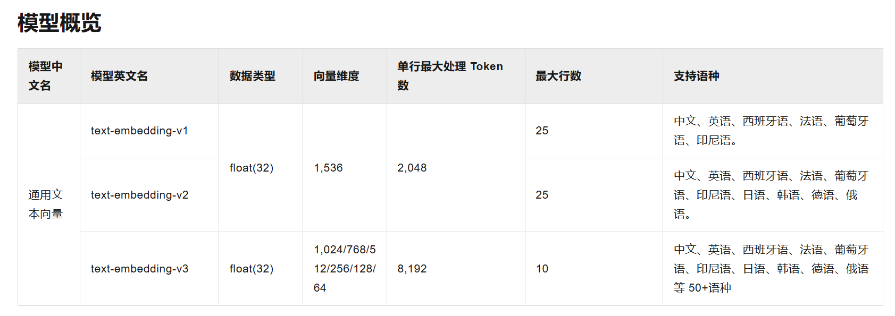

## 1、向量大模型
1.1、介绍
通用文本向量模型:https://help.aliyun.com/zh/model-studio/developer-reference/text-embedding-synchronous-api?spm=a2c4g.11186623.help-menu-2400256.d_2_5_0.592672a3yMJDRq&scm=20140722.H_2712515._OR_help-T_cn~zh-V_1

使用通用文本向量text-embedding-v3，维度1024，维度越多，对事务的描述越精准，信息检索的精度越高
配置向量模型
```text
#集成阿里通义千问-通用文本向量-v3
langchain4j.community.dashscope.embedding-model.api-key=${DASH_SCOPE_API_KEY}
langchain4j.community.dashscope.embedding-model.model-name=text-embedding-v3
```

## 2、向量存储
### 2.1、Pinecone简介
之前我们使用的是InMemoryEmbeddingStore作为向量存储，但是不建议在生产中使用基于内存的向量存储。因此这里我们使用Pinecone作为向量数据库。
官方网站:https://app.pinecone.io/organizations/-OMR0sIOzDL6ZTkOF7GG/projects/7caae26b-5cc5-421b-b6f3-b9ae9357bcbe/keys
访问官方网站、注册、登录、获取apiKey且配置在环境变量中

### 2.2、Pinecone的使用
<font color = 'red'>得分的含义</font>
在向量检索场景中，当我们把查询文本转换为向量后，会在嵌入存储(EmbeddingStore)里查找与之最相似的向量(这些向量对应着文档片段等内容)，为了衡量查询向量和存储向量之间的相似程度，会使用某种相似度计算方法(例如余弦相似度等)来得出一个数值，
这个数值就是得分。得分越高，表明查询向量和存储向量越相似，对应的文档片段与查询文本的相关性也就越高。
<font color = 'red'>得分的作用</font>
- **筛选结果:通过设置** `minScore` 阈值，能够过滤掉那些与查询文本相关性较低的结果。在代码里，`minScore(0.8)`意味着只有得分大于等于0.8的结果才会被返回，低于这个阈值的结果会被舍弃。这样可以确保返回的结果是与査询文本高度相关的，提升检索结果的质量, 
- **控制召回率和准确率**:调整 `minscore` 的值可以在召回率和准确率之间进行权衡。如果把阈值设置得较低，那么更多的结果会被返回，召回率会提高但可能会包含一些相关性不太强的结果，导致准确率下降;反之，如果把阈值设置得较高，返回的结果数量会减少，
准确率会提高，但可能会遗漏一些相关的结果，使得召回率降低。在实际应用中，需要根据具体的业务需求来合理设置 `minScore` 的值。

### 2.3、集成Pinecone
添加依赖:
```xml
<dependency>
    <groupId>dev.langchain4j</groupId>
    <artifactId>langchain4j-pinecone</artifactId>
</dependency>
```


