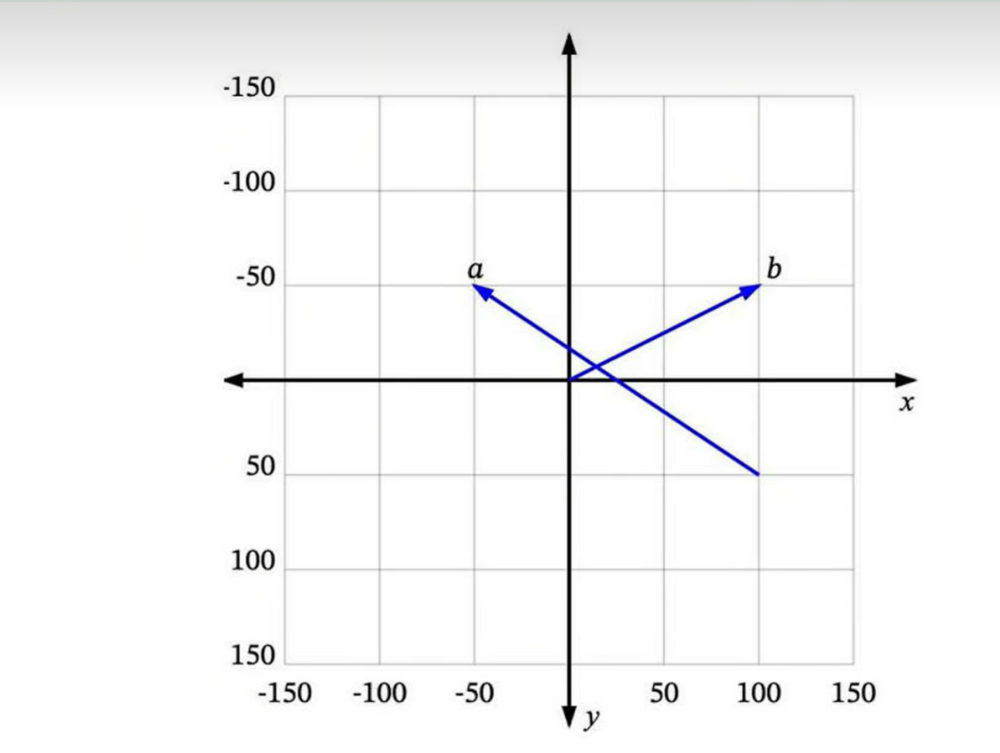
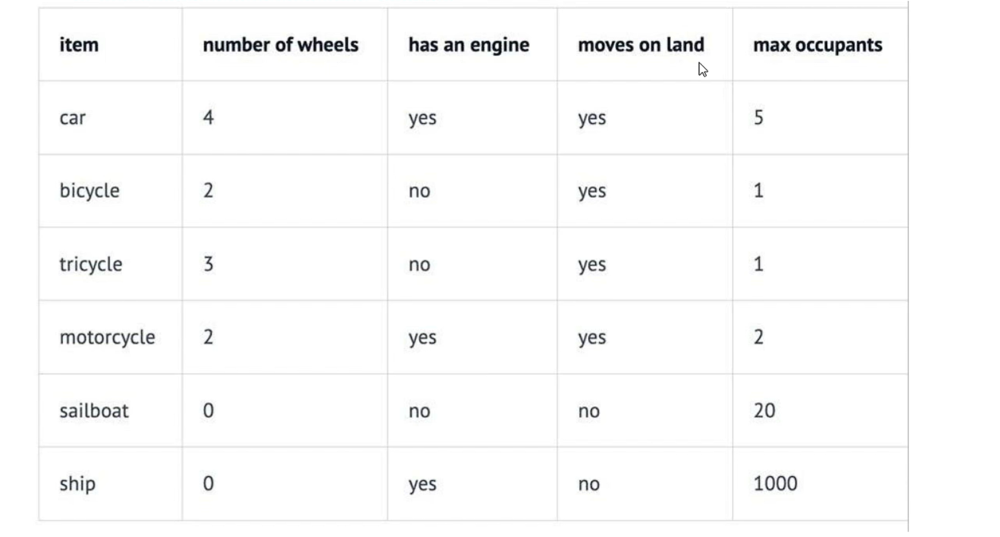
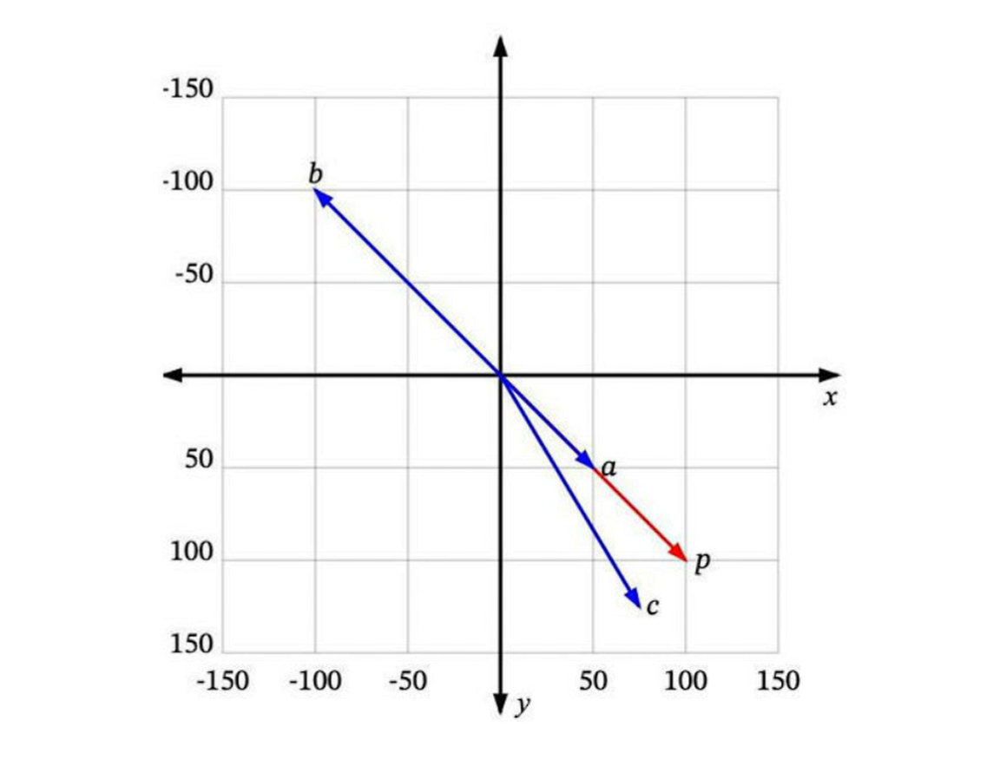
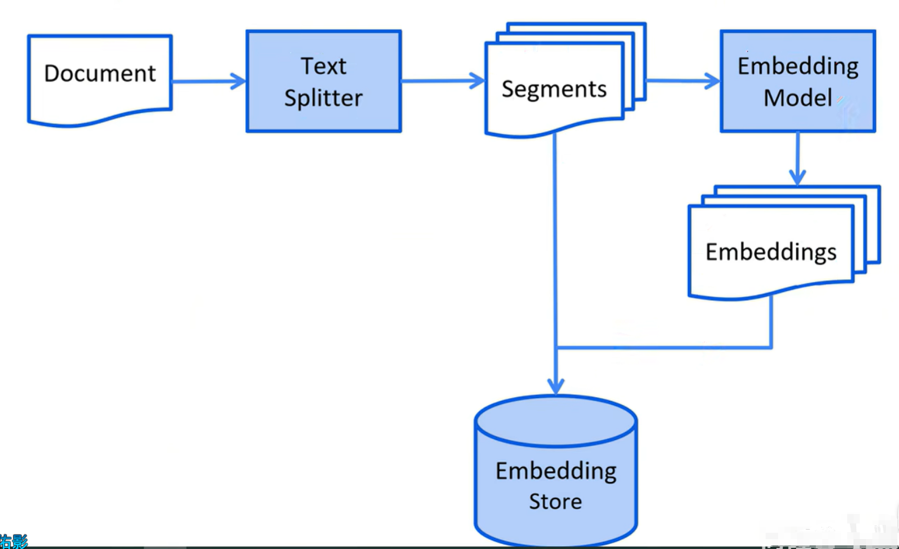
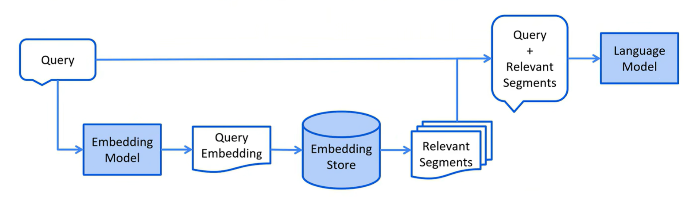

## 1 如何让大模型回答专业领域的问题
### 1.1 微调大模型
在现有大模型的基础上，使用小规模的特定任务数据进行再次训练，调整模型参数，让模型更精确地处理特定领域或任务的数据。
更新需重新训练，计算资源和时间成本高。
- 优点:一次会话只需一次模型调用，速度快，在特定任务上性能更高，准确性也更高。 
- 缺点:知识更新不及时，模型训成本高、训练周期长。 
- 应用场景:适合知识库稳定、对生成内容准确性和风格要求高的场景，如对上下文理解和语言生成质量要求高的文学创作、专业文档生成等。

### 1.2 RAG
**R**etrieval-**A**ugmented **G**eneration 检索增强生成
将原始问题以及提示词信息发送给大语言模型之前，先通过外部知识库检索相关信息，然后将检索结果和原始问题一起发送给大模型，
大模型依据外部知识库再结合自身的训练数据，组织自然语言回答问题。通过这种方式，大语言模型可以获取到特定领域的相关信息，并能够利用这些信息进行回复。
- 优点:数据存储在外部知识库，可以实时更新，不依赖对模型自身的训练，成本更低 
- 缺点:需要两次查询:先查询知识库，然后再查询大模型，性能不如微调大型 
- 应用场景:适用于知识库规模大月题繁更新的场景，如企业客服、实时新闻查询、法律和医疗领域的最新知识问答等,

### 1.3 RAG常用方法
- **全文(关键词)搜索**，这种方法通过将问题和提示词中的关键词与知识库文档数据库进行匹配来搜索文档。根据这些关键词在每个文档中的出现频率和相关性对搜索结果进行排序。
- 向量搜索 ，也被称为“语义搜索”。文本通过**嵌入模型**被转换为**数字向量**。然后，它根据查询向量与文档向量之间的余弦相似度或其他相似性/距离度量来查找和排序文档，
从而捕捉更深层次的语义含义。 
- 混合搜索。结合多种搜索方法(例如，全文搜索+向量搜索)通常可以提高搜索的效果。

## 2 向量搜索 vector search
### 2.1 向量 Vectors
可以将向量理解为从空间中的一个点到另一个点的移动。例如，在下图中，我们可以看到一些二维空间中的向量:
a是一个从 (100,50) 到 (-50,-50)的向量，b 是一个从(0,0)到 (100,-50)的向量

很多时候，我们处理的向量是从原点(0,0)开始的，比如b。这样我们可以省略向量起点部分，直接说b是向量(100,-50)。
如何将向量的概念扩展到非数值实体上呢(例如文本)?

### 2.2维度 Dimensions
如我们所见，每个数值向量都有x和y坐标(或者在多维系统中是x、y2,….)。x、y、.….,是这个向量空间的轴，称为维度。
对于我们想要表示为向量的一些非数值实体，我们首先需要决定这些维度，并为每个实体在每个维度上分配一个值。
例如，在一个交通工具数据集中，我们可以定义四个维度:“轮子数量”、“是否有发动机”、“是否可以在地上开动"和“最大乘客数”。 然后我们可以将一些车辆表示为:


因此，我们的汽车Car向量将是(4,yes,yes,5)，或者用数值表示为 (4,1,1,5) (将 yes 设为 1，no 设为 0)
向量的每个维度代表数据的不同特性，维度越多对事务的描述越精确，我们可以使用“是否有翅膀”、“是否使用柴油”、“最高速度”、“平均重量”、“价格”等等更多的维度信息。

### 2.3 相似度 Similarity
如果用户搜索 **“轿车Car”** 你希望能够返回所有与`"汽车automobile"`和 `“车辆vehicle"` 等信息相关的结果。向量搜索就是实现这个目标的一种方法。
**如何确定哪些是最相似的?**
每个向量都有一个长度和方向。例如，在这个图中，p和a指向相同的方向，但长度不同。p和b正好指向相反的方向，但有相同的长度，然后还有c，长度比p短一点，方向不完全相同，但很接近。


那么，哪一个最接近p呢?
如果“相似”仅仅意味着指向相似的方向，那么a是最接近p的。接下来是c。b是最不相似的，因为它正好指向与p相反的方向。如果“相似“仅仅意味着相似的长度，那么b是最接近p的(因为它有相同的长度)，接下来是c，然后是 a。
由于向量通常用于描述语义意义，仅仅看长度通常无法满足需求。<font color = 'red'>大多数相似度测量要么仅依赖于方向，要么同时考虑方向和大小。</font>

### 2.4 相似度测量 Measures of similarity
相似度测量即相似度计算。四种常见的向量相似度计算方法(这里不展开讨论):
- 欧几里得距离 Euclidean distance
- 曼哈顿距离 Manhattan distance
- 点积 Dot product 
- 余弦相似度 Cosine similarity

## 3 RAG的过程
### 3.1 索引阶段
在索引阶段，对知识库文档进行预处理，可实现检索阶段的高效搜索。
- 以下是索引阶段的简化图:
加载知识库文档 ==> 将文档中的<font color = 'red'>文本分段</font> => 利用<font color = 'red'>向量大模型</font>将分段后的<font color = 'red'>文本转换成向量</font> =>将向量<font color = 'red'>存入向量数据库</font>

**<font color = 'red'>为什么要进行文本分段?</font>**
大语言模型(LLM)的上下文窗口有限，所以整个知识库可能无法全部容纳其中。
  - 你在提问中提供的信息越多，大语言模型处理并做出回应所需的时间就越长。
  - 你在提问中提供的信息越多，所花费也就越多。
  - 提问中的无关信息可能会干扰大语言模型，增加产生幻觉(生成错误信息)的几率。
我们可以通过将知识库分割成更小、更易于理解的片段来解决这些问题。

### 3.2 检索阶段
- 以下是检索阶段的简化图
通过向量模型<font color = 'red'>将用户查询转换成向量</font>==>在向量数据库中根据用户查询进行<font color = 'red'>相似度匹配</font>==>将用户查询和向量数据库中匹配到的相关内容一起交给LLM处理


## 4 文档加载器 Document Loader
### 4.1、常见文档加载器
- `来自 langchain4j 模块的文件系统文档加载器(FileSystemDocumentLoader)`
- 来自 langchain4j 模块的类路径文档加载器(classPathDocumentLoader)
- 来自 langchain4j 模块的网址文档加载器(UrlDocumentLoader)
- 来自 langchain4j-document-loader-amazon-s3 模块的亚马逊 $3 文档加载器(Amazns3DocumentLoader)
- 来自 langchain4j-document-loader-azure-storage-blob 模块的 Azure Blob 存储文档加载器(AzureBlobStorageDocumentLoader)
- 来自 langchain4j-document-loader-github 模块的 GitHub 文档加载器(GitHubDocumentLoader)
- 来自 langchain4j-document-loader-google-cloud-storage 模块的谷歌云存储文档加载器(GoogleCloudStorageDocumentLoader)
- 来自 langchain4i-document-loader-selenium 模块的 Selenium 文档加载器(SeleniumDocumentLoader)
- 来自 langchain4i-document-loader-tencent-cos 模块的腾讯云对象存储文档加载器(TencentCosDocumentLoader)

### 4.2、测试文档加载
``` java
@Test
    public void testReadDocument() {
        // 加载单个文件
        Document document = FileSystemDocumentLoader.loadDocument("D:\\file\\测试.txt");
        System.out.println(document.text());

        // 从一个目录中加载所有文档
        List<Document> documents = FileSystemDocumentLoader.loadDocuments("D:\\file");
        for (Document document1 : documents) {
            System.out.println("=====================");
            System.out.println(document1.metadata());
            System.out.println(document1.text());
        }

        // 从一个目录中加载所有的.txt文档
        PathMatcher pathMatcher = FileSystems.getDefault().getPathMatcher("glob:*.txt");
        List<Document> documents1 = FileSystemDocumentLoader.loadDocuments("D:\\file", pathMatcher, new TextDocumentParser());
        
        // 从一个目录及子目录中加载所有文档
        List<Document> documents2 = FileSystemDocumentLoader.loadDocumentsRecursively("D:\\file", new TextDocumentParser());
    }
```
## 5 文档解析器 Document Parser
### 5.1 常见文档解析器
文档可以是各种格式的文件，比如 PDF、DOC、TXT等等。为了解析这些不同格式的文件，有一个“文档解析器”(Documentparser)接口，并且我们的库中包含了该接口的几种实现方式:
- `来自 langchain4j模块的文本文档解析器(TextDocumentParser)，它能够解析纯文本格式的文件(例如 TXT、HTML、MD 等)。`
- 来自langchain4j- document parser-apache-pdfbx 模块的 Apache PDFBox 文档解析器(ApachePdfBoxDocumentParser)，它可以解析 PDF 文件
- 来自 langchain4j-document parserapache-poi模块的 Apache POI 文档解析器(ApachePoiDocumentParser)，它能够解析微软办公软件的文件格式(例如 DOC、DOCX、PPT、PPTX、XLS、XLSX等)。 
- 来自 langchain4j-document-parser-apache-tika 模块的 Apache Tika 文档解析器(ApacheTikaDocumentParser)，它可以自动检测并解析几乎所有现有的文件格式。

假设如果我们想解析PDF文档，那么原有的 `TextDocumentParser` 就无法工作了，我们需要引入 `langchain4i-document-parser-apache-pdfbox`

### 5.2 添加依赖
```xml
<!--解析pdf文档-->
<dependency>
    <groupId>dev.langchain4j</qroupId>
    <artifactId>langchain4j-document-parser-apache-pdfbox</artifactId>
</dependency>
```