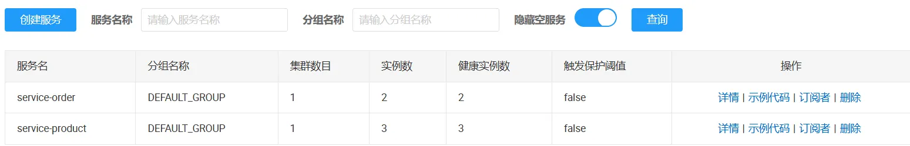
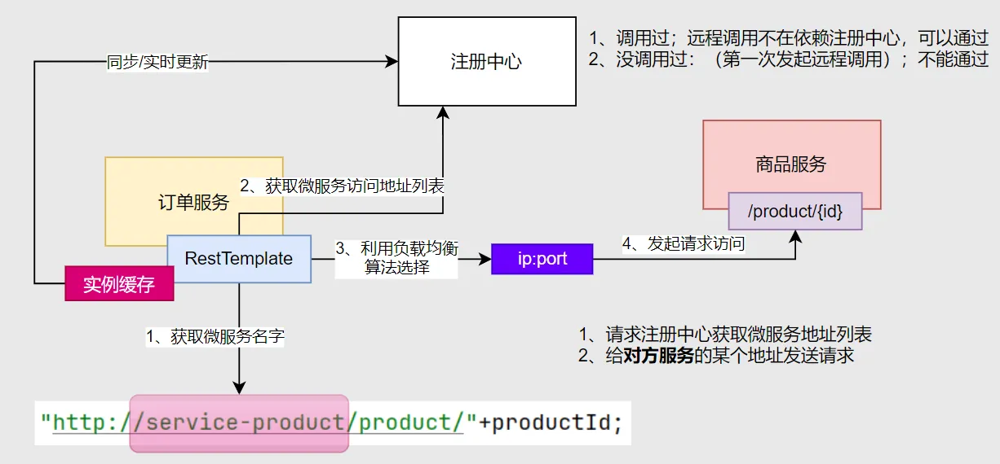

#  Nacos - 注册/配置中心

## 基础入门

### 简介

官网：https://nacos.io/zh-cn/docs/v2/quickstart/quick-start.html

Nacos /nɑ:kəʊs/ 是 Dynamic Naming and Configuration Service的首字母简称，一个更易于构建云原生应用的动态服务发现、配置管理和服务管理平台。

- 启动：`startup.cmd -m standalone`

## 注册中心

### 依赖引入

```yaml
<dependency>
    <groupId>com.alibaba.cloud</groupId>
    <artifactId>spring-cloud-starter-alibaba-nacos-discovery</artifactId>
</dependency>
```

###  整合配置

1、在 `application.properties`中配置如下

```properties
spring.cloud.nacos.discovery.server-addr=127.0.0.1:8848

#暂未用到配置中心功能，需要关闭配置检查
#spring.cloud.nacos.config.import-check.enabled=false
```

2、开启服务注册/发现功能

```java
@EnableDiscoveryClient //核心注解
@SpringBootApplication
public class OrderMainApplication {
	public static void main(String[] args) {
		SpringApplication.run(OrderMainApplication.class, args);
	}
}
```

### 服务注册

#### 查看效果

访问：http://localhost:8848/nacos 可以看到服务已经注册上来；



#### 注册更多

1. 创建 `service-product`服务
2. 引入 `nacos依赖`
3. 配置 `nacos地址信息`
   a.注意：每个微服务端口不一样
4. 启动应用，查看是否注册成功

###  服务发现

#### DiscoveryClient

```java
@Autowired
DiscoveryClient discoveryClient;
@Test
void discoveryClientTest(){
    for (String service : discoveryClient.getServices()) {
        System.out.println("service = " + service);
        //获取ip+port
        List<ServiceInstance> instances = discoveryClient.getInstances(service);
        for (ServiceInstance instance : instances) {
            System.out.println("ip："+instance.getHost()+"；"+"port = " + instance.getPort());
        }
    }
}
```

#### NacosServiceDiscovery

```java
@Autowired
NacosServiceDiscovery nacosServiceDiscovery;
@Test
void  nacosServiceDiscoveryTest() throws NacosException {
    for (String service : nacosServiceDiscovery.getServices()) {
        System.out.println("service = " + service);
        List<ServiceInstance> instances = nacosServiceDiscovery.getInstances(service);
        for (ServiceInstance instance : instances) {
            System.out.println("ip："+instance.getHost()+"；"+"port = " + instance.getPort());
        }
    }
}
```

### 远程调用

#### 配置 RestTemplate

```java
@Configuration
public class UserConfiguration {
   
    @Bean
    RestTemplate restTemplate() {
        return new RestTemplate();
    }
}
```

#### 测试调用

```java
@Autowired
RestTemplate restTemplate;

@Test
void testRestTemplate() {
    String forObject = restTemplate.getForObject("http://localhost:8080/movie", String.class);
    System.out.println(forObject);
    System.out.println("-----------------------------");

}
```

#### 小结

1. 使用 RestTemplate 可以获取到远程数据
2. 必须精确指定地址和端口
3. 如果远程宕机将不可用

期望：可以负载均衡调用，不用担心远程宕机

### 负载均衡

#### 依赖导入

```xml
<dependency>
  <groupId>org.springframework.cloud</groupId>
  <artifactId>spring-cloud-starter-loadbalancer</artifactId>
</dependency>
```

#### LoadBalancerClient

```java
// 进阶2：完成负载均衡发送请求
private Product getProductFromRemoteWithLoadBalance(Long productId){
    //1、获取到商品服务所在的所有机器IP+port
    ServiceInstance choose = loadBalancerClient.choose("service-product");
    //远程URL
    String url = "http://"+choose.getHost() +":" +choose.getPort() +"/product/"+productId;
    log.info("远程请求：{}",url);
    //2、给远程发送请求
    Product product = restTemplate.getForObject(url, Product.class);
    return product;
}
```

#### 注解式负载均衡

```java
@Configuration
public class UserConfiguration {
    
    @LoadBalanced
    @Bean
    RestTemplate restTemplate() {
        return new RestTemplate();
    }
}
```

```java
// 进阶3：基于注解的负载均衡
private Product getProductFromRemoteWithLoadBalanceAnnotation(Long productId){

    String url = "http://service-product/product/"+productId;
    //2、给远程发送请求； service-product 会被动态替换
    Product product = restTemplate.getForObject(url, Product.class);
    return product;
}
```

####  小结

1. 负载均衡调用只需要传入`服务名`
2. 请求发起之前会自动去注册中心确定微服务地址
3. 如果微服务宕机，会自动剔除在线名单，请求将不会发过去

### 深入探索

经典面试题：

**如果注册中心宕机，远程调用是否可以成功？**

1. 从未调用过，如果宕机，调用会立即失败
2. 调用过，如果宕机，因为会缓存名单，调用会成功
3. 调用过，如果注册中心和对方服务宕机，因为会缓存名单，调用会阻塞后失败（Connection Refused）




