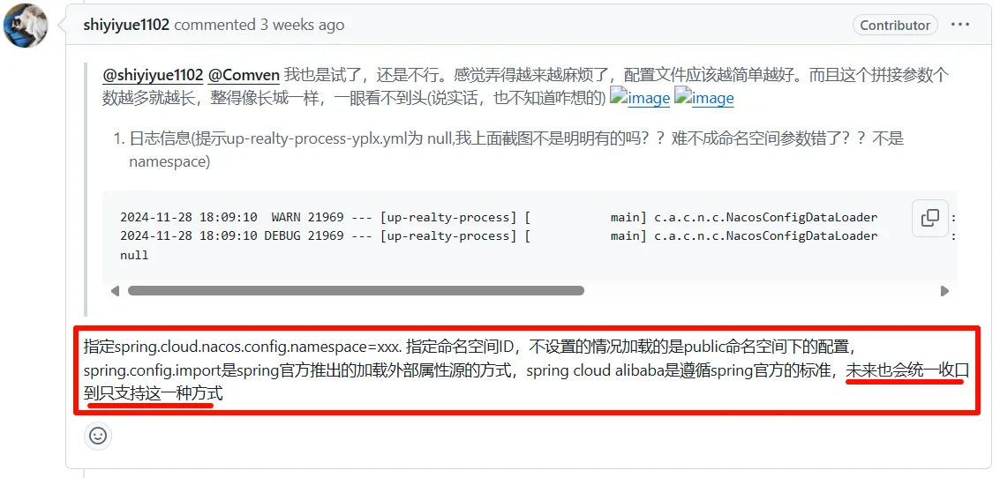
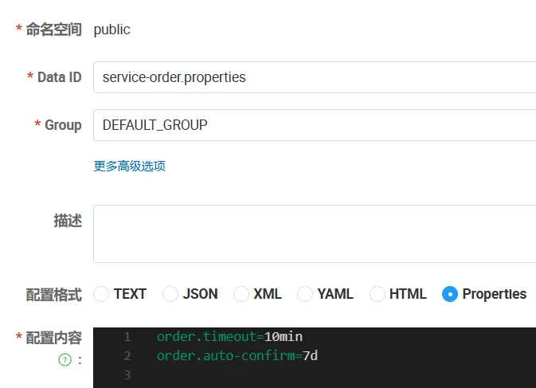
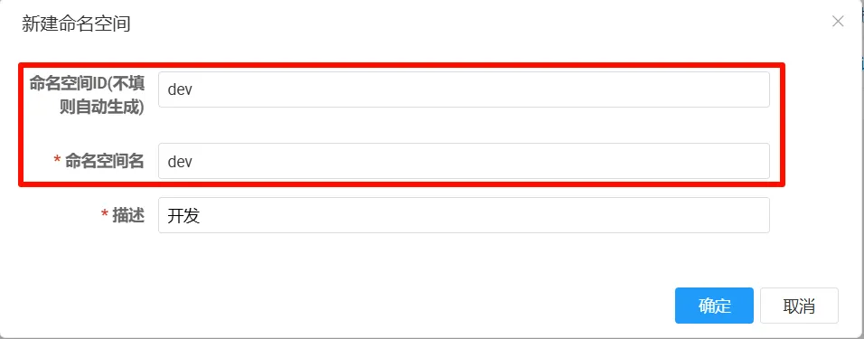
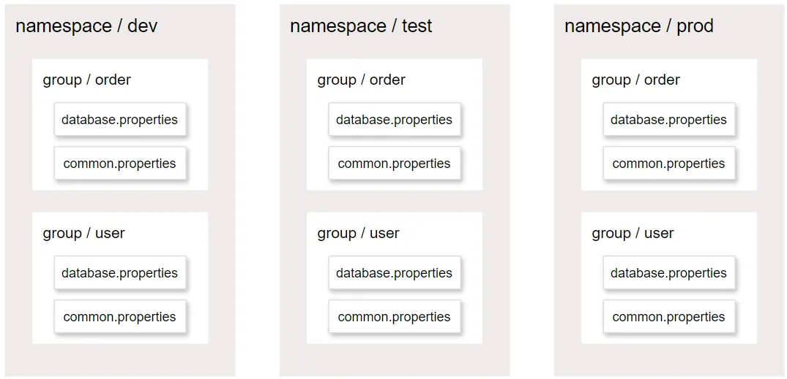

## **配置中心**

 

> 配置中心主要问题：

 

### **整合配置**

#### **依赖引入**

```xml
<dependency>
  <groupId>com.alibaba.cloud</groupId>
  <artifactId>spring-cloud-starter-alibaba-nacos-config</artifactId>
</dependency>
```

#### **配置文件**

application.properties

```properties
# 指定配置中心地址
spring.cloud.nacos.server-addr=localhost:8848
spring.config.import=nacos:service-order.properties
```

 

#### **配置集-dataId**

 

### **动态刷新**

#### **@RefreshScope**

Nacos 配置文件配置内容更新后，如果不加入此注解，程序无法感知到内容的变化

```java
@RefreshScope//自动刷新
@RestController
public class OrderController {


    @Autowired
    OrderService orderService;

   @Value("${order.timeout}")
   String orderTimeout;
   @Value("${order.auto-confirm}")
   String orderAutoConfirm;

    @Autowired
    OrderProperties orderProperties;

    @GetMapping("/config")
    public String config(){
        return "order.timeout="+orderProperties.getTimeout()+"； " +
                "order.auto-confirm="+orderProperties.getAutoConfirm() +"；"+
                "order.db-url="+orderProperties.getDbUrl();
    }
}
```

#### **ConfigurationProperties**

> 无需 @RefreshScope，自动绑定配置，动态更新

```java
@Component
@ConfigurationProperties(prefix = "order") //配置批量绑定在nacos下，可以无需@RefreshScope就能实现自动刷新
@Data
public class OrderProperties {
  String timeout;
  String autoConfirm;
  String dbUrl;
}
```

### **NacosConfigManager**

```java
@Bean
ApplicationRunner applicationRunner(NacosConfigManager manager){
    return args -> {
        ConfigService configService = manager.getConfigService();
        configService.addListener("service-order.properties", "DEFAULT_GROUP", new Listener() {
            @Override
            public Executor getExecutor() {
                return Executors.newFixedThreadPool(4);
            }

            @Override
            public void receiveConfigInfo(String configInfo) {
                System.out.println("configInfo = " + configInfo);
            }
        });
    };
}
```

### **namespace、dataId、group**

#### **namespace**

命名空间：实现多环境隔离，如：开发、测试、预发、生产等

 

#### **dataId**

数据集id：就是以前配置文件的名字。完整写法：名字.后缀 如：common.properties

#### **groupId**

分组id：一般可以用微服务的名字作为自己的组。

#### **推荐用法**

 

 

 