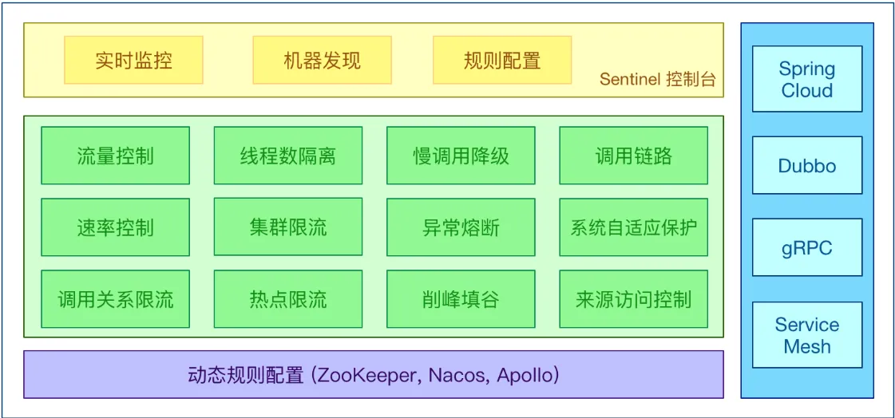
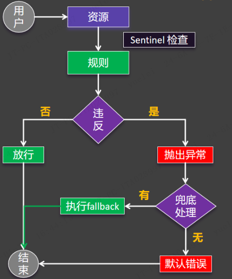

# Sentinel - 流量保护

## 介绍

官网：https://sentinelguard.io/zh-cn/index.html

wiki：https://github.com/alibaba/Sentinel/wiki

下载控制台：📎sentinel-dashboard-1.8.8.jar

随着微服务的流行，服务和服务之间的稳定性变得越来越重要。Sentinel 以流量为切入点，从流量控制、流量路由、熔断降级、系统自适应过载保护、热点流量防护等多个维度保护服务的稳定性。

Sentinel 具有以下特征:

- **丰富的应用场景**：Sentinel 承接了阿里巴巴近 10 年的双十一大促流量的核心场景，例如秒杀（即突发流量控制在系统容量可以承受的范围）、消息削峰填谷、集群流量控制、实时熔断下游不可用应用等。

- **完备的实时监控**：Sentinel 同时提供实时的监控功能。您可以在控制台中看到接入应用的单台机器秒级数据，甚至 500 台以下规模的集群的汇总运行情况。

- **广泛的开源生态**：Sentinel 提供开箱即用的与其它开源框架/库的整合模块，例如与 Spring Cloud、Apache Dubbo、gRPC、Quarkus 的整合。您只需要引入相应的依赖并进行简单的配置即可快速地接入 Sentinel。同时 Sentinel 提供 Java/Go/C++ 等多语言的原生实现。

- **完善的 SPI 扩展机制**：Sentinel 提供简单易用、完善的 SPI 扩展接口。您可以通过实现扩展接口来快速地定制逻辑。例如定制规则管理、适配动态数据源等。

## 架构

## 资源&规则

定义资源：

- 主流框架自动适配（Web Servlet、Dubbo、Spring Cloud、gRPC、Spring WebFlux、Reactor）；所有Web接口均为资源
- 编程式：SphU API
- 声明式：@SentinelResource

定义规则：

- 流量控制规则
- 熔断降级规则
- 系统保护规则
- 来源访问控制规则
- 热点参数规则

