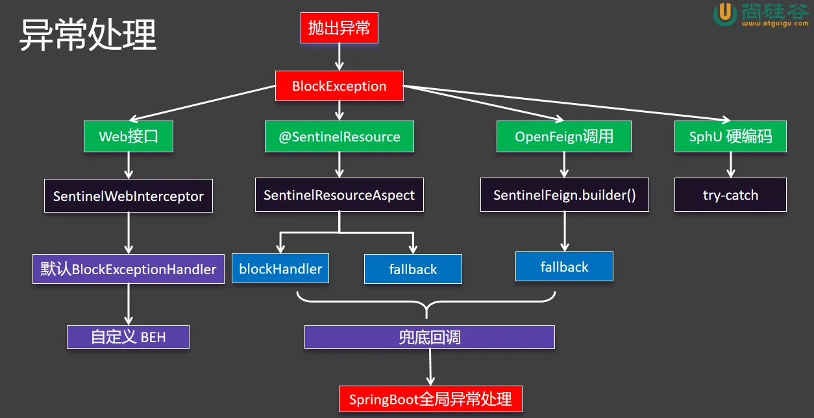
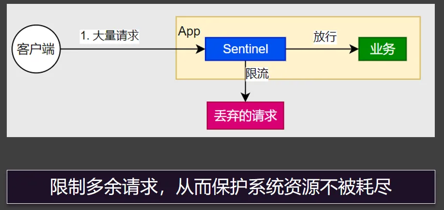
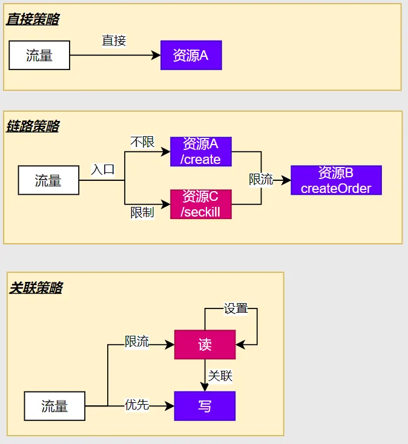
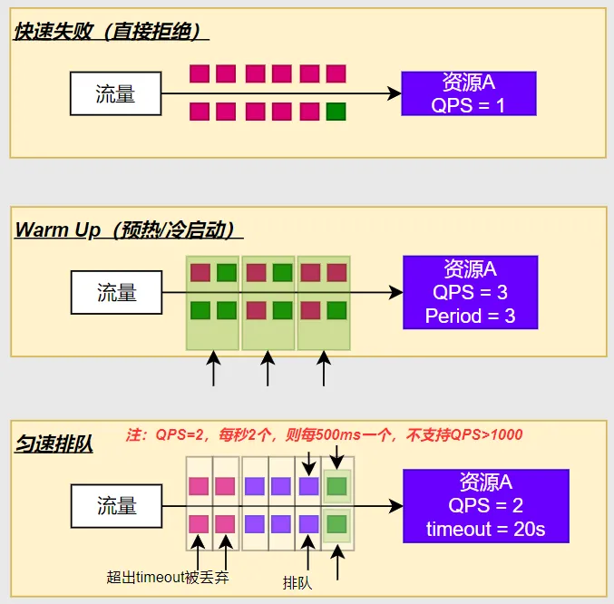
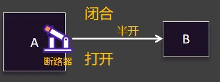
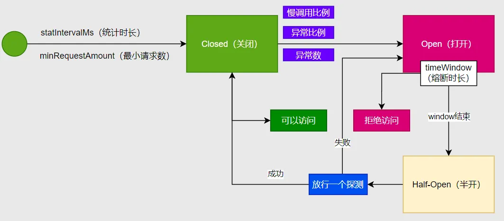
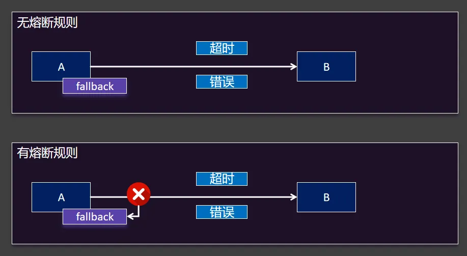
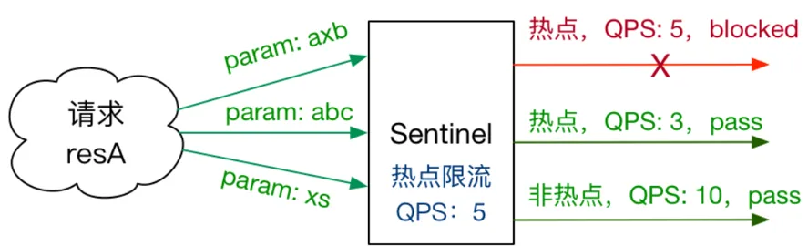

## **环境搭建**

### 依赖

```xml
<dependency>
  <groupId>com.alibaba.cloud</groupId>
  <artifactId>spring-cloud-starter-alibaba-sentinel</artifactId>
</dependency>
```

### **启动控制台**

java -jar sentinel.jar

### **配置连接**

```yaml
spring:
 cloud:
  sentinel:
   transport:
    dashboard: localhost:8080
```

## **异常处理**




### **自定义 BlockExceptionHandler**

```java
@Component
public class MyBlockExceptionHandler implements BlockExceptionHandler {

  private ObjectMapper objectMapper = new ObjectMapper();

  @Override
  public void handle(HttpServletRequest request, HttpServletResponse response, String resourceName, BlockException e) throws Exception {

    response.setStatus(429); //too many requests
    response.setContentType("application/json;charset=utf-8");
    PrintWriter writer = response.getWriter();
    R error = R.error(500, resourceName + " 被Sentinel限制了，原因：" + e.getClass());

    String json = objectMapper.writeValueAsString(error);
    writer.write(json);
    writer.flush();
    writer.close();
  }
}
```

### **blockHandler**

```java
 @SentinelResource(value = "createOrder",blockHandler = "createOrderFallback")

  @Override
  public Order createOrder(Long productId, Long userId) {
//     Product product = getProductFromRemoteWithLoadBalanceAnnotation(productId);
    //使用Feign完成远程调用
    Product product = productFeignClient.getProductById(productId);
    Order order = new Order();
    order.setId(1L);

    // 总金额
    order.setTotalAmount(product.getPrice().multiply(new BigDecimal(product.getNum())));
    order.setUserId(userId);
    order.setNickName("zhangsan");
    order.setAddress("尚硅谷");
    //远程查询商品列表
    order.setProductList(Arrays.asList(product));
    return order;
  }

  //兜底回调
  public Order createOrderFallback(Long productId, Long userId, BlockException e){
    Order order = new Order();
    order.setId(0L);
    order.setTotalAmount(new BigDecimal("0"));
    order.setUserId(userId);
    order.setNickName("未知用户");
    order.setAddress("异常信息："+e.getClass());
    return order;
}
```


### **OpenFeign - 兜底回调**

```java
@FeignClient(value = "service-product",fallback = ProductFeignClientFallback.class) // feign客户端
public interface ProductFeignClient {
  //mvc注解的两套使用逻辑
  //1、标注在Controller上，是接受这样的请求
  //2、标注在FeignClient上，是发送这样的请求
  @GetMapping("/product/{id}")
  Product getProductById(@PathVariable("id") Long id);
}
```


```java
@Component
public class ProductFeignClientFallback implements ProductFeignClient {

  @Override
  public Product getProductById(Long id) {
    System.out.println("兜底回调....");
    Product product = new Product();
    product.setId(id);
    product.setPrice(new BigDecimal("0"));
    product.setProductName("未知商品");
    product.setNum(0);
    return product;
  }
}
```

 

## **规则 - 流量控制**

 

 

### **5.6.1. 阈值类型**

QPS：统计每秒请求数

并发线程数：统计并发线程数

### **流控模式**

 

### **流控效果**

 

 

## **规则 - 熔断降级**

### **断路器**

 

### **工作原理**

 

 

### **熔断与兜底**

 

 

## **规则 - 热点参数**

 

### **环境搭建**

```java
  @GetMapping("/seckill")
  @SentinelResource(value = "seckill-order",fallback = "seckillFallback")
  public Order seckill(@RequestParam(value = "userId",required = false) Long userId, @RequestParam(value = "productId",defaultValue = "1000") Long productId){
    Order order = orderService.createOrder(productId, userId);
    order.setId(Long.MAX_VALUE);
    return order;
  }

  public Order seckillFallback(Long userId,Long productId, BlockException exception){
    System.out.println("seckillFallback....");
    Order order = new Order();
    order.setId(productId);
    order.setUserId(userId);
    order.setAddress("异常信息："+exception.getClass());
    return order;
  }
```


