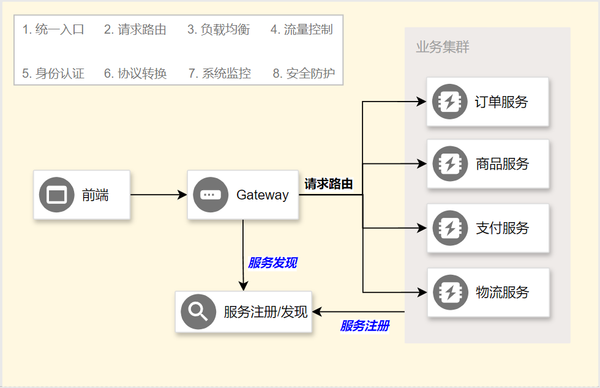
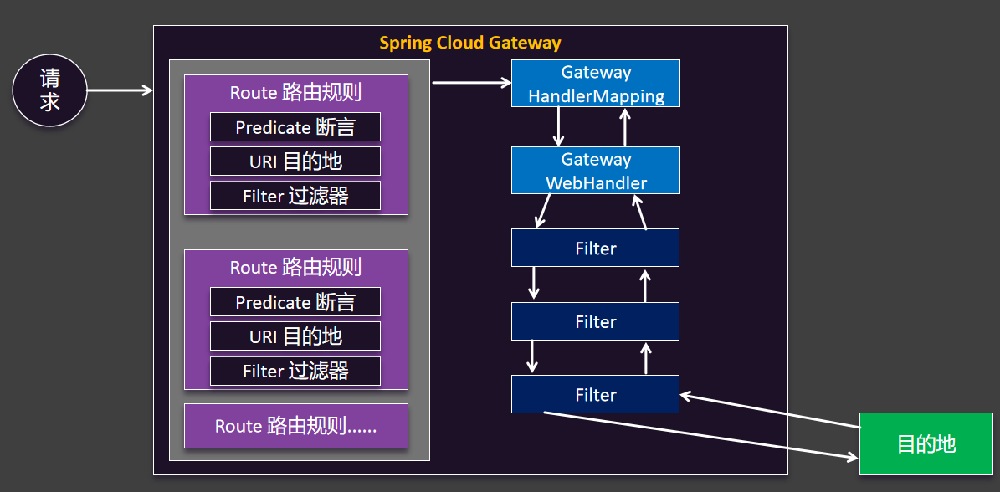

官网：https://spring.io/projects/spring-cloud-gateway

## 基础入门

### 功能



### HelloWorld

> `/api/order/**`路由给订单
>
> `/api/product/**`路由给商品
>
> 测试负载均衡

#### 创建项目

引入 `spring-cloud-starter-gateway`、`spring-cloud-starter-alibaba-nacos-discovery`

```xml
<dependencies>
    <dependency>
        <groupId>org.springframework.cloud</groupId>
        <artifactId>spring-cloud-starter-loadbalancer</artifactId>
    </dependency>
    <dependency>
        <groupId>com.alibaba.cloud</groupId>
        <artifactId>spring-cloud-starter-alibaba-nacos-discovery</artifactId>
    </dependency>
    <dependency>
        <groupId>org.springframework.cloud</groupId>
        <artifactId>spring-cloud-starter-gateway</artifactId>
    </dependency>
</dependencies>
```

#### 改造微服务

- 为 service-order、service-prduct 添加 `/api`基础路径

#### 配置网关

创建 `application.yml`编写如下配置

```yaml
spring:
  cloud:
    gateway:
      routes:
        - id: order-route
          uri: lb://service-order
          predicates:
            - Path=/api/order/**
        - id: product-route
          uri: lb://service-product
          predicates:
            - Path=/api/product/**
```

### 原理



## Predicate - 断言

```yaml
spring:
  cloud:
    gateway:
      routes:
      - id: after_route
        uri: https://example.org
        predicates:
        - After=2017-01-20T17:42:47.789-07:00[America/Denver]
```

| **名**               | 参数（个数/类型）   | **作用**                                                     |
| -------------------- | ------------------- | ------------------------------------------------------------ |
| After                | 1/datetime          | 在指定时间之后                                               |
| Before               | 1/datetime          | 在指定时间之前                                               |
| Between              | 2/datetime          | 在指定时间区间内                                             |
| Cookie               | 2/string,regexp     | 包含cookie名且必须匹配指定值                                 |
| Header               | 2/string,regexp     | 包含请求头且必须匹配指定值                                   |
| Host                 | N/string            | 请求host必须是指定枚举值                                     |
| Method               | N/string            | 请求方式必须是指定枚举值                                     |
| Path                 | 2/List<String>,bool | 请求路径满足规则，是否匹配最后的/                            |
| Query                | 2/string,regexp     | 包含指定请求参数                                             |
| RemoteAddr           | 1/List<String>      | 请求来源于指定网络域(CIDR写法)                               |
| Weight               | 2/string,int        | 按指定权重负载均衡                                           |
| XForwardedRemoteAddr | 1/List<string>      | 从X-Forwarded-For请求头中解析请求来源，并判断是否来源于指定网络域 |

## Filter - 过滤器

| 名                               | 参数（个数/类型） | 作用                                              |
| -------------------------------- | ----------------- | ------------------------------------------------- |
| AddRequestHeader                 | 2/string          | 添加请求头                                        |
| AddRequestHeadersIfNotPresent    | 1/List<string>    | 如果没有则添加请求头，key:value方式               |
| AddRequestParameter              | 2/string、string  | 添加请求参数                                      |
| AddResponseHeader                | 2/string、string  | 添加响应头                                        |
| CircuitBreaker                   | 1/string          | 仅支持forward:/inCaseOfFailureUseThis方式进行熔断 |
| CacheRequestBody                 | 1/string          | 缓存请求体                                        |
| DedupeResponseHeader             | 1/string          | 移除重复响应头，多个用空格分割                    |
| FallbackHeaders                  | 1/string          | 设置Fallback头                                    |
| JsonToGrpc                       |                   | 请求体Json转为gRPC                                |
| LocalResponseCache               | 2/string          | 响应数据本地缓存                                  |
| MapRequestHeader                 | 2/string          | 把某个请求头名字变为另一个名字                    |
| ModifyRequestBody                | 仅 Java 代码方式  | 修改请求体                                        |
| ModifyResponseBody               | 仅 Java 代码方式  | 修改响应体                                        |
| PrefixPath                       | 1/string          | 自动添加请求前缀路径                              |
| PreserveHostHeader               | 0                 | 保护Host头                                        |
| RedirectTo                       | 3/string          | 重定向到指定位置                                  |
| RemoveJsonAttributesResponseBody | 1/string          | 移除响应体中的某些Json字段，多个用,分割           |
| RemoveRequestHeader              | 1/string          | 移除请求头                                        |
| RemoveRequestParameter           | 1/string          | 移除请求参数                                      |
| RemoveResponseHeader             | 1/string          | 移除响应头                                        |
| RequestHeaderSize                | 2/string          | 设置请求大小，超出则响应431状态码                 |
| RequestRateLimiter               | 1/string          | 请求限流                                          |
| RewriteLocationResponseHeader    | 4/string          | 重写Location响应头                                |
| RewritePath                      | 2/string          | 路径重写                                          |
| RewriteRequestParameter          | 2/string          | 请求参数重写                                      |
| RewriteResponseHeader            | 3/string          | 响应头重写                                        |
| SaveSession                      | 0                 | session保存，配合spring-session框架               |
| SecureHeaders                    | 0                 | 安全头设置                                        |
| SetPath                          | 1/string          | 路径修改                                          |
| SetRequestHeader                 | 2/string          | 请求头修改                                        |
| SetResponseHeader                | 2/string          | 响应头修改                                        |
| SetStatus                        | 1/int             | 设置响应状态码                                    |
| StripPrefix                      | 1/int             | 路径层级拆除                                      |
| Retry                            | 7/string          | 请求重试设置                                      |
| RequestSize                      | 1/string          | 请求大小限定                                      |
| SetRequestHostHeader             | 1/string          | 设置Host请求头                                    |
| TokenRelay                       | 1/string          | OAuth2的token转发                                 |

## CORS - 跨域处理

> 全局跨域

```yaml
spring:
  cloud:
    gateway:
      globalcors:
        cors-configurations:
          '[/**]':
            allowedOrigins: "https://docs.spring.io"
            allowedMethods:
            - GET
```

> 局部跨域

```yaml
spring:
  cloud:
    gateway:
      routes:
      - id: cors_route
        uri: https://example.org
        predicates:
        - Path=/service/**
        metadata:
          cors:
            allowedOrigins: '*'
            allowedMethods:
              - GET
              - POST
            allowedHeaders: '*'
            maxAge: 30
```

## GlobalFilter

```java
@Bean
public GlobalFilter customFilter() {
    return new CustomGlobalFilter();
}

public class CustomGlobalFilter implements GlobalFilter, Ordered {

    @Override
    public Mono<Void> filter(ServerWebExchange exchange, GatewayFilterChain chain) {
        log.info("custom global filter");
        return chain.filter(exchange);
    }

    @Override
    public int getOrder() {
        return -1;
    }
}
```


