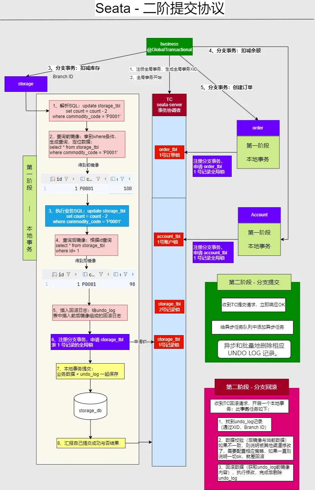

# Seata - 分布式事务

官网：https://seata.apache.org/zh-cn/

## 环境搭建

### SQL

> 启动一个数据库，然后运行如下sql文件

```sql
CREATE DATABASE IF NOT EXISTS `storage_db`;
USE  `storage_db`;
DROP TABLE IF EXISTS `storage_tbl`;
CREATE TABLE `storage_tbl` (
                               `id` int(11) NOT NULL AUTO_INCREMENT,
                               `commodity_code` varchar(255) DEFAULT NULL,
                               `count` int(11) DEFAULT 0,
                               PRIMARY KEY (`id`),
                               UNIQUE KEY (`commodity_code`)
) ENGINE=InnoDB DEFAULT CHARSET=utf8;
INSERT INTO storage_tbl (commodity_code, count) VALUES ('P0001', 100);
INSERT INTO storage_tbl (commodity_code, count) VALUES ('B1234', 10);

-- 注意此处0.3.0+ 增加唯一索引 ux_undo_log
DROP TABLE IF EXISTS `undo_log`;
CREATE TABLE `undo_log` (
                            `id` bigint(20) NOT NULL AUTO_INCREMENT,
                            `branch_id` bigint(20) NOT NULL,
                            `xid` varchar(100) NOT NULL,
                            `context` varchar(128) NOT NULL,
                            `rollback_info` longblob NOT NULL,
                            `log_status` int(11) NOT NULL,
                            `log_created` datetime NOT NULL,
                            `log_modified` datetime NOT NULL,
                            `ext` varchar(100) DEFAULT NULL,
                            PRIMARY KEY (`id`),
                            UNIQUE KEY `ux_undo_log` (`xid`,`branch_id`)
) ENGINE=InnoDB AUTO_INCREMENT=1 DEFAULT CHARSET=utf8;

CREATE DATABASE IF NOT EXISTS `order_db`;
USE  `order_db`;
DROP TABLE IF EXISTS `order_tbl`;
CREATE TABLE `order_tbl` (
                             `id` int(11) NOT NULL AUTO_INCREMENT,
                             `user_id` varchar(255) DEFAULT NULL,
                             `commodity_code` varchar(255) DEFAULT NULL,
                             `count` int(11) DEFAULT 0,
                             `money` int(11) DEFAULT 0,
                             PRIMARY KEY (`id`)
) ENGINE=InnoDB DEFAULT CHARSET=utf8;
-- 注意此处0.3.0+ 增加唯一索引 ux_undo_log
DROP TABLE IF EXISTS `undo_log`;
CREATE TABLE `undo_log` (
                            `id` bigint(20) NOT NULL AUTO_INCREMENT,
                            `branch_id` bigint(20) NOT NULL,
                            `xid` varchar(100) NOT NULL,
                            `context` varchar(128) NOT NULL,
                            `rollback_info` longblob NOT NULL,
                            `log_status` int(11) NOT NULL,
                            `log_created` datetime NOT NULL,
                            `log_modified` datetime NOT NULL,
                            `ext` varchar(100) DEFAULT NULL,
                            PRIMARY KEY (`id`),
                            UNIQUE KEY `ux_undo_log` (`xid`,`branch_id`)
) ENGINE=InnoDB AUTO_INCREMENT=1 DEFAULT CHARSET=utf8;

CREATE DATABASE IF NOT EXISTS `account_db`;
USE  `account_db`;
DROP TABLE IF EXISTS `account_tbl`;
CREATE TABLE `account_tbl` (
                               `id` int(11) NOT NULL AUTO_INCREMENT,
                               `user_id` varchar(255) DEFAULT NULL,
                               `money` int(11) DEFAULT 0,
                               PRIMARY KEY (`id`)
) ENGINE=InnoDB DEFAULT CHARSET=utf8;
INSERT INTO account_tbl (user_id, money) VALUES ('1', 10000);
-- 注意此处0.3.0+ 增加唯一索引 ux_undo_log
DROP TABLE IF EXISTS `undo_log`;
CREATE TABLE `undo_log` (
                            `id` bigint(20) NOT NULL AUTO_INCREMENT,
                            `branch_id` bigint(20) NOT NULL,
                            `xid` varchar(100) NOT NULL,
                            `context` varchar(128) NOT NULL,
                            `rollback_info` longblob NOT NULL,
                            `log_status` int(11) NOT NULL,
                            `log_created` datetime NOT NULL,
                            `log_modified` datetime NOT NULL,
                            `ext` varchar(100) DEFAULT NULL,
                            PRIMARY KEY (`id`),
                            UNIQUE KEY `ux_undo_log` (`xid`,`branch_id`)
) ENGINE=InnoDB AUTO_INCREMENT=1 DEFAULT CHARSET=utf8;
```

### 微服务配置

#### 依赖

```yaml
<dependency>
  <groupId>com.alibaba.cloud</groupId>
  <artifactId>spring-cloud-starter-alibaba-seata</artifactId>
</dependency>
```

#### 配置

每个微服务创建 `file.conf`文件，完整内容如下；

【微服务只需要复制 `service 块`配置即可】

```nginx
#
# Licensed to the Apache Software Foundation (ASF) under one or more
# contributor license agreements.  See the NOTICE file distributed with
# this work for additional information regarding copyright ownership.
# The ASF licenses this file to You under the Apache License, Version 2.0
# (the "License"); you may not use this file except in compliance with
# the License.  You may obtain a copy of the License at
#
#     http://www.apache.org/licenses/LICENSE-2.0
#
# Unless required by applicable law or agreed to in writing, software
# distributed under the License is distributed on an "AS IS" BASIS,
# WITHOUT WARRANTIES OR CONDITIONS OF ANY KIND, either express or implied.
# See the License for the specific language governing permissions and
# limitations under the License.
#

transport {
  # tcp, unix-domain-socket
  type = "TCP"
  #NIO, NATIVE
  server = "NIO"
  #enable heartbeat
  heartbeat = true
  # the tm client batch send request enable
  enableTmClientBatchSendRequest = false
  # the rm client batch send request enable
  enableRmClientBatchSendRequest = true
   # the rm client rpc request timeout
  rpcRmRequestTimeout = 2000
  # the tm client rpc request timeout
  rpcTmRequestTimeout = 30000
  # the rm client rpc request timeout
  rpcRmRequestTimeout = 15000
  #thread factory for netty
  threadFactory {
    bossThreadPrefix = "NettyBoss"
    workerThreadPrefix = "NettyServerNIOWorker"
    serverExecutorThread-prefix = "NettyServerBizHandler"
    shareBossWorker = false
    clientSelectorThreadPrefix = "NettyClientSelector"
    clientSelectorThreadSize = 1
    clientWorkerThreadPrefix = "NettyClientWorkerThread"
    # netty boss thread size
    bossThreadSize = 1
    #auto default pin or 8
    workerThreadSize = "default"
  }
  shutdown {
    # when destroy server, wait seconds
    wait = 3
  }
  serialization = "seata"
  compressor = "none"
}
service {
  #transaction service group mapping
  vgroupMapping.default_tx_group = "default"
  #only support when registry.type=file, please don't set multiple addresses
  default.grouplist = "127.0.0.1:8091"
  #degrade, current not support
  enableDegrade = false
  #disable seata
  disableGlobalTransaction = false
}

client {
  rm {
    asyncCommitBufferLimit = 10000
    lock {
      retryInterval = 10
      retryTimes = 30
      retryPolicyBranchRollbackOnConflict = true
    }
    reportRetryCount = 5
    tableMetaCheckEnable = false
    tableMetaCheckerInterval = 60000
    reportSuccessEnable = false
    sagaBranchRegisterEnable = false
    sagaJsonParser = "fastjson"
    sagaRetryPersistModeUpdate = false
    sagaCompensatePersistModeUpdate = false
    tccActionInterceptorOrder = -2147482648 #Ordered.HIGHEST_PRECEDENCE + 1000
    sqlParserType = "druid"
    branchExecutionTimeoutXA = 60000
    connectionTwoPhaseHoldTimeoutXA = 10000
  }
  tm {
    commitRetryCount = 5
    rollbackRetryCount = 5
    defaultGlobalTransactionTimeout = 60000
    degradeCheck = false
    degradeCheckPeriod = 2000
    degradeCheckAllowTimes = 10
    interceptorOrder = -2147482648 #Ordered.HIGHEST_PRECEDENCE + 1000
  }
  undo {
    dataValidation = true
    onlyCareUpdateColumns = true
    logSerialization = "jackson"
    logTable = "undo_log"
    compress {
      enable = true
      # allow zip, gzip, deflater, lz4, bzip2, zstd default is zip
      type = zip
      # if rollback info size > threshold, then will be compress
      # allow k m g t
      threshold = 64k
    }
  }
  loadBalance {
      type = "XID"
      virtualNodes = 10
  }
}
log {
  exceptionRate = 100
}
tcc {
  fence {
    # tcc fence log table name
    logTableName = tcc_fence_log
    # tcc fence log clean period
    cleanPeriod = 1h
  }
}
```

## 事务模式

### AT

> 二阶提交协议原理




